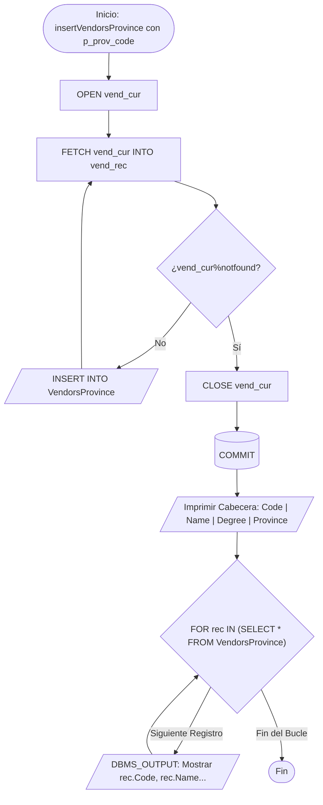

```mermaid
flowchart TD
    A([Inicio: insertVendorsProvince con p_prov_code]) --> B[OPEN vend_cur]
    B --> C[FETCH vend_cur INTO vend_rec]
    C --> D{¿vend_cur%notfound?}
    
    D -- No --> E[/"INSERT INTO VendorsProvince"/]
    E --> C
    
    D -- Sí --> F[CLOSE vend_cur]
    F --> G[(COMMIT)]
    G --> H[/"Imprimir Cabecera: Code | Name | Degree | Province"/]
    H --> I{"FOR rec IN (SELECT * FROM VendorsProvince)"}
    
    I -- Siguiente Registro --> J[/"DBMS_OUTPUT: Mostrar rec.Code, rec.Name..."/]
    J --> I
    
    I -- Fin del Bucle --> K([Fin])
```