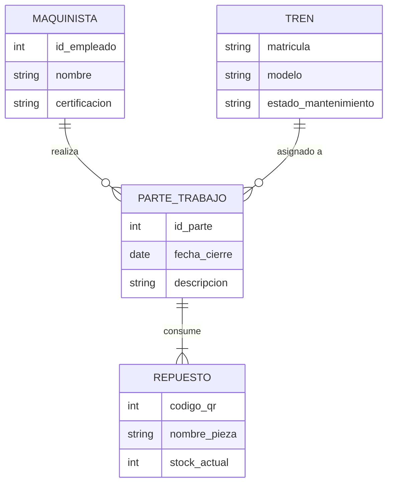

```mermaid
erDiagram
    MAQUINISTA ||--o{ PARTE_TRABAJO : "realiza"
    TREN ||--o{ PARTE_TRABAJO : "asignado a"
    PARTE_TRABAJO ||--|{ REPUESTO : "consume"
    
    TREN {
        string matricula
        string modelo
        string estado_mantenimiento
    }
    MAQUINISTA {
        int id_empleado
        string nombre
        string certificacion
    }
    PARTE_TRABAJO {
        int id_parte
        date fecha_cierre
        string descripcion
    }
    REPUESTO {
        int codigo_qr
        string nombre_pieza
        int stock_actual
    }
```