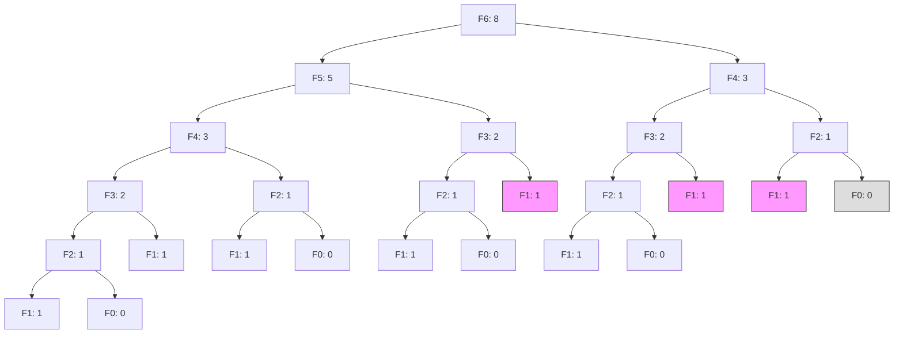

```mermaid
graph TD
    %% Nodo Raíz
    F6[F6: 8] --> F5[F5: 5]
    F6 --> F4[F4: 3]

    %% Rama F5
    F5 --> F4a[F4: 3]
    F5 --> F3a[F3: 2]

    %% Rama F4 (de F6)
    F4 --> F3b[F3: 2]
    F4 --> F2a[F2: 1]

    %% Rama F4a (de F5)
    F4a --> F3c[F3: 2]
    F4a --> F2b[F2: 1]

    %% Rama F3a (de F5)
    F3a --> F2c[F2: 1]
    F3a --> F1a[F1: 1]

    %% Rama F3b (de F4)
    F3b --> F2d[F2: 1]
    F3b --> F1b[F1: 1]

    %% Sub-ramas de F2 y F3 restantes
    F2a --> F1c[F1: 1]
    F2a --> F0a[F0: 0]

    F3c --> F2e[F2: 1]
    F3c --> F1d[F1: 1]

    F2b --> F1e[F1: 1]
    F2b --> F0b[F0: 0]

    F2c --> F1f[F1: 1]
    F2c --> F0c[F0: 0]

    F2d --> F1g[F1: 1]
    F2d --> F0d[F0: 0]

    F2e --> F1h[F1: 1]
    F2e --> F0e[F0: 0]
    
    %% Estilo para los casos base
    style F1a fill:#f9f,stroke:#333
    style F1b fill:#f9f,stroke:#333
    style F1c fill:#f9f,stroke:#333
    style F0a fill:#ddd,stroke:#333
```