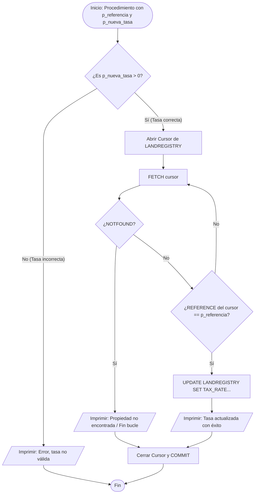

```mermaid
flowchart TD
    A([Inicio: Procedimiento con p_referencia y p_nueva_tasa]) --> B{¿Es p_nueva_tasa > 0?}
    B -- No (Tasa incorrecta) --> C[/Imprimir: Error, tasa no válida/]
    C --> K([Fin])
    
    B -- Sí (Tasa correcta) --> D[Abrir Cursor de LANDREGISTRY]
    D --> E[FETCH cursor]
    E --> F{¿NOTFOUND?}
    F -- Sí --> G[/Imprimir: Propiedad no encontrada / Fin bucle/]
    G --> J[Cerrar Cursor y COMMIT]
    
    F -- No --> H{¿REFERENCE del cursor == p_referencia?}
    H -- Sí --> I[UPDATE LANDREGISTRY SET TAX_RATE...]
    I --> I2[/Imprimir: Tasa actualizada con éxito/]
    I2 --> J
    
    H -- No --> E
    
    J --> K
```