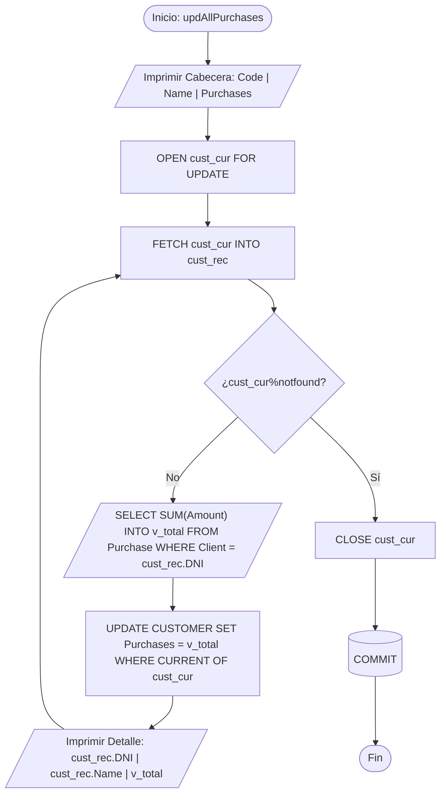

```mermaid
flowchart TD
    A([Inicio: updAllPurchases]) --> B[/"Imprimir Cabecera: Code | Name | Purchases"/]
    B --> C[OPEN cust_cur FOR UPDATE]
    C --> D[FETCH cust_cur INTO cust_rec]
    D --> E{¿cust_cur%notfound?}
    
    E -- No --> F[/"SELECT SUM(Amount) INTO v_total FROM Purchase WHERE Client = cust_rec.DNI"/]
    F --> G[UPDATE CUSTOMER SET Purchases = v_total WHERE CURRENT OF cust_cur]
    G --> H[/"Imprimir Detalle: cust_rec.DNI | cust_rec.Name | v_total"/]
    H --> D
    
    E -- Sí --> I[CLOSE cust_cur]
    I --> J[(COMMIT)]
    J --> K([Fin])
```