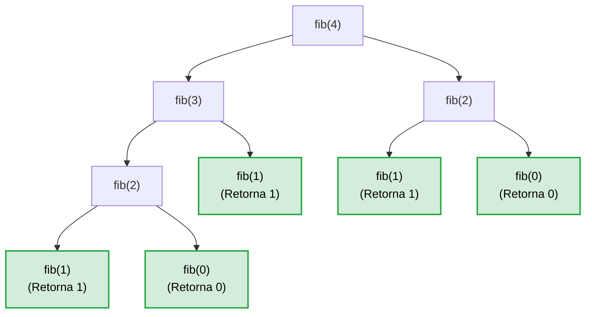

```mermaid
graph TD
    %% Llamada principal
    F4["fib(4)"] --> F3["fib(3)"]
    F4 --> F2_A["fib(2)"]

    %% Rama izquierda de fib(3)
    F3 --> F2_B["fib(2)"]
    F3 --> F1_A["fib(1) <br> (Retorna 1)"]

    %% Rama derecha de la llamada principal fib(2)
    F2_A --> F1_B["fib(1) <br> (Retorna 1)"]
    F2_A --> F0_A["fib(0) <br> (Retorna 0)"]

    %% Sub-rama del fib(2) que viene del fib(3)
    F2_B --> F1_C["fib(1) <br> (Retorna 1)"]
    F2_B --> F0_B["fib(0) <br> (Retorna 0)"]

    %% Estilos para destacar los casos base
    classDef baseCase fill:#d4edda,stroke:#28a745,stroke-width:2px,color:black;
    class F1_A,F1_B,F0_A,F1_C,F0_B baseCase;
```