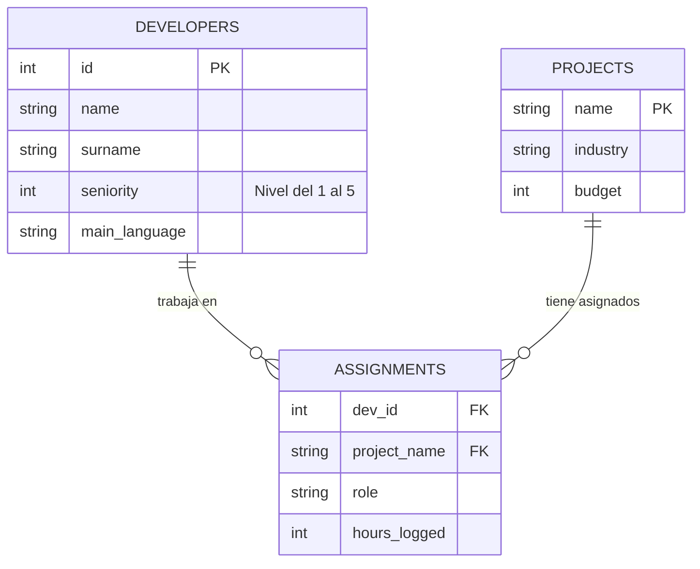

## 🟢 Level 1 – Basics

````sql
-- Display all the data from the employees table.  
 select * from employees;  
  
-- List the name and salary of all employees.  
select first_Name, salary from employees;  
--  
-- Show the employees whose salary is greater than 2000.  
select * from employees where salary > 2000;  
--  
-- Show the employees who belong to department 10.  
select * from employees where department_id = 10;  
--  
-- List the employees ordered by salary from highest to lowest.  
select * from employees order by salary desc;  
--  
-- Show the 5 employees with the highest salary.  
select * from employees order by salary desc limit 5;  
--  
-- Show the employees whose name starts with A.  
select * from employees where first_name like 'A%';  
--  
-- List the employees hired after the year 2020.  
select * from employees where hire_date > '2020-01-01';  
--  
-- Show the employees who do not have a commission.  
select * from employees where employees.employees.commission_pct is null;  
--  
-- Show the employees with a salary between 1500 and 3000.  
select * from employees where employees.employees.salary between 1500 and 3000;
````

## 🟡 Level 2 – Functions and filters
```sql
# Show the employees from department 10 or 20.  
select *  
from employees e where e.DEPARTMENT_ID in (10,20);  
  
# List the employees whose salary is not between 1000 and 2000.  
select *  
from employees e where e.SALARY not between 1000 and 2000;  
#  
# Show the maximum, minimum, and average salary of the employees.  
select max(e.SALARY),min(e.SALARY),avg(e.SALARY)  
from employees e;  
#  
# Show the total number of employees.  
select count(*) from employees;  
#  
# Show the number of employees per department.  
select e.DEPARTMENT_ID,count(*) from employees e group by e.DEPARTMENT_ID;  
#  
# Show the employees whose name has exactly 5 letters.  
select * from employees e where e.FIRST_NAME like '_____';  
#  
# Show the employees whose name ends with ez.  
select * from employees e where e.FIRST_NAME like '%ez';  
#  
# Show the salary rounded to 2 decimal places.  
select round(e.SALARY,2) from employees e;  
#  
# Show the salary (salary * 12).  
select e.SALARY * 12 from employees e;  
#  
# Show the employees ordered by seniority (oldest first).  
select * from employees e order by e.HIRE_DATE;
```

## 🟠 Level 3 – GROUP BY and HAVING
```sql
# Show the average salary per department.  
select avg(e.SALARY) from employees e group by e.DEPARTMENT_ID;  
#  
# Show the departments with more than 3 employees.  
select d.DEPARTMENT_ID from departments d  
group by d.DEPARTMENT_ID having count(*) > 3;  
#  
# Show the department with the highest average salary.  
select e.DEPARTMENT_ID, avg(e.SALARY) from employees e  
group by e.DEPARTMENT_ID order by avg(e.SALARY) desc limit 1;  
#  
# Show the number of employees hired each year.  
select year(e.HIRE_DATE), count(*) from employees e  
group by year(e.HIRE_DATE);  
#  
# Show the departments whose total salary exceeds 20,000.  
select e.DEPARTMENT_ID, sum(e.SALARY) from employees e  
group by e.DEPARTMENT_ID having sum(e.SALARY) > 20000;  
#  
# Show the maximum salary per department, only if it exceeds 3000.  
select max(e.SALARY) from employees e  
group by e.DEPARTMENT_ID having max(e.SALARY) > 3000;  
#  
# Show the number of employees with commission and without commission.  
SELECT COUNT(*) FROM employees WHERE commission_pct > 0;  
SELECT COUNT(*) FROM employees WHERE commission_pct = 0 OR commission_pct IS NULL;  
#  
# Show the departments with at least one employee earning more than 4000.  
select d.DEPARTMENT_ID from departments d, employees e  
where d.DEPARTMENT_ID = e.DEPARTMENT_ID and e.SALARY > 4000;  
#  
# Show the average salary per job position.  
select avg(e.SALARY) from employees e group by e.JOB_ID;  
#  
# Show the job positions with more than 2 employees.  
select e.JOB_ID from employees e group by e.JOB_ID having count(*) > 2;
```
## 🔵 Level 4 – Subqueries

```sql
-- 31  
select e.* from employees e  
where e.SALARY>(select avg(e1.SALARY) from employees e1);  
  
-- 32  
select e.* from employees e  
where e.DEPARTMENT_ID in (select DEPARTMENT_ID from employees  e2 where e2.FIRST_NAME like'John%');  
  
-- 33  
select e.* from employees e where e.SALARY = (select max(SALARY) from employees);  
  
-- 34  
select e.* from employees e where e.SALARY > (select sum(SALARY) from employees e2 where e2.DEPARTMENT_ID = 20);  
  
-- 35  
select * from departments where DEPARTMENT_ID not in  
(select DEPARTMENT_ID from employees);  
  
-- 36  
select *  
from employees e where e.HIRE_DATE = (select min(HIRE_DATE) from employees);  
-- 37  
select * from employees e where e.SALARY >  
(select m.salary from employees m where m.EMPLOYEE_ID = e.MANAGER_ID);  
  
-- 38  
select *  
from employees e where e.DEPARTMENT_ID =  
(select DEPARTMENT_ID from employees e1 group by DEPARTMENT_ID order by count(*) desc limit 1);  
  
-- 39  
select * from employees e where e.SALARY in  
(select SALARY from employees e1 where e1.DEPARTMENT_ID = 50) and e.DEPARTMENT_ID!=50;  
  
-- 40 Show the employees whose salary is among the top 3 highest.  
SELECT e.*  
FROM employees e  
WHERE e.SALARY>(select distinct SALARY from employees order by SALARY desc limit 3,1)
order by e.salary;
```

## **🟣Level 5 — JOINs**
```sql
-- 41  
select e.first_name, e.last_name, d.department_name  
from employees e join departments d on e.department_id = d.department_id;  
  
-- 42  
select e.*  
from employees e left join departments d on e.department_id = d.department_id;  
  
-- 43  
select d.DEPARTMENT_NAME,l.CITY  
from departments d left join locations l on d.location_id = l.location_id;  
  
-- 44  
select l.CITY,c.COUNTRY_NAME  
from locations l left join countries c on l.country_id = c.country_id;  
  
-- 45  
select c.COUNTRY_NAME, r.REGION_NAME  
from countries c left join regions r on c.region_id = r.region_id;  
  
-- 46  
select concat(e.first_name,' ',e.last_name) as Employee,d.department_name,l.city,c.country_name,r.region_name  
from employees e left join departments d on e.department_id = d.department_id  
left join locations l on d.location_id = l.location_id  
left join countries c on l.country_id = c.country_id  
left join regions r on c.region_id = r.region_id;  
  
-- 47  
select e.first_name, e.last_name, j.job_title  
from employees e left join jobs j on e.job_id = j.job_id;  
  
-- 48  
select e.salary, j.MIN_SALARY, j.MAX_SALARY  
from employees e join jobs j on e.job_id = j.job_id;  
  
-- 49  
select e.*  
from employees e left join jobs j on e.job_id = j.job_id  
where e.SALARY not between j.MIN_SALARY and j.MAX_SALARY;  
  
-- 50  
select e.first_name, e.last_name, concat(m.first_name,' ',m.last_name) as Manager  
from employees e left join employees m on e.manager_id = m.employee_id;
```

## 🔴 Level 6 — Challenges
```sql
-- 51  
select e.FIRST_NAME,salary,abs(round(e.SALARY-  
(select avg(e1.SALARY) from employees e1  
where e.DEPARTMENT_ID=e1.department_id),2)) as "Diferencia"  
from employees e;  
  
-- 52  
SELECT e.FIRST_NAME, e.SALARY, e.DEPARTMENT_ID  
FROM employees e  
WHERE (e.DEPARTMENT_ID, e.SALARY) IN (  
    SELECT DEPARTMENT_ID, MAX(SALARY)  
    FROM employees  
    group by DEPARTMENT_ID  
);  
  
-- 53  
select sum(e1.SALARY) as SumaSalario,e1.DEPARTMENT_ID from employees e1  
group by e1.DEPARTMENT_ID  
having SumaSalario>50000;  
  
-- 54  
select e.FIRST_NAME as "Empleado",e.SALARY as "Salario Empleado",m.SALARY as "Salario Manager",m.FIRST_NAME as "Manager"  
from employees e join employees m on e.MANAGER_ID=m.EMPLOYEE_ID  
where e.SALARY>m.SALARY;  
  
-- 55  
select e.FIRST_NAME,e.SALARY,(select avg(e1.SALARY) from employees e1  
where e.DEPARTMENT_ID=e1.department_id  group by e1.DEPARTMENT_ID)as "Salario Medio Departamento"  
from employees e  
where e.SALARY>(select avg(e1.SALARY) from employees e1  
                where e.DEPARTMENT_ID=e1.department_id  group by e1.DEPARTMENT_ID);  
  
-- 56  
select  
    r.REGION_NAME,  
    COUNT(e.EMPLOYEE_ID) as Total_Empleados  
from regions r  
         left join countries c on r.REGION_ID = c.REGION_ID  
         left join locations l on c.COUNTRY_ID = l.COUNTRY_ID  
         left join departments d on l.LOCATION_ID = d.LOCATION_ID  
         left join employees e on d.DEPARTMENT_ID = e.DEPARTMENT_ID  
group by r.REGION_ID, r.REGION_NAME;  
  
-- 57  
select  
    c.COUNTRY_NAME,  
    round(IFNULL(AVG(e.SALARY), 0)) as "Salario Medio"  
from countries c  
left join locations l on c.COUNTRY_ID = l.COUNTRY_ID  
left join departments d on l.LOCATION_ID = d.LOCATION_ID  
left join employees e on d.DEPARTMENT_ID = e.DEPARTMENT_ID  
group by c.COUNTRY_NAME,c.COUNTRY_ID;  
  
-- 58  
select  
    l.CITY,  
    COUNT(e.EMPLOYEE_ID) AS NumeroEmpleados  
from locations l  
         join departments d on l.LOCATION_ID = d.LOCATION_ID  
         join employees e on d.DEPARTMENT_ID = e.DEPARTMENT_ID  
group by l.LOCATION_ID, l.CITY  
having NumeroEmpleados = (  
    select COUNT(emp.EMPLOYEE_ID) AS total  
    from employees emp  
             join departments dep ON emp.DEPARTMENT_ID = dep.DEPARTMENT_ID  
             join locations loc ON dep.LOCATION_ID = loc.LOCATION_ID  
    group by loc.LOCATION_ID  
    order by total desc  
    limit 1  
    );  
-- 59  
select distinct e.first_name, e.last_name  
from employees e  
         join job_history jh on e.employee_id = jh.employee_id  
where e.department_id != jh.department_id;  
-- 60 Empleados que han tenido más de un JOB_ID  
select e.first_name, e.last_name, COUNT(jh.job_id) + 1 as total_puestos  
from employees e  
         join job_history jh ON e.employee_id = jh.employee_id  
group by e.employee_id  
having total_puestos > 1;
```


