# Diagrama de casos de uso
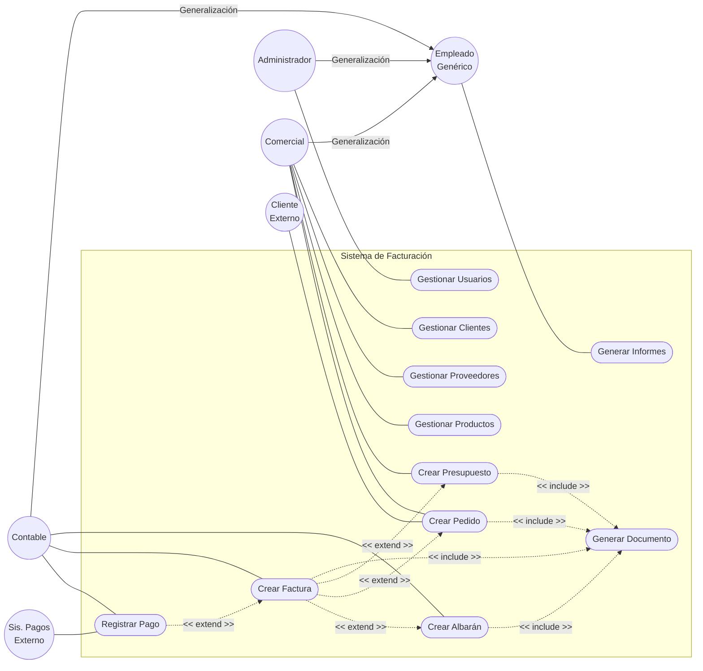
```mermaid
flowchart LR
    %% Definición de Actores (Usamos nodos circulares para simular actores en Obsidian)
    Admin((Administrador))
    Contable((Contable))
    Comercial((Comercial))
    Cliente((Cliente\nExterno))
    SisPagos((Sis. Pagos\nExterno))
    Empleado((Empleado\nGenérico))

    %% Generalización de actores
    Admin -->|Generalización| Empleado
    Contable -->|Generalización| Empleado
    Comercial -->|Generalización| Empleado

    %% Límite del Sistema
    subgraph Sistema_de_Facturacion [Sistema de Facturación]
        direction TB
        GU([Gestionar Usuarios])
        GC([Gestionar Clientes])
        GP([Gestionar Proveedores])
        GProd([Gestionar Productos])
        
        CPres([Crear Presupuesto])
        CPed([Crear Pedido])
        CAlb([Crear Albarán])
        CFac([Crear Factura])
        
        GDoc([Generar Documento])
        RPago([Registrar Pago])
        GInf([Generar Informes])
    end

    %% Relaciones Actores - Casos de Uso
    Admin --- GU
    Empleado --- GInf
    
    Comercial --- GC
    Comercial --- GP
    Comercial --- GProd
    Comercial --- CPres
    Comercial --- CPed
    
    Cliente --- CPed
    
    Contable --- CAlb
    Contable --- CFac
    Contable --- RPago
    
    SisPagos --- RPago

    %% Relaciones Include y Extend
    CPres -.->|<< include >>| GDoc
    CPed -.->|<< include >>| GDoc
    CAlb -.->|<< include >>| GDoc
    CFac -.->|<< include >>| GDoc
    
    CFac -.->|<< extend >>| CPres
    CFac -.->|<< extend >>| CPed
    CFac -.->|<< extend >>| CAlb
    
    RPago -.->|<< extend >>| CFac
```
## Mapa general
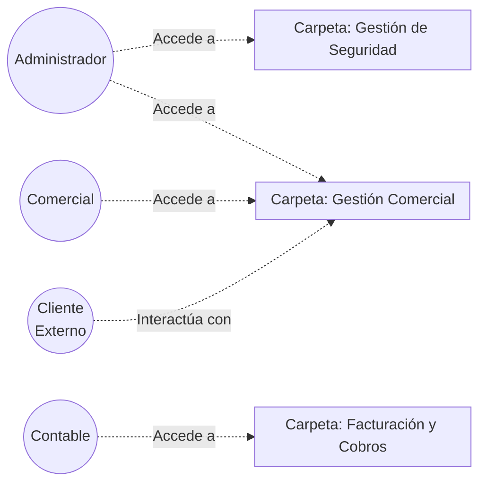
```mermaid
flowchart LR
    %% Actores
    Admin((Administrador))
    Comercial((Comercial))
    Contable((Contable))
    Cliente((Cliente\nExterno))
    
    %% Paquetes (Carpetas)
    subgraph P_Seguridad [Carpeta: Gestión de Seguridad]
    end
    subgraph P_Comercial [Carpeta: Gestión Comercial]
    end
    subgraph P_Facturacion [Carpeta: Facturación y Cobros]
    end
    
    %% Relaciones
    Admin -.->|Accede a| P_Seguridad
    Admin -.->|Accede a| P_Comercial
    Comercial -.->|Accede a| P_Comercial
    Cliente -.->|Interactúa con| P_Comercial
    Contable -.->|Accede a| P_Facturacion
```
## Gestión de seguridad
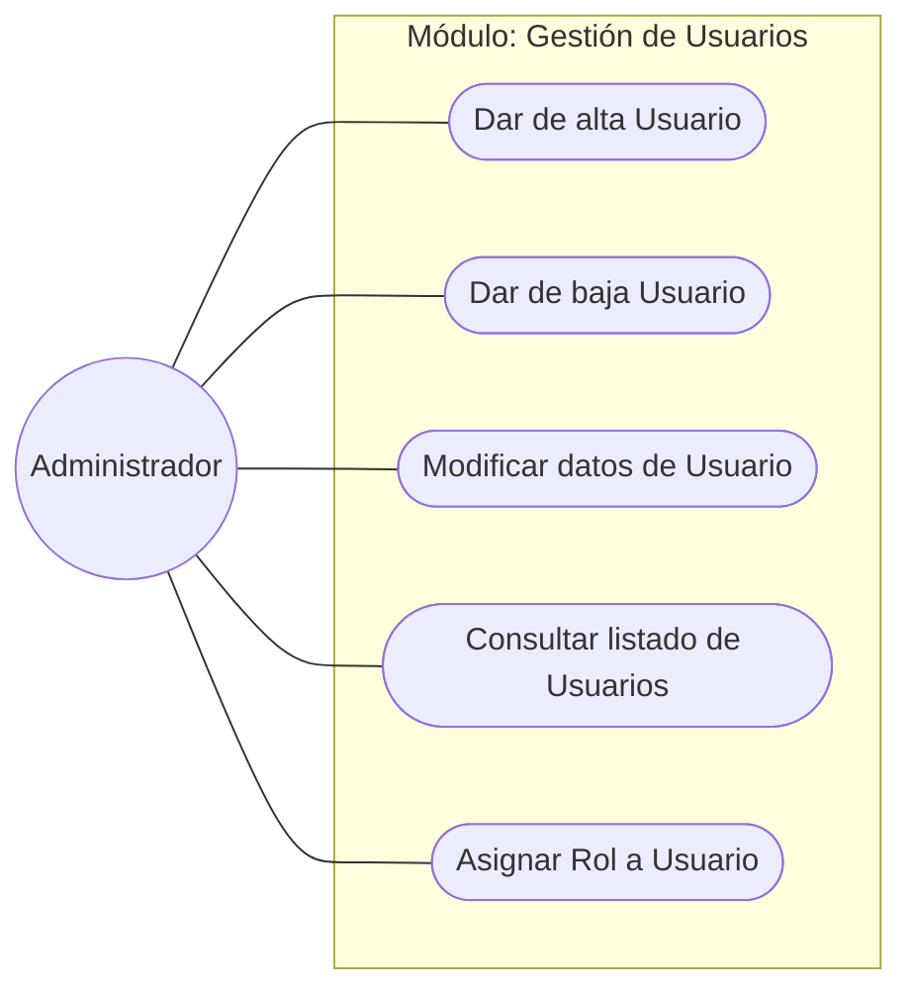
```mermaid
flowchart LR
    Admin((Administrador))

    subgraph Gestión_de_Usuarios [Módulo: Gestión de Usuarios]
        direction TB
        Alta([Dar de alta Usuario])
        Baja([Dar de baja Usuario])
        Mod([Modificar datos de Usuario])
        Consultar([Consultar listado de Usuarios])
        Asignar([Asignar Rol a Usuario])
    end

    Admin --- Alta
    Admin --- Baja
    Admin --- Mod
    Admin --- Consultar
    Admin --- Asignar
```
## Facturación y Cobros
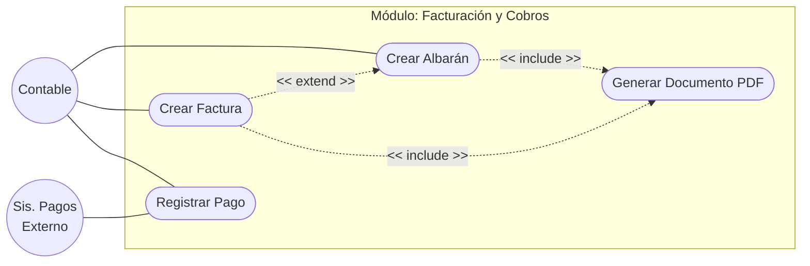
```mermaid
flowchart LR
    Contable((Contable))
    SisPagos((Sis. Pagos\nExterno))

    subgraph Modulo_Facturacion [Módulo: Facturación y Cobros]
        direction TB
        CFac([Crear Factura])
        CAlb([Crear Albarán])
        RPago([Registrar Pago])
        GDoc([Generar Documento PDF])
    end

    Contable --- CAlb
    Contable --- CFac
    Contable --- RPago
    SisPagos --- RPago

    CFac -.->|<< extend >>| CAlb
    CFac -.->|<< include >>| GDoc
    CAlb -.->|<< include >>| GDoc
```

## Gestión Comercial
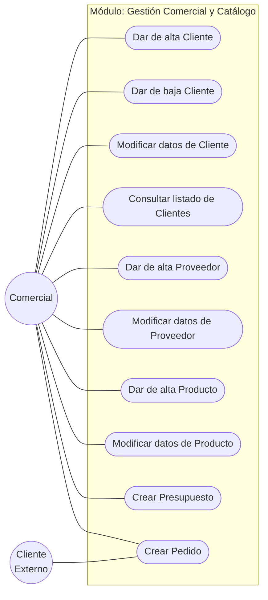
```mermaid
flowchart LR
    %% Actores
    Comercial((Comercial))
    Cliente((Cliente\nExterno))

    subgraph Modulo_Comercial [Módulo: Gestión Comercial y Catálogo]
        direction TB
        
        %% Bloque Clientes
        AltaC([Dar de alta Cliente])
        BajaC([Dar de baja Cliente])
        ModC([Modificar datos de Cliente])
        ConC([Consultar listado de Clientes])
        
        %% Bloque Proveedores (Ejemplo representativo)
        AltaProv([Dar de alta Proveedor])
        ModProv([Modificar datos de Proveedor])
        
        %% Bloque Productos (Ejemplo representativo)
        AltaProd([Dar de alta Producto])
        ModProd([Modificar datos de Producto])
        
        %% Bloque Operaciones Comerciales
        CPres([Crear Presupuesto])
        CPed([Crear Pedido])
    end

    %% Conexiones del Comercial (CRUD Clientes)
    Comercial --- AltaC
    Comercial --- BajaC
    Comercial --- ModC
    Comercial --- ConC
    
    %% Conexiones del Comercial (Proveedores y Productos)
    Comercial --- AltaProv
    Comercial --- ModProv
    Comercial --- AltaProd
    Comercial --- ModProd
    
    %% Conexiones del Comercial (Operaciones)
    Comercial --- CPres
    Comercial --- CPed

    %% Conexiones del Cliente Externo
    Cliente --- CPed
```
# Diagrama de clases

```mermaid
classDiagram
    direction TB

    %% 1. ENUMERACIONES Y CLASES ABSTRACTAS %%
    class EstadoDocumento {
        <<enumeration>>
        BORRADOR
        EMITIDO
        ENVIADO
        PAGADO
        VENCIDO
        ANULADO
    }
    class EstadoPedido {
        <<enumeration>>
        Borrador
        Confirmado
        Enviado
        Facturado
        Cancelado
    }
    class EstadoPago {
        <<enumeration>>
        Registrado
        Confirmado
        Rechazado
    }
    class TipoMetodoPago {
        <<enumeration>>
        Transferencia
        Tarjeta
        Efectivo
        Domiciliacion
    }

    %% 2. NAMESPACES Y CLASES %%
    namespace GestionYConfiguracion {
        class Empresa {
            -cif : String
            -nombre : String
            -direccion : String
            -cuentasBancarias : String
            +editarDatos() void
            +configurarNumeracion() void
            +crearSerie(tipo : String) String
        }
        class ConfiguracionEmpresa {
            -moneda : String
            -formatoPapel : String
            -logoVisible : boolean
            -serieFactura : String
            -serieAlbaran : String
            -seriePedido : String
            -seriePresupuesto : String
            -stockMinimo : int
            +guardarCambios() void
        }
    }

    namespace SeguridadYRoles {
        class Usuario {
	    <<abstract>>
            -id : String
            -nombre : String
            -email : String
            -contrasenia : String
            -esActivo : boolean
            +autenticar(contrasenia : String) boolean
            +cambiarContrasenia(id : String) void
        }
        class Rol {
            -id : String
            -nombre : String
            -descripcion : String
        }
        class Permiso {
            -id : String
            -nombrePermiso : String
            -codigoAcceso : String
            -descripcion : String
        }
    }

    namespace Actores {
        class Cliente {
            -id : String
            -nif : String
            -nombre : String
            -categoria : String
            -saldoPendiente : double
            +consultarHistorial() void
        }
        class Proveedor {
            -id : String
            -nombre : String
            -nif : String
            -contactoVentas : String
            -condicionesPago : String
        }
        class Vendedor {
            -id : String
            -nombre : String
            -email : String
            -comision : double
            -totalVentas : Integer
        }
    }

    namespace CatalogoYLogistica {
        class Articulo {
            <<abstract>>
            #id: String
            #codigo : String
            #descripcion : String
            #precioBase : double
        }
        class Producto {
            -stockActual : Integer
            -stockMinimo : Integer
            +actualizarStock() void
        }
        class Servicio {
            -duracionMinutos : int
        }
        class CategoriaProducto {
            -id : String
            -nombre : String
            -descripcion : String
        }
        class Inventario {
            -id : String
            -ubicacion : String
            -ultimaRevision : Date
            +generarAlertaStockBajo() void
        }
        class MovimientoInventario {
            -id : String
            -fecha : Date
            -tipo : String
            -cantidad : Integer
            -motivo : String
        }
    }

    namespace Documentacion {
        class Documento {
            <<abstract>>
            #id : String
            #numero : String
            #fecha : Date
            #total : Double
            #estado : EstadoDocumento
            #descuentoTotal : double
            +totalBruto() double
            +totalImpuestos() double
            +totalNeto() double
        }
        class Pedido {
            -fechaConfirmacion : Date
            -estadoPedido : EstadoPedido
            +confirmar() void
        }
        class Albaran {
            -fechaEnvio : Date
            -tracking : String
        }
        class Factura {
            -vencimiento : Date
            +emitir() void
            +anular(motivo : String) void
            +enviar() void
        }
        class Presupuesto {
            -fechaValidez : Date
        }
        class LineaDocumento {
            -id : String
            -cantidad : double
            -precioUnitario : double
            -descuento : double
            +subtotal() double
        }
    }

    namespace FinanzasYReportes {
        class Pago {
            -id : String
            -importe : double
            -fechaPago : Date
            -estado : EstadoPago
            +confirmarPago() boolean
        }
        class MetodoPago {
            -id : String
            -tipo : TipoMetodoPago
            -reglas : String
        }
        class Impuesto {
            -id : String
            -nombre : String
            -tipo : String
            -porcentaje : double
            -aplicableA : String
        }
        class Informe {
            -tipoInforme : String
            -rangoFechas : Date
            +exportarPDF() void
        }
    }

    %% 3. RELACIONES %%
    
    %% Herencias (Establecen la jerarquía principal)
    Usuario <|-- Vendedor : hereda credenciales
	Usuario <|-- Cliente : hereda credenciales
	Usuario <|-- Proveedor : hereda credenciales
    Articulo <|-- Producto
    Articulo <|-- Servicio
    Documento <|-- Presupuesto
    Documento <|-- Pedido
    Documento <|-- Albaran
    Documento <|-- Factura

    %% Composiciones raíz (Desde Empresa hacia los módulos)
	Empresa "1" *-- "1" ConfiguracionEmpresa : configuracion
    Empresa "1" o--> "0..*" Usuario : tiene
    Empresa "1" o--> "0..*" Cliente : clientes
    Empresa "1" o--> "0..*" Proveedor : proveedores
    Empresa "1" o--> "0..*" Vendedor : vendedores
    Empresa "1" o--> "1..*" Inventario : almacenes
    Empresa "1" o--> "0..*" Articulo : catalogo
    Empresa "1" o--> "0..*" Impuesto : impuestos
    Empresa "1" o--> "0..*" Documento : documentos
    Empresa "1" --> "0..*" Informe : genera

    %% Seguridad y Roles
    Usuario "0..*" --> "0..*" Rol : esDesignadoPor
    Rol "0..*" --> "0..*" Permiso : tiene

    %% Actores y Catálogo
    Vendedor "1" --> "0..*" Cliente : gestiona
    Producto "0..*" --> "0..1" CategoriaProducto : categoria

    %% Logística e Inventario
    Inventario "1" --> "0..*" MovimientoInventario : movimientos
    MovimientoInventario "1" --> "1" Producto : producto

    %% Documentación y Líneas
    Documento "0..*" --> "1" Cliente : destinatario
    Documento "0..*" --> "0..1" Vendedor : comercial
	Documento "1" *--> "1..*" LineaDocumento : lineas
    LineaDocumento "1" --> "1" Articulo : item
    LineaDocumento "0..*" --> "0..*" Impuesto : aplica

    %% Flujo de Documentos (Transformaciones lógicas)
    Pedido "0..*" --> "0..*" Albaran : genera
    Pedido "0..*" --> "0..*" Factura : convierte
    Albaran "0..*" --> "0..*" Factura : agrupa

    %% Finanzas y Pagos
    Factura "1" --> "0..*" Pago : pagos
    Pago "1" --> "1" MetodoPago : metodo

    %% Reportes
    Informe ..> Documento : consulta
    Informe ..> Pago : consulta
```

## Mapa general
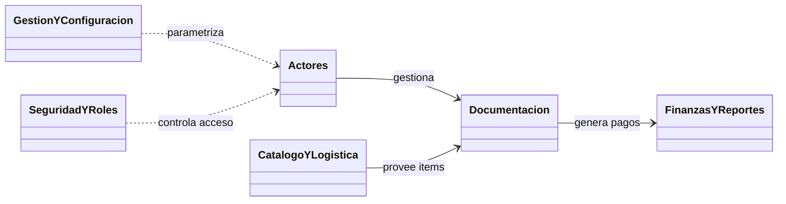
```mermaid
classDiagram
    direction LR
    class GestionYConfiguracion
    class SeguridadYRoles
    class Actores
    class CatalogoYLogistica
    class Documentacion
    class FinanzasYReportes

    GestionYConfiguracion ..> Actores : parametriza
    SeguridadYRoles ..> Actores : controla acceso
    Actores --> Documentacion : gestiona
    CatalogoYLogistica --> Documentacion : provee items
    Documentacion --> FinanzasYReportes : genera pagos
```

## Módulo de Seguridad y Roles
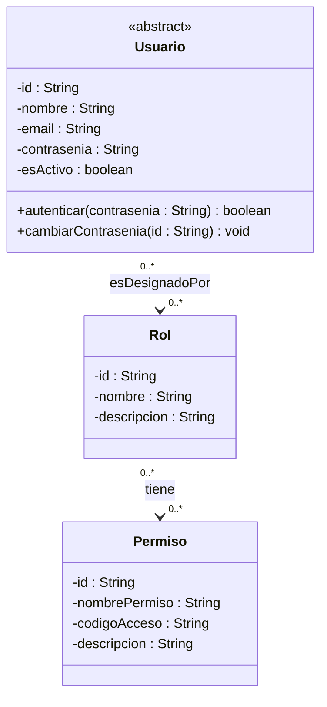
```mermaid
classDiagram
    direction TB
    class Usuario {
        <<abstract>>
        -id : String
        -nombre : String
        -email : String
        -contrasenia : String
        -esActivo : boolean
        +autenticar(contrasenia : String) boolean
        +cambiarContrasenia(id : String) void
    }
    class Rol {
        -id : String
        -nombre : String
        -descripcion : String
    }
    class Permiso {
        -id : String
        -nombrePermiso : String
        -codigoAcceso : String
        -descripcion : String
    }
    
    Usuario "0..*" --> "0..*" Rol : esDesignadoPor
    Rol "0..*" --> "0..*" Permiso : tiene
```

## Módulo de actores
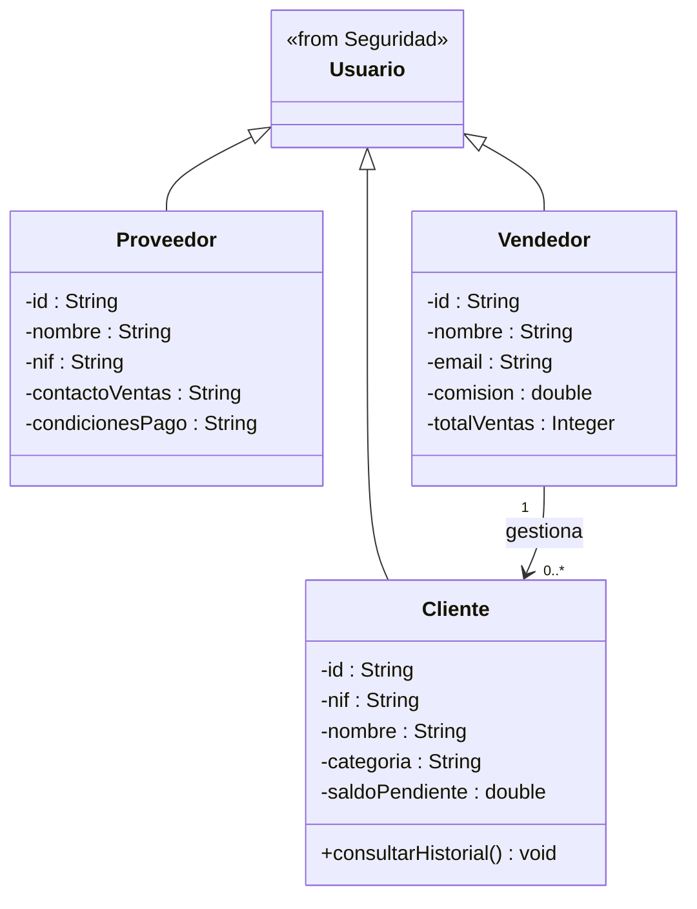
```mermaid
classDiagram
    direction TB
    class Usuario {
        <<from Seguridad>>
    }
    class Cliente {
        -id : String
        -nif : String
        -nombre : String
        -categoria : String
        -saldoPendiente : double
        +consultarHistorial() void
    }
    class Proveedor {
        -id : String
        -nombre : String
        -nif : String
        -contactoVentas : String
        -condicionesPago : String
    }
    class Vendedor {
        -id : String
        -nombre : String
        -email : String
        -comision : double
        -totalVentas : Integer
    }
    
    Usuario <|-- Vendedor
    Usuario <|-- Cliente
    Usuario <|-- Proveedor
    Vendedor "1" --> "0..*" Cliente : gestiona
```
## Módulo de Catálogo y Logística
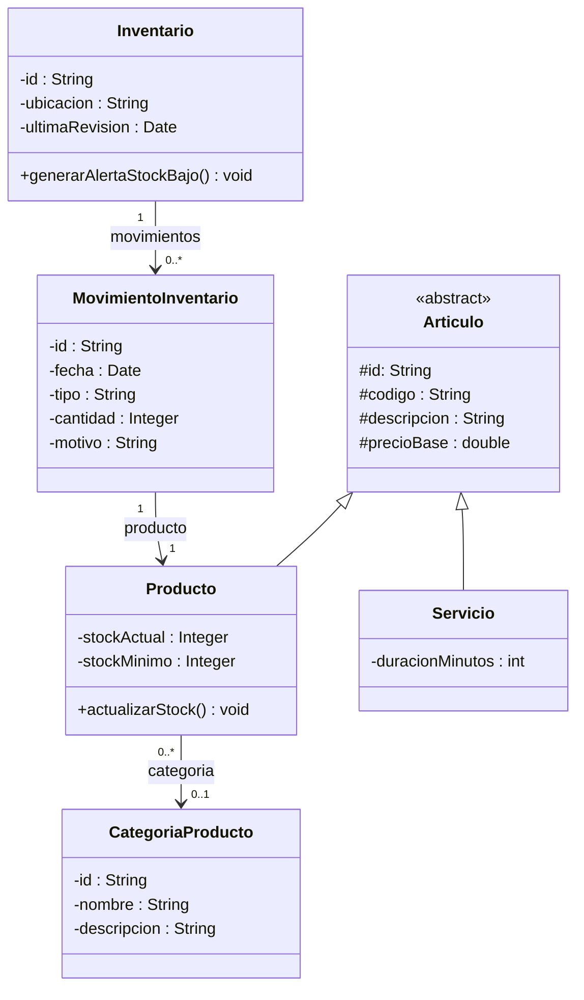
```mermaid
classDiagram
    direction TB
    class Articulo {
        <<abstract>>
        #id: String
        #codigo : String
        #descripcion : String
        #precioBase : double
    }
    class Producto {
        -stockActual : Integer
        -stockMinimo : Integer
        +actualizarStock() void
    }
    class Servicio {
        -duracionMinutos : int
    }
    class CategoriaProducto {
        -id : String
        -nombre : String
        -descripcion : String
    }
    class Inventario {
        -id : String
        -ubicacion : String
        -ultimaRevision : Date
        +generarAlertaStockBajo() void
    }
    class MovimientoInventario {
        -id : String
        -fecha : Date
        -tipo : String
        -cantidad : Integer
        -motivo : String
    }
    
    Articulo <|-- Producto
    Articulo <|-- Servicio
    Producto "0..*" --> "0..1" CategoriaProducto : categoria
    Inventario "1" --> "0..*" MovimientoInventario : movimientos
    MovimientoInventario "1" --> "1" Producto : producto
```
## Módulo de Documentación
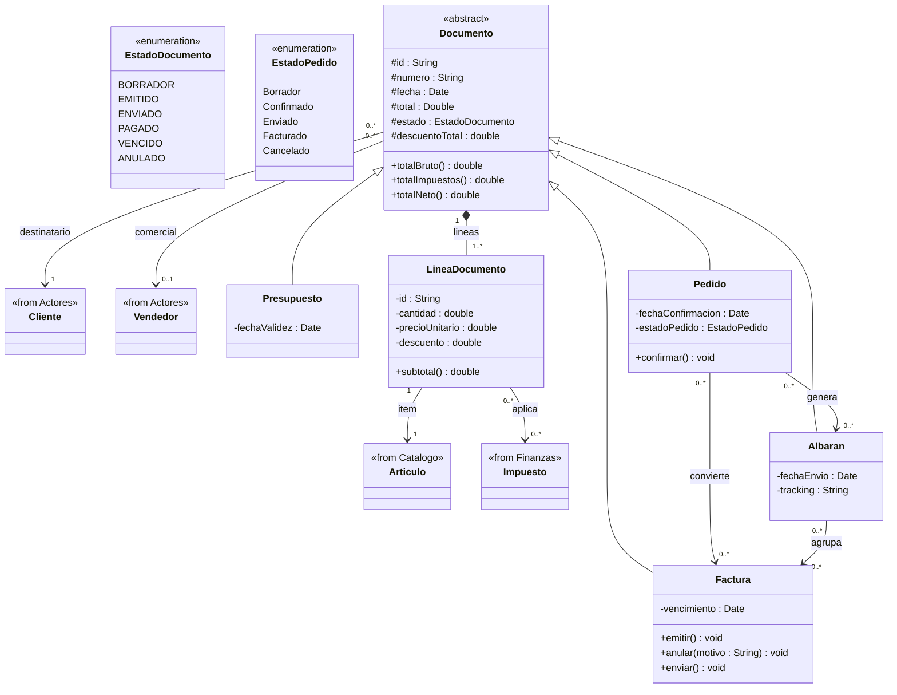
```mermaid
classDiagram
    direction TB

    %% 1. ENUMERACIONES %%
    class EstadoDocumento {
        <<enumeration>>
        BORRADOR
        EMITIDO
        ENVIADO
        PAGADO
        VENCIDO
        ANULADO
    }

    class EstadoPedido {
        <<enumeration>>
        Borrador
        Confirmado
        Enviado
        Facturado
        Cancelado
    }

    %% 2. CLASES EXTERNAS (Dependencias de otros módulos) %%
    class Cliente { <<from Actores>> }
    class Vendedor { <<from Actores>> }
    class Articulo { <<from Catalogo>> }
    class Impuesto { <<from Finanzas>> }

    %% 3. CLASE BASE (Abstracta) %%
    class Documento {
        <<abstract>>
        #id : String
        #numero : String
        #fecha : Date
        #total : Double
        #estado : EstadoDocumento
        #descuentoTotal : double
        +totalBruto() double
        +totalImpuestos() double
        +totalNeto() double
    }

    %% 4. CLASES DERIVADAS Y COMPONENTES %%
    class Presupuesto {
        -fechaValidez : Date
    }

    class Pedido {
        -fechaConfirmacion : Date
        -estadoPedido : EstadoPedido
        +confirmar() void
    }

    class Albaran {
        -fechaEnvio : Date
        -tracking : String
    }

    class Factura {
        -vencimiento : Date
        +emitir() void
        +anular(motivo : String) void
        +enviar() void
    }

    class LineaDocumento {
        -id : String
        -cantidad : double
        -precioUnitario : double
        -descuento : double
        +subtotal() double
    }

    %% 5. RELACIONES: HERENCIA (Estructura principal vertical) %%
    Documento <|-- Presupuesto
    Documento <|-- Pedido
    Documento <|-- Albaran
    Documento <|-- Factura

    %% 6. RELACIONES: COMPOSICIÓN Y ASOCIACIONES %%
    Documento "1" *-- "1..*" LineaDocumento : lineas
    Documento "0..*" --> "1" Cliente : destinatario
    Documento "0..*" --> "0..1" Vendedor : comercial
    
    LineaDocumento "1" --> "1" Articulo : item
    LineaDocumento "0..*" --> "0..*" Impuesto : aplica

    %% 7. RELACIONES: FLUJO LÓGICO (Transformaciones documentales) %%
    Pedido "0..*" --> "0..*" Albaran : genera
    Pedido "0..*" --> "0..*" Factura : convierte
    Albaran "0..*" --> "0..*" Factura : agrupa
```

## Módulo de Finanzas y Reportes
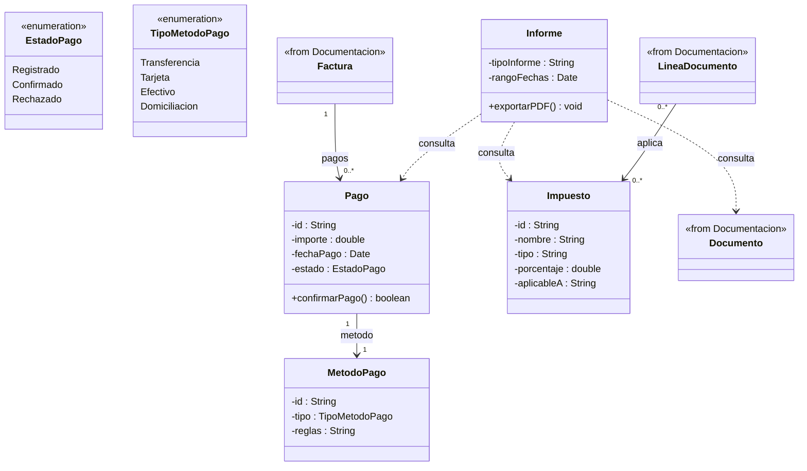
```mermaid
classDiagram
    direction TB
    class EstadoPago {
        <<enumeration>>
        Registrado
        Confirmado
        Rechazado
    }
    class TipoMetodoPago {
        <<enumeration>>
        Transferencia
        Tarjeta
        Efectivo
        Domiciliacion
    }
    class Pago {
        -id : String
        -importe : double
        -fechaPago : Date
        -estado : EstadoPago
        +confirmarPago() boolean
    }
    class MetodoPago {
        -id : String
        -tipo : TipoMetodoPago
        -reglas : String
    }
    class Impuesto {
        -id : String
        -nombre : String
        -tipo : String
        -porcentaje : double
        -aplicableA : String
    }
    class Informe {
        -tipoInforme : String
        -rangoFechas : Date
        +exportarPDF() void
    }
    
    %% Clases Externas %%
    class Factura { <<from Documentacion>> }
    class Documento { <<from Documentacion>> }
    class LineaDocumento { <<from Documentacion>> }

    Factura "1" --> "0..*" Pago : pagos
    Pago "1" --> "1" MetodoPago : metodo
    Informe ..> Documento : consulta
    Informe ..> Pago : consulta
    Informe ..> Impuesto : consulta
    LineaDocumento "0..*" --> "0..*" Impuesto : aplica
```
## Módulo de Gestión y Configuración
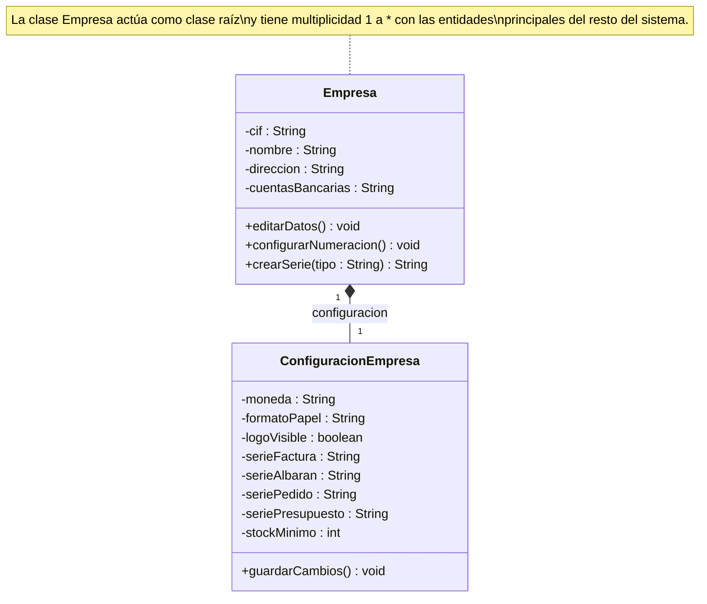
```mermaid
classDiagram
    direction TB
    class Empresa {
        -cif : String
        -nombre : String
        -direccion : String
        -cuentasBancarias : String
        +editarDatos() void
        +configurarNumeracion() void
        +crearSerie(tipo : String) String
    }
    class ConfiguracionEmpresa {
        -moneda : String
        -formatoPapel : String
        -logoVisible : boolean
        -serieFactura : String
        -serieAlbaran : String
        -seriePedido : String
        -seriePresupuesto : String
        -stockMinimo : int
        +guardarCambios() void
    }
    
    Empresa "1" *-- "1" ConfiguracionEmpresa : configuracion
    
    note for Empresa "La clase Empresa actúa como clase raíz\ny tiene multiplicidad 1 a * con las entidades\nprincipales del resto del sistema."
```

# Diagramas de secuencia
## Crear Factura
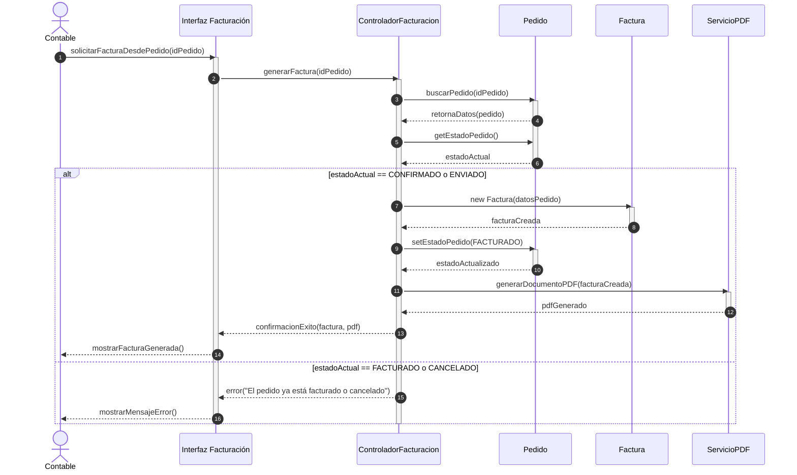
```mermaid
sequenceDiagram
    autonumber
    actor C as Contable
    participant UI as Interfaz Facturación
    participant Ctrl as ControladorFacturacion
    participant P as Pedido
    participant F as Factura
    participant PDF as ServicioPDF

    C->>UI: solicitarFacturaDesdePedido(idPedido)
    activate UI
    UI->>Ctrl: generarFactura(idPedido)
    activate Ctrl
    
    %% Búsqueda y validación del pedido
    Ctrl->>P: buscarPedido(idPedido)
    activate P
    P-->>Ctrl: retornaDatos(pedido)
    
    Ctrl->>P: getEstadoPedido()
    P-->>Ctrl: estadoActual
    deactivate P
    
    %% Lógica condicional (alt/else)
    alt estadoActual == CONFIRMADO o ENVIADO
        %% Creación de la factura
        Ctrl->>F: new Factura(datosPedido)
        activate F
        F-->>Ctrl: facturaCreada
        deactivate F
        
        %% Actualización del estado del pedido
        Ctrl->>P: setEstadoPedido(FACTURADO)
        activate P
        P-->>Ctrl: estadoActualizado
        deactivate P
        
        %% Generación del documento (<<include>> de tu caso de uso)
        Ctrl->>PDF: generarDocumentoPDF(facturaCreada)
        activate PDF
        PDF-->>Ctrl: pdfGenerado
        deactivate PDF
        
        %% Respuesta final de éxito
        Ctrl-->>UI: confirmacionExito(factura, pdf)
        UI-->>C: mostrarFacturaGenerada()
        
    else estadoActual == FACTURADO o CANCELADO
        %% Camino de error (Excepción)
        Ctrl-->>UI: error("El pedido ya está facturado o cancelado")
        UI-->>C: mostrarMensajeError()
    end
    
    deactivate Ctrl
    deactivate UI
```

### Flujo Principal
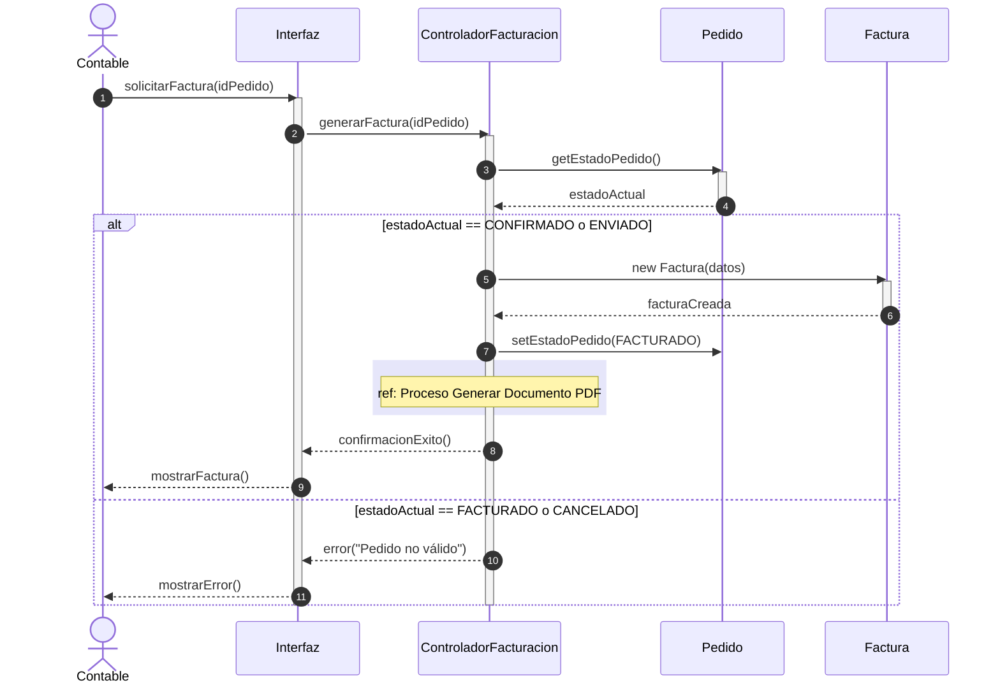
```mermaid
sequenceDiagram
    autonumber
    actor C as Contable
    participant UI as Interfaz
    participant Ctrl as ControladorFacturacion
    participant P as Pedido
    participant F as Factura

    C->>UI: solicitarFactura(idPedido)
    activate UI
    UI->>Ctrl: generarFactura(idPedido)
    activate Ctrl
    
    Ctrl->>P: getEstadoPedido()
    activate P
    P-->>Ctrl: estadoActual
    deactivate P
    
    alt estadoActual == CONFIRMADO o ENVIADO
        Ctrl->>F: new Factura(datos)
        activate F
        F-->>Ctrl: facturaCreada
        deactivate F
        
        Ctrl->>P: setEstadoPedido(FACTURADO)
        
        %% SIMULACIÓN DE LA CAJA "REF" DE UML
        rect rgb(230, 230, 250)
        note over Ctrl: ref: Proceso Generar Documento PDF
        end
        
        Ctrl-->>UI: confirmacionExito()
        UI-->>C: mostrarFactura()
        
    else estadoActual == FACTURADO o CANCELADO
        Ctrl-->>UI: error("Pedido no válido")
        UI-->>C: mostrarError()
    end
    
    deactivate Ctrl
    deactivate UI
```

### Sub-Proceso
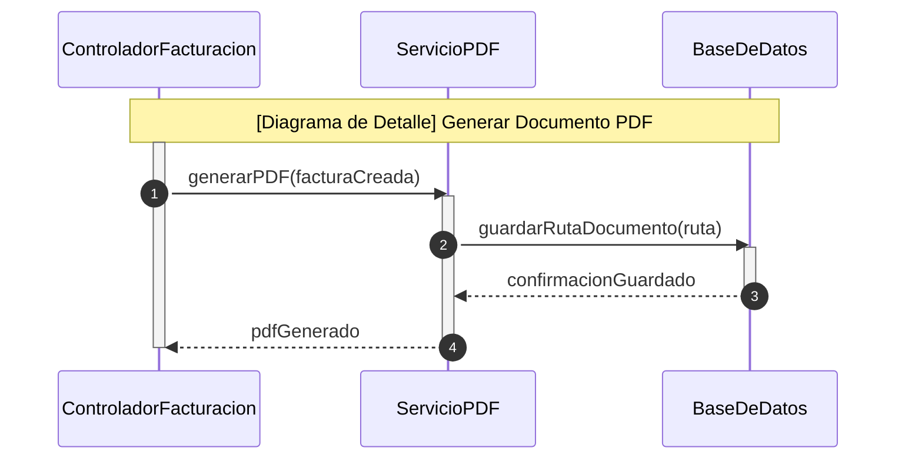
```mermaid
sequenceDiagram
    autonumber
    participant Ctrl as ControladorFacturacion
    participant PDF as ServicioPDF
    participant BD as BaseDeDatos

    note over Ctrl, BD: [Diagrama de Detalle] Generar Documento PDF
    
    activate Ctrl
    Ctrl->>PDF: generarPDF(facturaCreada)
    activate PDF
    
    PDF->>BD: guardarRutaDocumento(ruta)
    activate BD
    BD-->>PDF: confirmacionGuardado
    deactivate BD
    
    PDF-->>Ctrl: pdfGenerado
    deactivate PDF
    deactivate Ctrl
```

## Registrar pago de factura
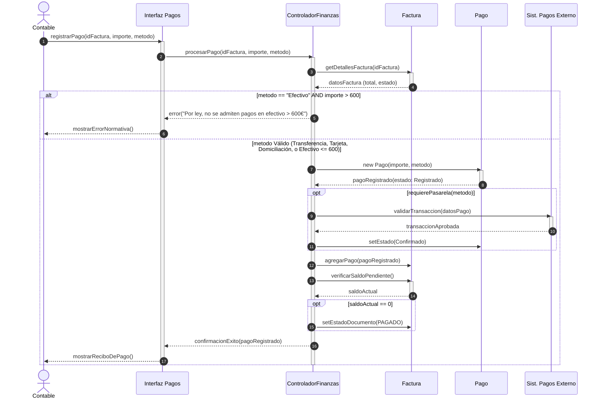
```mermaid
sequenceDiagram
    autonumber
    actor C as Contable
    participant UI as Interfaz Pagos
    participant Ctrl as ControladorFinanzas
    participant F as Factura
    participant P as Pago
    participant SP as Sist. Pagos Externo

    C->>UI: registrarPago(idFactura, importe, metodo)
    activate UI
    UI->>Ctrl: procesarPago(idFactura, importe, metodo)
    activate Ctrl
    
    %% Validación de la Factura
    Ctrl->>F: getDetallesFactura(idFactura)
    activate F
    F-->>Ctrl: datosFactura (total, estado)
    deactivate F
    
    %% Verificación de Regla de Negocio (Límite 600€ en efectivo)
    alt metodo == "Efectivo" AND importe > 600
        %% Rechazo por normativa legal
        Ctrl-->>UI: error("Por ley, no se admiten pagos en efectivo > 600€")
        UI-->>C: mostrarErrorNormativa()
        
    else metodo Válido (Transferencia, Tarjeta, Domiciliación, o Efectivo <= 600)
        %% El pago es válido, se procede a registrarlo
        Ctrl->>P: new Pago(importe, metodo)
        activate P
        P-->>Ctrl: pagoRegistrado(estado: Registrado)
        deactivate P
        
        %% Si es tarjeta/transferencia, interactúa con la pasarela externa
        opt requierePasarela(metodo)
            Ctrl->>SP: validarTransaccion(datosPago)
            activate SP
            SP-->>Ctrl: transaccionAprobada
            deactivate SP
            
            Ctrl->>P: setEstado(Confirmado)
        end
        
        %% Se vincula el pago a la factura
        Ctrl->>F: agregarPago(pagoRegistrado)
        
        %% Se evalúa si la factura está totalmente pagada
        Ctrl->>F: verificarSaldoPendiente()
        activate F
        F-->>Ctrl: saldoActual
        deactivate F
        
        opt saldoActual == 0
            Ctrl->>F: setEstadoDocumento(PAGADO)
        end
        
        Ctrl-->>UI: confirmacionExito(pagoRegistrado)
        UI-->>C: mostrarReciboDePago()
    end
    
    deactivate Ctrl
    deactivate UI
```
# Diagrama de estados
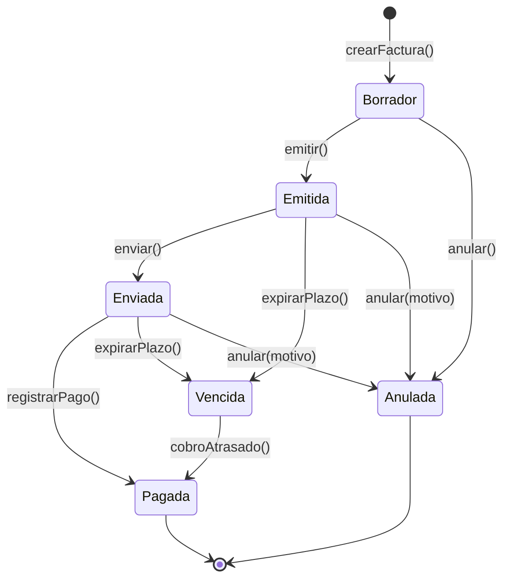
```mermaid
stateDiagram-v2
    direction TB

    %% 1. FLUJO PRINCIPAL (El ciclo de vida ideal)
    [*] --> Borrador : crearFactura()
    Borrador --> Emitida : emitir()
    Emitida --> Enviada : enviar()
    Enviada --> Pagada : registrarPago()
    Pagada --> [*]

    %% 2. FLUJO DE VENCIMIENTO (Desviación temporal)
    Emitida --> Vencida : expirarPlazo()
    Enviada --> Vencida : expirarPlazo()
    Vencida --> Pagada : cobroAtrasado()

    %% 3. FLUJO DE ANULACIÓN (Excepciones y fin prematuro)
    Borrador --> Anulada : anular()
    Emitida --> Anulada : anular(motivo)
    Enviada --> Anulada : anular(motivo)
    Anulada --> [*]
```
# Diagrama de comunicación
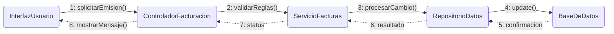
```mermaid
flowchart LR
    %% Clases / Objetos
    UI(InterfazUsuario)
    Ctrl(ControladorFacturacion)
    Serv(ServicioFacturas)
    Repo(RepositorioDatos)
    DB(BaseDeDatos)

    %% Conexiones y Mensajes Numerados
    UI -- "1: solicitarEmision()" --> Ctrl
    Ctrl -- "2: validarReglas()" --> Serv
    Serv -- "3: procesarCambio()" --> Repo
    Repo -- "4: update()" --> DB
    
    %% Respuestas
    DB -. "5: confirmacion" .-> Repo
    Repo -. "6: resultado" .-> Serv
    Serv -. "7: status" .-> Ctrl
    Ctrl -. "8: mostrarMensaje()" .-> UI
```
# Diagrama de componentes
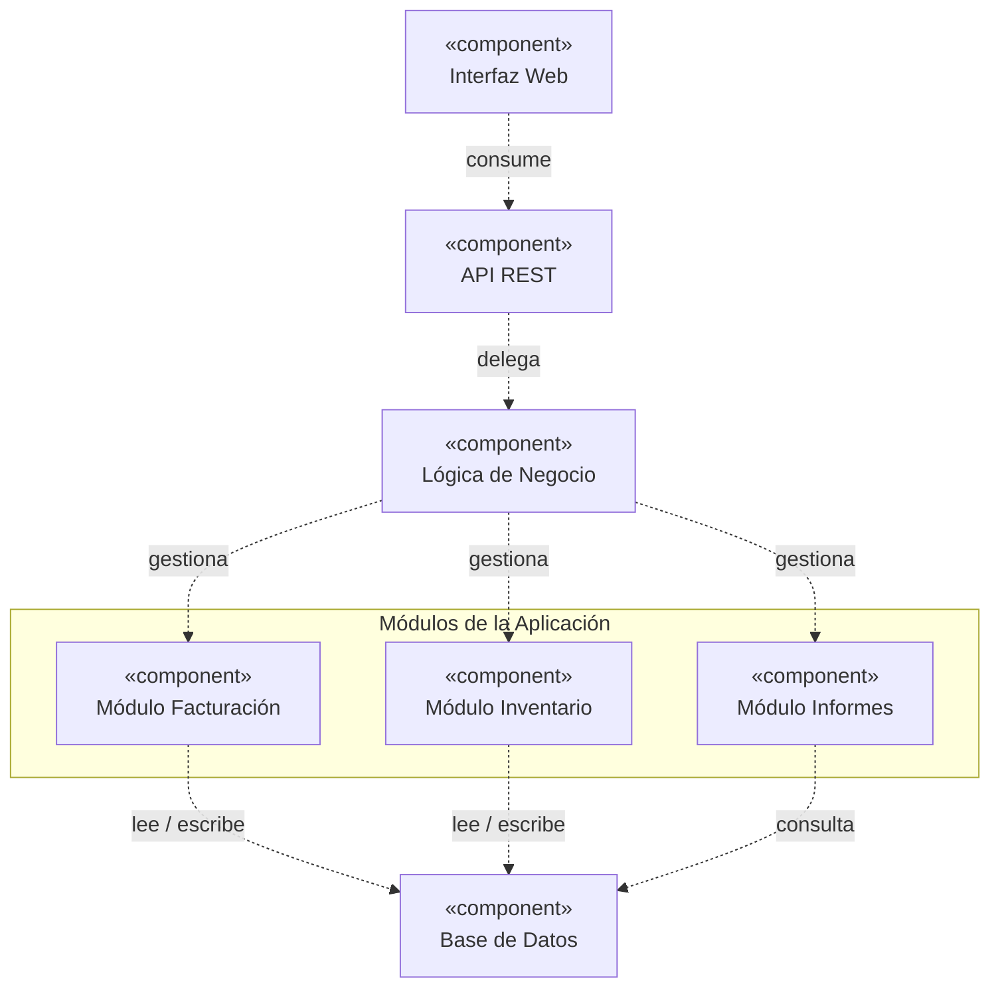
```mermaid
flowchart TD
    %% Capa de Presentación
    UI["«component»\nInterfaz Web"]

    %% Capa de Servicios
    API["«component»\nAPI REST"]

    %% Capa Lógica / Núcleo
    Logic["«component»\nLógica de Negocio"]

    %% Módulos Específicos
    subgraph Modulos ["Módulos de la Aplicación"]
        direction LR
        Fact["«component»\nMódulo Facturación"]
        Inv["«component»\nMódulo Inventario"]
        Rep["«component»\nMódulo Informes"]
    end

    %% Capa de Datos
    DB["«component»\nBase de Datos"]

    %% Relaciones de Dependencia
    UI -.->|consume| API
    API -.->|delega| Logic
    Logic -.->|gestiona| Fact
    Logic -.->|gestiona| Inv
    Logic -.->|gestiona| Rep
    
    Fact -.->|lee / escribe| DB
    Inv -.->|lee / escribe| DB
    Rep -.->|consulta| DB
```
# Diagrama de despliegue
```mermaid
flowchart TD
    %% Nodo Cliente
    subgraph Cliente ["«node»\nDispositivo del Usuario (PC/Móvil)"]
        Nav["«execution environment»\nNavegador Web"]
    end

    %% Nodo Servidor de Aplicaciones
    subgraph ServidorApp ["«node»\nServidor de Aplicaciones"]
        WebSrv["«execution environment»\nServidor Web (Apache/Nginx)"]
        App["«artifact»\nSistemaFacturacion.war"]
        
        WebSrv -.->|aloja| App
    end

    %% Nodo Servidor de Base de Datos
    subgraph ServidorDB ["«node»\nServidor de Base de Datos"]
        DBMS["«execution environment»\nMotor BD (MySQL/PostgreSQL)"]
        Data["«artifact»\nEsquemaDatos.sql"]
        
        DBMS -.->|ejecuta| Data
    end

    %% Conexiones de Red (Asociaciones físicas)
    Nav <-->|"Protocolo HTTPS\n(TCP/IP)"| WebSrv
    App <-->|"Protocolo JDBC\n(Red Local)"| DBMS
```