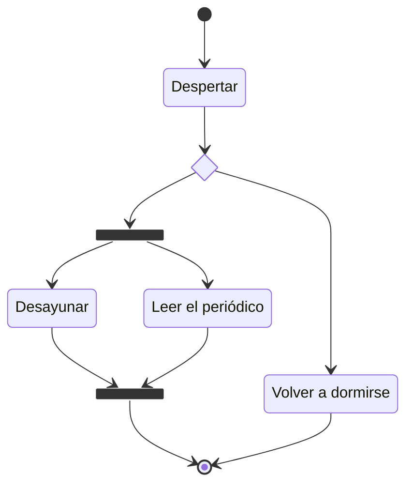
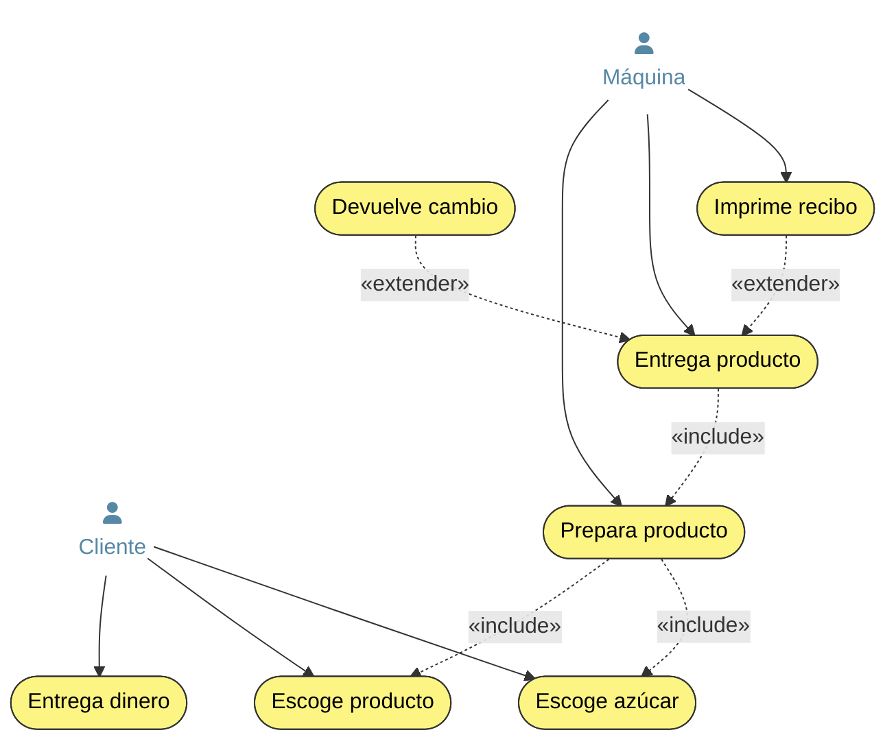
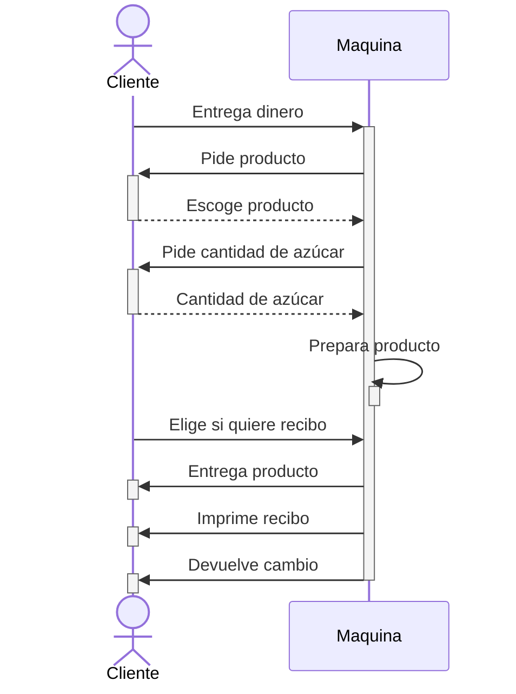
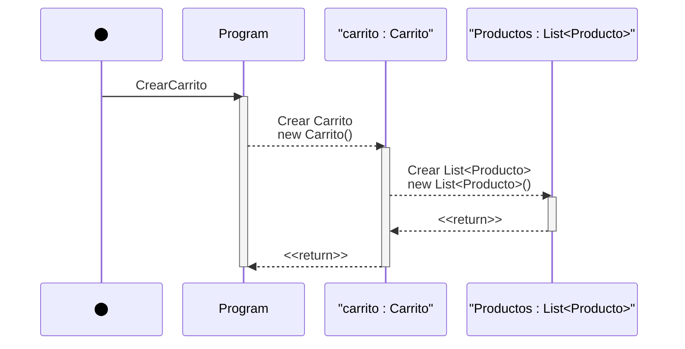
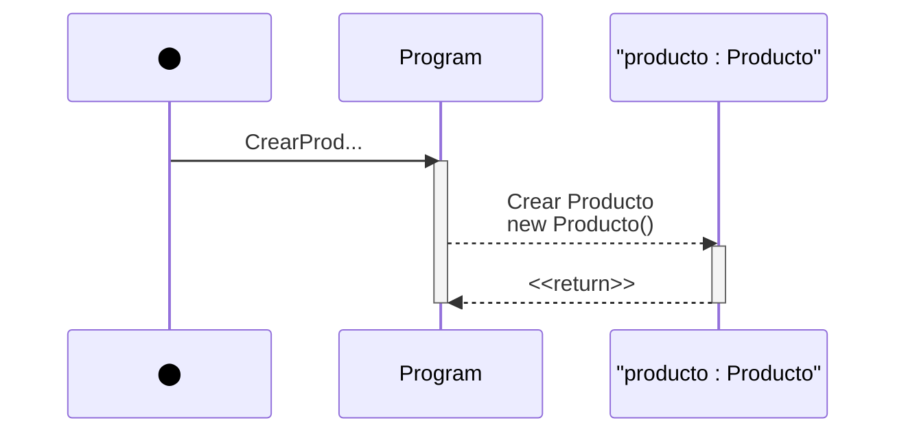
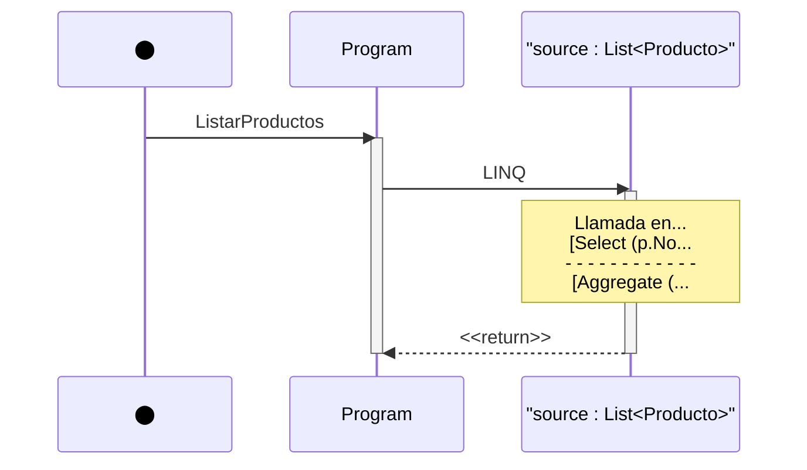
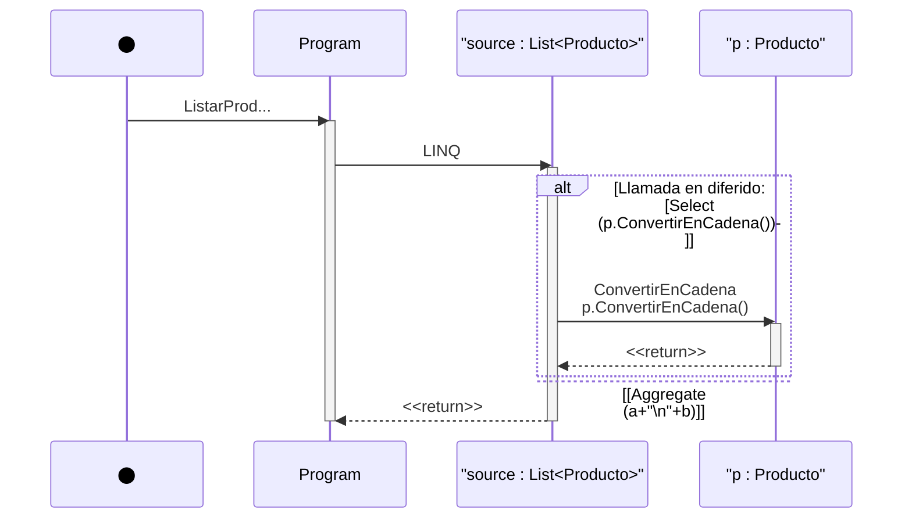

# 1. TIPOS Y CAMPO DE APLICACIÓN
Existen diversos tipos de diagramas de comportamiento y, al igual que en el caso de los diagramas de clase del capítulo anterior, también son diagramas basados en el estándar unificado **UML**. Los diagramas de comportamiento son un modo de representar gráficamente los **procesos** y formas de uso de un programa, con ellos visualizamos los aspectos dinámicos de un sistema, como el flujo de mensajes a lo largo del tiempo, el movimiento físico de los componentes en una red o los diferentes estados y operaciones que transcurren en el ciclo de vida de un programa.

Si en los diagramas de clases veíamos cómo se definían y especificaban las diferentes clases, sus operaciones y relaciones, los diagramas de comportamiento nos dirán cómo interactúan a lo largo del tiempo dichas clases y operaciones.
Al tratarse de un tipo totalmente diferente de diagramas, no es necesario que lleven una relación directa con el diagrama de clases de un sistema, es más, podría no aparecer ningún nombre del diagrama de clases en un diagrama de comportamiento. No son diagramas estructurales, son diagramas conceptuales de manejo, de flujo y de la secuencia de un programa, por lo que es muy posible que dependiendo de la profundidad y extensión de un diagrama no aparezcan algunas de las entidades definidas en el diagrama de clases.

Cabe destacar que todos los diagramas de comportamiento se utilizan de un modo jerárquico, es decir, en principio, sea el diagrama que sea, se realiza un diagrama sencillo con pocas “etapas”, donde vemos el funcionamiento del sistema, separándolo en diferentes secciones que posteriormente tendrán un diagrama más detallado y específico.
# 2. DIAGRAMAS DE ACTIVIDAD
Representan los flujos de trabajo del sistema desde su inicio hasta el fin con las operaciones y componentes del sistema.

Este tipo de diagramas tienen un gran parecido con los clásicos diagramas de flujo que seguramente hayáis visto con anterioridad y con una notación muy similar. Los diagramas de actividad tienen unas características muy concretas y restrictivas, se componen de tres elementos: estados, transiciones y nodos.
## Estados
- Se representan como un rectángulo con los bordes redondeados.
- Definen los diferentes estados o etapas por las que pasa la ejecución del programa
## Transiciones
- Se representan como una flecha unidireccional.
- Son líneas de conexión que enlazan estados entre sí con una dirección.
## Nodos
- Existen diferentes tipos de nodos. Decisión, Barras de sincronización, nodo inicial y nodo final.
- Los de decisión definen caminos alternativos.
- Las barras de sincronización definen actividades que ocurren de manera asíncrona.
- Los nodos iniciales y finales son únicos y deben existir en el diagrama. Indican el estado inicial y final del flujo de trabajo.
---
Las reglas son muy sencillas, siempre debe haber **un único estado inicial y un único estado final**, todas las operaciones, transiciones y procesos ocurren entre esos dos puntos. Las transiciones se realizan entre estados y pueden tener nodos de por medio.

En el ejemplo hemos utilizado un **nodo inicial** (representado por un punto), un **nodo final** (representado con un punto rodeado por una circunferencia), unas **flechas de transición** entre estados, un nodo de decisión (representado por un rombo) y dos **barras de sincronización** (representadas por una línea gruesa de color negro). Al igual que los **nodos de bifurcación**, las **barras de sincronización** pueden unir **transiciones** y separarlas, en este caso hemos usado los dos tipos de barras, ya que después de desayunar y leer el periódico debemos unir nuestro flujo de transición al realizarse de manera asíncrona.
### Ejemplo:

Utilizaremos el elemento rotulado como **Initial Node** para poner el nodo inicial desde donde empezará nuestro flujo de trabajo, como vemos, tenemos también el nodo final rotulado como **Activity Final Node** que, como hemos visto, utilizaremos para definir el final de nuestra actividad.

El elemento **Action** dibuja nuestros estados, y luego tendríamos las bifurcaciones. Las bifurcaciones las tenemos de dos tipos, las que separan y las que unen, básicamente tendríamos un **Decision node**, que recibe una flecha de transición y pueden salir una o más de una, representando una decisión. Lo contrario ocurre con el **Merge Node**, donde recibe más de una transición y solo sale una transición de él.

Tendríamos un comportamiento análogo con las barras de sincronización, donde el **Fork Node** separaría transiciones y el **Join Node** las uniría.

Finalmente, tendríamos el elemento **Connector**, que, como su propio nombre indica, sirve de conexión entre los elementos. Representa las flechas de transición.
# 3. DIAGRAMAS DE CASOS DE USO
Los diagramas de casos de uso representan cómo interactúan los diferentes actores en un sistema para cada caso de uso. Es decir, definen qué acciones puede realizar cada actor dentro de un sistema.

Cada acción está representada de un modo muy simple por un rótulo que representa el caso de uso de la operación en cuestión.

Un modo de ver los casos de uso dentro de una aplicación serían los diferentes roles o permisos de los usuarios que tienen acceso a dicha aplicación, de este modo, dentro de un banco, los casos de uso no son los mismos (al menos no todos) si el usuario es el gerente o es un cajero.

Las relaciones que se pueden realizar entre casos de uso y los actores son realmente muy parecidas, son del mismo tipo pero restrictivas entre sí.
**Extensión**: Esta relación implica que un caso de uso puede extender a otro, es decir, que el comportamiento del caso extendido se utiliza en otro caso de uso.
**Inclusión**: Similar a la extensión, esta relación implica que un caso de uso se incluye en otro, pero con una dirección determinada. Generalmente, este caso de uso suele provenir de un caso de uso de otro actor, mientras que el de extensión puede no venir de un actor concreto.
**Generalización**: Es un modo de representar la herencia de casos de uso, es decir, un caso de uso puede ser genérico, pero tener formas más específicas del mismo.
**Límite de un sistema**: Se utiliza para separar los diferentes sistemas dentro de un diagrama de casos de uso. En caso de que solo haya un sistema, no es necesario establecer el límite de un sistema.

# 4. DIAGRAMAS DE SECUENCIA
Los diagramas de **secuencia** modelan la secuencia lógica a través del tiempo de los mensajes entre **instancias**. Se podría definir como la pila de llamadas resultante de realizar las diferentes operaciones, forman un mapeado de la traza de llamadas que se realizan cuando un participante realiza una acción.

El diagrama de secuencia se estructura mediante **líneas de vida**, que a su vez representan a un **participante** en el sistema, ya sea un actor o cualquier otro elemento que participe en el transcurso secuencial de nuestro programa. La parte más importante del diagrama es la línea de vida, esa línea representa una secuencia, una **cronología** que nos permite visualizar con un rápido vistazo las interacciones, mensajes y participantes, así como el número de ellos a través de toda la vida del programa, desde que se ejecuta hasta que se cierra.

Los diagramas de secuencia visualizan dos tipos de mensajes.

**Síncronos**: Se corresponden con llamadas a métodos del objeto que recibe el mensaje.
El objeto que envía el mensaje queda bloqueado hasta que termina la llamada. Este tipo de mensajes se representan con flechas con la cabeza llena.

**Asíncronos**: Estos mensajes terminan inmediatamente, y crean un nuevo hilo de ejecución dentro de la secuencia. Se representan con flechas con la cabeza abierta. Al igual que los mensajes síncronos, también se representa la respuesta con una flecha discontinua.

En este diagrama vemos que se han usado los mensajes asíncronos y los mensajes síncronos, básicamente observamos que las opciones que no requieren respuesta se han representado con llamadas asíncronas, aunque no se tiene por qué corresponder de ese modo siempre. Básicamente, la máquina tiene tres períodos de proceso: cuando le pide los datos al cliente, cuando procesa la solicitud y cuando devuelve los resultados (en este caso un café, el cambio y un recibo) al cliente.
## Ingeniería inversa
Al igual que con los diagramas de clases, podemos conseguir el diagrama de secuencia de un **método concreto** de manera automática mediante técnicas de ingeniería inversa disponibles en la herramienta de modelado de Visual Studio, para ello, vamos a realizar una sencilla aplicación que añade productos a un carrito de la compra.

Podemos crear el diagrama de secuencia de cualquier método de nuestro código, para observar las diferencias en cada método, vamos
a generar un diagrama por cada uno de los métodos implementados en nuestra clase principal excluyendo el método main. Lo único que
tenemos que hacer es botón derecho en cualquier método y seleccionar la opción **Generar diagrama de secuencia.**
```java
private static Carrito CrearCarrito(int numPedido){
Carrito carrito = new Carrito();
carrito.NumPedido = numPedido;
return carrito;
}
```

```java
private static Producto CrearProducto(string nombre,double precio) {
Producto producto = new Producto();
producto.Nombre = nombre;
producto.Precio = precio;
return producto;
}
```

```java
private static string ListarProductos(Carrito carrito) {
string resultado = “Productos del carrito con No de pedido: “ + carrito.NumPedido +”\n”;
resultado += carrito.Productos.Select(p => p.Nombre + “ Precio: “ +
p.Precio.ToString()).Aggregate((a,b)=> a+”\n”+b);
return resultado;
}
```

Podemos observar en el último diagrama cómo se ha realizado la llamada a LINQ que hemos usado para sacar formateada la información de nuestra colección. LINQ es una poderosa herramienta para el manejo de colecciones, hemos utilizado su potencial para proyectar sus elementos obteniendo una lista con los strings formateados y luego utilizando una concatenación de sus elementos, por ese motivo aparecen esas interacciones en la llamada en diferido que hemos realizado a la hora de crear nuestro listado de los productos.

Con este sencillo programa, no hemos visto lo que ocurre cuando hay llamadas a otros métodos dentro de nuestro proyecto, pero eso tiene fácil solución, vamos a añadir un método ConvertirEnCadena a nuestra clase **Producto**, ese método devolverá un string que tendrá un formato como el que hemos formado antes.

```java
public string ConvertirEnCadena(){
return nombre + “ Precio: “ + precio.ToString();
}
private static string ListarProductos(Carrito carrito){
string resultado = “Productos del carrito con No de pedido: “ + carrito.NumPedido + ”\n”;
resultado += carrito.Productos.Select(p => p.ConvertirEnCadena())
.Aggregate((a,b)=> a+”\n”+b);
return resultado;
}
```

Como hemos visto, simplemente hemos sustituido en el método de proyección de LINQ donde antes convertíamos la información del
producto en una cadena, para utilizar en su lugar el método de la clase **Producto** que se encarga de esta tarea que acabamos de crear.

En este nuevo diagrama, podemos ver como la llamada en diferido en donde se realiza el uso de la proyección del método Select llama a su vez al método convertir cadena de la clase **Producto**.

Con esto habríamos terminado con el uso de la generación automática de diagramas de secuencia, y hemos aprendido un nuevo
concepto: las **llamadas en diferido** que se realizan al utilizar métodos y extensiones externas a nuestro propio código.