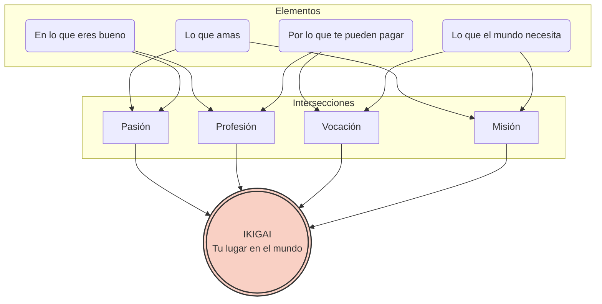

# Ikigai
- **Lo que amo:** Me encanta resolver acertijos lógicos, pasar horas frente al ordenador creando cosas desde cero y explorar continuamente las novedades de los sistemas operativos móviles.
    
- **En lo que soy bueno:** Se me da genial estructurar bases de datos, escribir código limpio (por ejemplo, en Java,Python o JavaScript) y encontrar fallos rápidamente cuando un programa se cuelga (_debugging_).
    
- **Por lo que me pueden pagar:** Las empresas tecnológicas y las consultoras buscan constantemente perfiles técnicos para crear, actualizar y mantener sus aplicaciones. Es un sector muy demandado y bien remunerado.
    
- **Lo que el mundo necesita:** La sociedad actual necesita herramientas digitales que faciliten la vida de las personas, como aplicaciones de telemedicina, plataformas educativas, o herramientas de accesibilidad para personas con discapacidad.

Si uno todos estos puntos, mi _Ikigai_ podría ser **trabajar como desarrollador de aplicaciones móviles**.
De esta manera, logro el equilibrio perfecto:

1. Al programar y diseñar la lógica de la app, disfruto de mi día a día (**Pasión**).
    
2. Utilizar mis habilidades técnicas para que la app sea rápida y no tenga errores (**Profesión**).
    
3. Una empresa del sector sanitario o educativo me contrata y me paga un buen sueldo por sus conocimientos (**Vocación**).
    
4. Siento que mis líneas de código tienen un impacto real y positivo ayudando a personas que lo necesitan (**Misión**).

# Diana autoevaluación
- **Asertividad:** 3 (Fuerte)
    
- **Resiliencia:** 3 (Fuerte)
    
- **Resolución de conflictos:** 3 (Fuerte)
    
- **Trabajo en equipo:** 2 (Medio-Alto)
    
- **Responsabilidad:** 2 (Medio-Alto)
    
- **Habilidades comunicativas:** 2 (Medio-Alto)
    
- **Empatía:** 1 (Área de mejora)
    
- **Inteligencia emocional:** 1 (Área de mejora)

![[Pasted image 20260323180624.png|1000]]
# Test de personalidad
![[Pasted image 20260330180644.png]]
![[Pasted image 20260330180731.png]]
![[Pasted image 20260330180756.png]]
# Test autoestima de Rosenberg
![[Pasted image 20260327180522.png]]
Autoestima elevada
# Diana autoestima Covey
![[Pasted image 20260327181444.png]]
# DAFO

|                      | **Aspectos Negativos**                                                                                                                                                                                                                                                                                                       | **Aspectos Positivos**                                                                                                                                                                                                                                                                                                                                            |
| -------------------- | ---------------------------------------------------------------------------------------------------------------------------------------------------------------------------------------------------------------------------------------------------------------------------------------------------------------------------- | ----------------------------------------------------------------------------------------------------------------------------------------------------------------------------------------------------------------------------------------------------------------------------------------------------------------------------------------------------------------- |
| **Análisis Interno** | **Debilidades**      • Dificultad para delegar tareas en otros compañeros porque se me da mal el trabajo en equipo.      • Falta de experiencia previa gestionando equipos.      • Nivel alto de autoexigencia que genera estrés ya que siempre quiero notas superiores.      • Miedo a hablar en público ante presentaciones de clases por ser vergonzoso                                                                                                 | **Fortalezas**      • Alta capacidad de adaptación a nuevos entornos.      • Buen dominio sobre la programación.      • Facilidad para la resolución de problemas técnicos.      • Gran sentido de la responsabilidad y proactividad. |
| **Análisis Externo** |**Amenazas**      • Fuerte competencia de candidatos más jóvenes con mayor nivel de programación.      • Cambios tecnológicos muy rápidos que exigen estudio constante.      • Posibles reestructuraciones de plantilla por recortes presupuestarios.      |           **Oportunidades**      • Auge del trabajo en remoto que amplía las ofertas.      • Existencia de programas de mentoría en la empresa actual.      • Acceso a cursos gratuitos o subvencionados de liderazgo.      • Crecimiento del sector profesional en el que se trabaja.     |

# CAME
|**Estrategia**|**Mis Acciones Concretas**|
|---|---|
|**Corregir**      _(Mis Debilidades)_|• **Trabajo en equipo y delegación:** Empezaré pidiendo y haciendo _code reviews_ a mis compañeros. Es una forma técnica de colaborar sin forzar dinámicas de grupo que se me dan mal.      • **Experiencia en gestión:** Me ofreceré a liderar un pequeño módulo dentro de un proyecto, coordinando solo a una o dos personas para ganar rodaje.      • **Autoexigencia y notas:** Aplicaré _Timeboxing_ (me asignaré un tiempo máximo por tarea). Asumiré que en programación es mejor entregar un código funcional que buscar una perfección que me genera estrés.      • **Miedo a exponer:** Me grabaré en vídeo practicando mis presentaciones para las clases. Verme hacerlo bien me dará la seguridad que necesito frente a la vergüenza.|
|**Afrontar**      _(Mis Amenazas)_|• **Competencia joven:** Me especializaré en un nicho que valore mi capacidad de resolución de problemas técnicos complejos y mi proactividad, no solo la velocidad picando código.      • **Cambios tecnológicos:** Bloquearé 2 horas fijas a la semana en mi calendario dedicadas exclusivamente a leer documentación o probar nuevas herramientas para no quedarme atrás.      • **Reestructuraciones:** Mantendré mi repositorio de GitHub siempre actualizado con proyectos funcionales para estar preparado ante cualquier recorte presupuestario.|
|**Mantener**      _(Mis Fortalezas)_|• **Adaptabilidad:** Seguiré ofreciéndome voluntario para probar cualquier nueva herramienta o _framework_ que surja en la empresa o en clase.      • **Dominio de la programación:** Seguiré participando en plataformas de retos de código para mantener mi agilidad mental y mi base técnica bien afilada.      • **Resolución y proactividad:** Documentaré los problemas técnicos complejos que logre resolver para crear mi propia base de conocimiento y ser aún más rápido en el futuro.|
|**Explotar**      _(Mis Oportunidades)_|• **Mentoría interna:** Aprovecharé mi proactividad para pedir oficialmente un mentor en mi empresa actual que me guíe sobre cómo perder el miedo a liderar.      • **Cursos de liderazgo:** Me matricularé en cursos gratuitos o subvencionados para compensar con teoría mi falta de experiencia práctica gestionando equipos.      • **Trabajo remoto:** Configuraré alertas de empleo en remoto específicas para mi lenguaje de programación, buscando puestos que encajen con mi alto sentido de la responsabilidad.|

# Proyecto profesional
## 1. Meta Profesional

Convertirme en un Desarrollador Multiplataforma especializado en la resolución de problemas técnicos complejos , capaz de trabajar de forma autónoma en entornos remotos, y con el objetivo a medio plazo de asumir roles de liderazgo técnico (Tech Lead) gestionando pequeños equipos.

## 2. Hard Skills y Soft Skills

**Hard Skills (Habilidades Técnicas):**

- Buen dominio general de la programación (Java, Kotlin, C#, etc., típicos de DAM).
    
- Manejo de control de versiones y repositorios (GitHub).
    
- Creación y gestión de bases de conocimiento técnico e incidencias.
    
- Uso de nuevas herramientas y frameworks tecnológicos.
    

**Soft Skills (Habilidades Blandas):**

- _Actuales:_ Alta capacidad de adaptación a nuevos entornos , gran sentido de la responsabilidad , proactividad , y facilidad para la resolución de problemas técnicos.
    
- _En desarrollo:_ Trabajo en equipo, delegación de tareas, gestión del estrés (control de autoexigencia) y comunicación/oratoria.
    

## 3. Formación

- **Formación Reglada:** Ciclo Formativo de Grado Superior en Desarrollo de Aplicaciones Multiplataforma (DAM).
    
- **Formación Complementaria:** Cursos gratuitos o subvencionados enfocados en liderazgo y gestión de equipos.
    
- **Formación Continua (Autodidacta):** Dedicación de 2 horas fijas semanales para leer documentación, probar nuevas herramientas y evitar la obsolescencia técnica.
    

## 4. El Mundo Laboral 

El sector tecnológico actual para un perfil DAM presenta un fuerte crecimiento y un auge muy importante del trabajo en remoto, lo cual amplía significativamente las ofertas disponibles. Sin embargo, es un entorno de ritmo rápido que exige estudio constante debido a los continuos cambios tecnológicos. Existe una fuerte competencia de candidatos muy jóvenes con gran nivel de programación, y el mercado no está exento de inestabilidades, como posibles reestructuraciones de plantilla por recortes presupuestarios.

## 5. Análisis DAFO

|**Análisis Interno**|**Análisis Externo**|
|---|---|
|**Debilidades:**      - Falta de experiencia previa gestionando equipos.      - Dificultad para delegar y trabajar en equipo.      - Alto nivel de autoexigencia que genera estrés.      - Miedo a hablar en público (vergüenza).|**Amenazas:**      - Fuerte competencia de candidatos jóvenes.      - Cambios tecnológicos muy rápidos.      - Posibles reestructuraciones por recortes.|
|**Fortalezas:**      - Alta capacidad de adaptación.      - Buen dominio de la programación.      - Facilidad para la resolución de problemas técnicos.      - Gran responsabilidad y proactividad.|**Oportunidades:**      - Auge del trabajo remoto.      - Programas de mentoría en la empresa actual.      - Cursos gratuitos/subvencionados de liderazgo.      - Crecimiento del sector profesional.|

## 6. Análisis CAME (Estrategia)

- **Corregir (Debilidades):** Implementar _code reviews_ para colaborar técnicamente, liderar módulos pequeños de 1-2 personas, usar _Timeboxing_ para rebajar el perfeccionismo y grabarse en vídeo para practicar exposiciones.
    
- **Afrontar (Amenazas):** Especializarse en un nicho de resolución de problemas complejos, bloquear 2 horas semanales en el calendario para estudio, y mantener un portfolio de GitHub siempre actualizado.
    
- **Mantener (Fortalezas):** Ofrecerse voluntario para probar nuevos frameworks, participar en retos de código (para afilar agilidad mental) y documentar los problemas resueltos para crear una base de conocimiento propia.
    
- **Explotar (Oportunidades):** Pedir un mentor oficial en la empresa para perder el miedo a liderar, matricularse en cursos de liderazgo y configurar alertas de empleo remoto específicas.
## 7. Plan de Acción 

Para hacer realidad esta estrategia, el plan se divide en acciones medibles:

1. **Ajuste de mentalidad y rutina (Inmediato):**
    
    - Implementar la técnica de _Timeboxing_ en todas las tareas de programación para priorizar código funcional sobre la perfección absoluta y reducir el estrés.
        
    - Bloquear en el calendario 2 horas fijas a la semana, de manera innegociable, para explorar documentación técnica.
        
2. **Mejora de habilidades colaborativas (Corto plazo):**
    
    - Empezar a pedir y realizar _code reviews_ a los compañeros como puente hacia el trabajo en equipo.
        
    - Grabarse en vídeo al preparar cualquier presentación de clase para ganar seguridad.
        
    - Documentar todo problema técnico complejo resuelto y subir proyectos funcionales a GitHub periódicamente.
        
3. **Transición hacia el liderazgo y especialización (Medio plazo):**
    
    - Aprovechar la proactividad para solicitar formalmente un mentor en la empresa actual.
        
    - Matricularse en un curso de liderazgo y ofrecerse a coordinar un pequeño módulo de proyecto (1-2 personas) para poner la teoría en práctica.
        
4. **Expansión laboral (Largo plazo):**
    
    - Configurar alertas de empleo para trabajo 100% remoto que busquen perfiles con alto grado de responsabilidad y capacidad autónoma de resolución de incidencias.