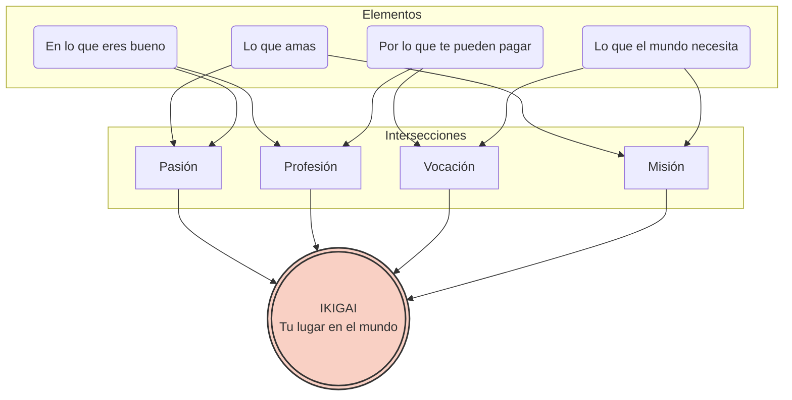

## 1. Familia Profesional y mi ciclo 

- **¿Qué es una familia profesional?** Es el conjunto de ciclos formativos de Formación Profesional (FP) que se agrupan porque comparten competencias y conocimientos de un mismo sector productivo o campo de trabajo.
    
- **El ciclo de Claudia:** Pertenece a la familia profesional de **Sanidad** (ciclo de Cuidados Auxiliares de Enfermería).
    
- **Tu ciclo:** El ciclo de DAM (Desarrollo de Aplicaciones Multiplataforma) pertenece a la familia profesional de **Informática y Comunicaciones**.
## 2. Opciones tras el Grado Medio
- **Acceso al Grado Superior:** 
Sí, con la normativa actual, al tener el título de Técnico (Grado Medio) se puede acceder directamente a un Ciclo Formativo de Grado Superior, aunque en el proceso de admisión se suele dar prioridad a quienes vienen de la misma familia profesional (en este caso, ambas son de Sanidad, así que tendría buena prioridad).
- **Convalidaciones:** 
Sí, le convalidarán módulos transversales.   
- **Opciones tras un CF de Grado Medio:** 
1. Incorporarse al mercado laboral. 
2. Cursar otro Ciclo Formativo de Grado Medio. 
3. Acceder a un Ciclo Formativo de Grado Superior. 
4. Estudiar Bachillerato.
## 3. Acceso a la Universidad tras el Grado Superior

- **Acceso directo:** Sí, el título de Técnico Superior permite el acceso directo a la universidad sin necesidad de hacer la fase general de la Selectividad. La nota media del ciclo cuenta sobre 10 puntos.
- **Itinerarios para Claudia:** Para carreras con notas de corte altas (como Medicina, que es lo que acabó estudiando), Claudia tendría que presentarse a la **fase específica (o voluntaria)** de la EBAU para subir su nota hasta un máximo de 14 puntos, examinándose de materias de modalidad de Bachillerato relacionadas con la rama de Ciencias de la Salud (como Biología o Química).
## 4. Convalidaciones en la Universidad
- **¿Tendrá la oportunidad?** Sí. Las universidades tienen tablas de reconocimiento de créditos ECTS . Al acceder a un grado universitario de la misma rama de conocimiento (Ciencias de la Salud), Claudia puede solicitar que le convaliden ciertas asignaturas gracias a los módulos que cursó en su Grado Superior de Anatomía Patológica.
## 5. Oposiciones para Técnicos de FP

- **¿Puede presentarse?** Sí.
    
- **¿A qué cuerpo o escala?**
    
    - Con el título de Técnico (Grado Medio), puede acceder a las oposiciones del **Grupo C2**.
        
    - Con el título de Técnico Superior (Grado Superior), puede acceder a las oposiciones del **Grupo C1**.
## Ikigai
Definición Ikigai y para que puede servir
- **Lo que amo:** Me encanta resolver acertijos lógicos, pasar horas frente al ordenador creando cosas desde cero y explorar continuamente las novedades de los sistemas operativos móviles.
    
- **En lo que soy bueno:** Se me da genial estructurar bases de datos, escribir código limpio (por ejemplo, en Java,Python o JavaScript) y encontrar fallos rápidamente cuando un programa se cuelga (_debugging_).
    
- **Por lo que me pueden pagar:** Las empresas tecnológicas y las consultoras buscan constantemente perfiles técnicos para crear, actualizar y mantener sus aplicaciones. Es un sector muy demandado y bien remunerado.
    
- **Lo que el mundo necesita:** La sociedad actual necesita herramientas digitales que faciliten la vida de las personas, como aplicaciones de telemedicina, plataformas educativas, o herramientas de accesibilidad para personas con discapacidad.

Si uno todos estos puntos, mi _Ikigai_ podría ser **trabajar como desarrollador de aplicaciones móviles**.
De esta manera, logro el equilibrio perfecto:

1. Al programar y diseñar la lógica de la app, disfruto de mi día a día (**Pasión**).
    
2. Utilizar mis habilidades técnicas para que la app sea rápida y no tenga errores (**Profesión**).
    
3. Una empresa del sector sanitario o educativo me contrata y me paga un buen sueldo por sus conocimientos (**Vocación**).
    
4. Siento que mis líneas de código tienen un impacto real y positivo ayudando a personas que lo necesitan (**Misión**).

