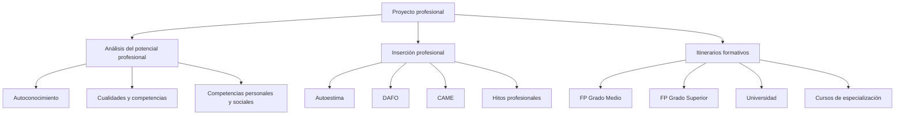

# 🧭 Organizo mis ideas

# 1️⃣ Análisis del potencial profesional

El **proyecto profesional** es una herramienta de planificación personal que permite orientar la carrera laboral a partir del conocimiento de uno mismo y del entorno laboral.

Implica analizar:

- Intereses y motivaciones
- Habilidades y destrezas
- Competencias profesionales
- Competencias personales y sociales
- Itinerarios formativos
- Mercado laboral

> El proyecto profesional **no es estático**: se revisa a lo largo de la vida por cambios tecnológicos, del mercado laboral o personales.

## 1.1 Autoconocimiento

Conocerse a uno mismo es clave para tomar decisiones profesionales acertadas.

Permite:

- Identificar fortalezas y debilidades
- Detectar carencias formativas
- Potenciar cualidades personales
- Mejorar como persona y profesional

> Todas las competencias pueden desarrollarse con esfuerzo y constancia.
---
## Ventana de Johari

Herramienta de autoconocimiento con cuatro áreas:

- **Área pública**: lo que yo y los demás conocen de mí
- **Área oculta**: lo que yo conozco y oculto
- **Área ciega**: lo que otros ven y yo no
- **Área desconocida**: lo que nadie conoce todavía

A mayor área pública → mejor comunicación y relaciones profesionales.

---
## 1.2 Cualidades y competencias profesionales

### Tipos de competencias
| Tipo                           | Descripción                                   |
| ------------------------------ | --------------------------------------------- |
| **Competencia general**        | Capacidades globales del título de FP         |
| **Competencias profesionales** | Habilidades técnicas específicas              |
| **Competencias personales**    | Gestión emocional, responsabilidad, autonomía |
| **Competencias sociales**      | Trabajo en equipo, comunicación, empatía      |

---
### Hard skills y soft skills

- **Hard skills** → conocimientos técnicos
- **Soft skills** → competencias personales y sociales

Ambas son necesarias para la empleabilidad.

---
## 1.3 Competencias personales y sociales con valor para el empleo

En el mercado laboral actual no basta con saber hacer un trabajo:  
también es imprescindible **saber estar y saber ser**.

Ejemplos:

- Comunicación
- Responsabilidad
- Trabajo en equipo
- Empatía
- Resiliencia
- Inteligencia emocional
- Resolución de conflictos
- Asertividad
---
# 2️⃣ La inserción profesional

### 2.1 La autoestima en la búsqueda de empleo

La autoestima es la valoración que una persona hace de sí misma.

Influye directamente en:

- Seguridad personal
- Afrontar procesos de selección
- Gestión del estrés
- Reconocimiento de capacidades y límites

---

### Las 4 dimensiones de la autoestima (Stephen R. Covey)

- **Física**
- **Mental**
- **Espiritual**
- **Social/emocional**

Todas deben mantenerse equilibradas.

---

### Autoestima y pirámide de Maslow

La autoestima se sitúa en los niveles superiores, vinculada a:

- Confianza
- Respeto
- Reconocimiento
- Autorrealización

---

## 2.2 Matriz DAFO y matriz CAME

### Matriz DAFO

Herramienta de análisis personal:

|Interno|Externo|
|---|---|
|Fortalezas|Oportunidades|
|Debilidades|Amenazas|

---
### Matriz CAME

Permite crear un plan de acción a partir del DAFO:

- **Corregir** debilidades
- **Afrontar** amenazas
- **Mantener** fortalezas
- **Explotar** oportunidades

---

## 2.3 Hitos en la trayectoria vital

Los **hitos personales, académicos o laborales** ayudan a:

- Identificar competencias adquiridas
- Preparar entrevistas de trabajo
- Construir el relato profesional

---

# 3️⃣ Itinerarios formativos

### Tras un CF de Grado Medio

- Acceso al mundo laboral
- Bachillerato
- CF de Grado Superior
- Otro CF de Grado Medio
- Curso de especialización

---

### Tras un CF de Grado Superior

- Mundo laboral
- Otro CF de GS
- Curso de especialización
- Universidad (con posible convalidación)

---

### Cursos de especialización

- FP Grado Medio → **Título de Especialista**
- FP Grado Superior → **Máster de FP**

---

### Internacionalización y Europass

- Erasmus+
- Europass CV
- Suplemento Europass al título
- Documento de movilidad

Facilitan la movilidad europea y el reconocimiento profesional.