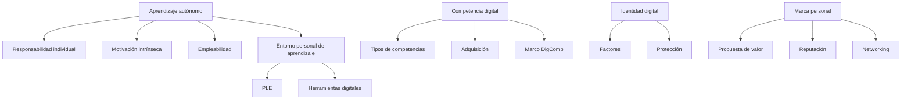

# 🧠 Organizo mis ideas

# 1️⃣ El aprendizaje autónomo

El **aprendizaje autónomo** es la capacidad de una persona para dirigir y controlar su propio proceso de aprendizaje sin depender exclusivamente de un entorno educativo formal.

Implica:

- Asumir la **responsabilidad individual** del aprendizaje.
- Tomar decisiones activas para adquirir conocimientos.
- Actualizar de forma continua las competencias profesionales.

Es una habilidad clave en un entorno laboral caracterizado por:

- Cambios tecnológicos rápidos.
- Evolución constante de las profesiones.
- Necesidad de formación a lo largo de toda la vida laboral.

---

## 1.1 Responsabilidad individual en el aprendizaje

Aunque existen sistemas de formación reglada (FP, universidad) y programas internacionales (Erasmus, Europass), el aprendizaje a lo largo de la vida debe complementarse con **formación autónoma**.

Ser responsable del propio aprendizaje supone:

- Identificar necesidades formativas.
- Buscar recursos adecuados.
- Adaptar conocimientos y destrezas al entorno laboral.

---

## 1.2 Motivación intrínseca

La **motivación intrínseca** es la que nace del interés personal por aprender y mejorar, sin depender de recompensas externas.

En el aprendizaje autónomo:

- Favorece la constancia.
- Incrementa la implicación personal.
- Mejora la empleabilidad como desarrollo personal.

Cuando existe motivación intrínseca, el aprendizaje es más profundo y duradero.

---

## 1.3 Empleabilidad y adaptación al entorno laboral

La **empleabilidad** es la capacidad de acceder, mantenerse y progresar en el mercado laboral.

Está directamente relacionada con:

- El nivel de formación.
- La actitud hacia el aprendizaje continuo.
- La capacidad de adaptación al cambio.

Los empleadores valoran especialmente:

- Actitud proactiva.
- Capacidad para actualizarse.
- Equilibrio entre **hard skills** y **soft skills**.

---

# 2️⃣ El entorno personal de aprendizaje (PLE)

Un **entorno personal de aprendizaje (PLE)** es el conjunto de herramientas, recursos y conexiones que utiliza una persona para aprender de forma autónoma y personalizada.

Características del PLE:

- Se basa en la **autonomía del aprendiz**.
- Evoluciona con el tiempo.
- Se adapta a intereses personales y profesionales.
- No depende de titulaciones oficiales.

---

## 2.1 Configuración del PLE

Un entorno personal de aprendizaje incluye:

- **Objetivos de aprendizaje**  
    Definición de metas personales y profesionales.
    
- **Metodologías de aprendizaje**  
    Uso de nuevas estrategias y herramientas digitales (web 2.0).
    
- **Relaciones personales**  
    Redes de contacto y comunidades digitales.
    
- **Competencias profesionales**  
    Mejora continua del perfil profesional.
    
- **Competencias digitales**  
    Uso eficaz y responsable de la tecnología.
    

---

## 2.2 Edupunk

El **edupunk** es un enfoque educativo alternativo basado en el aprendizaje:

- Autodidacta.
- Informal.
- Descentralizado.
- Personalizado.

Se apoya en la filosofía **“hazlo tú mismo”**, el uso de recursos digitales abiertos y la colaboración en línea, alejándose de estructuras educativas rígidas.

---

# 3️⃣ La competencia digital

La **competencia digital** implica el uso **seguro, crítico, responsable y sostenible** de las tecnologías digitales para el aprendizaje, el trabajo y la participación en la sociedad.

Es fundamental para:

- Mejorar la productividad laboral.
- Trabajar en entornos colaborativos.
- Facilitar el aprendizaje autónomo.
- Adaptarse a la transformación digital.

---

## 3.1 Tipos de competencias digitales

Entre las competencias digitales más relevantes destacan:

- Habilidades básicas informáticas y ofimáticas.
- Alfabetización digital (búsqueda y evaluación de información).
- Comunicación digital.
- Seguridad digital.
- Creación de contenidos digitales.
- Colaboración en línea.
- Análisis de datos.
- Adaptación a nuevas tecnologías, incluida la inteligencia artificial.

Estas competencias evolucionan constantemente y requieren actualización continua.

---

## 3.2 Adquisición de competencias digitales

Las competencias digitales pueden adquirirse mediante:

- Formación reglada.
- Cursos y plataformas online.
- Aprendizaje autónomo y PLE.
- Certificaciones digitales.
- Práctica activa y uso habitual de tecnologías.
- Participación en comunidades digitales.

---

## 3.3 Marco Europeo DigComp

El **Marco Europeo de Competencias Digitales para la Ciudadanía (DigComp)** es una referencia para evaluar y desarrollar la competencia digital.

Características:

- Organiza las competencias en áreas.
- Define **8 niveles de competencia**.
- Sirve como herramienta de autoevaluación y planificación formativa.

---

# 4️⃣ La identidad digital

La **identidad digital** es el conjunto de informaciones publicadas en internet que conforman la imagen que los demás tienen de una persona.

Incluye:

- Datos personales.
- Redes sociales.
- Actividades en línea.
- Reputación digital.

La identidad digital tiene un impacto directo en la **empleabilidad**, ya que muchas empresas consultan los perfiles digitales de los candidatos.

---

## 4.1 Factores que influyen en la identidad digital

- Información personal compartida.
- Presencia en redes sociales.
- Actividad en blogs y foros.
- Reputación y valoraciones en línea.
- Gestión de la privacidad.
- Seguridad digital.
- Desarrollo de la marca personal.

---

## 4.2 Protección de la identidad digital

Para proteger la identidad digital es necesario:

- Revisar la privacidad en redes sociales.
- Limitar la información personal publicada.
- Usar contraseñas seguras y autenticación en dos factores.
- Gestionar conscientemente perfiles y contactos.
- Supervisar la reputación digital periódicamente.

---

# 5️⃣ Marca personal (personal branding)

La **marca personal** es el proceso estratégico de construir y gestionar la imagen profesional de una persona, tanto en línea como fuera de internet.

Su finalidad es:

- Diferenciarse profesionalmente.
- Comunicar la propuesta de valor.
- Mejorar la empleabilidad.

---

## Claves para desarrollar la marca personal

- Definir objetivos profesionales.
- Identificar fortalezas y propuesta de valor.
- Mantener coherencia comunicativa.
- Gestionar la reputación digital.
- Desarrollar networking.
- Apostar por el aprendizaje continuo.

La marca personal es un proceso **dinámico**, que evoluciona con el crecimiento personal y profesional.