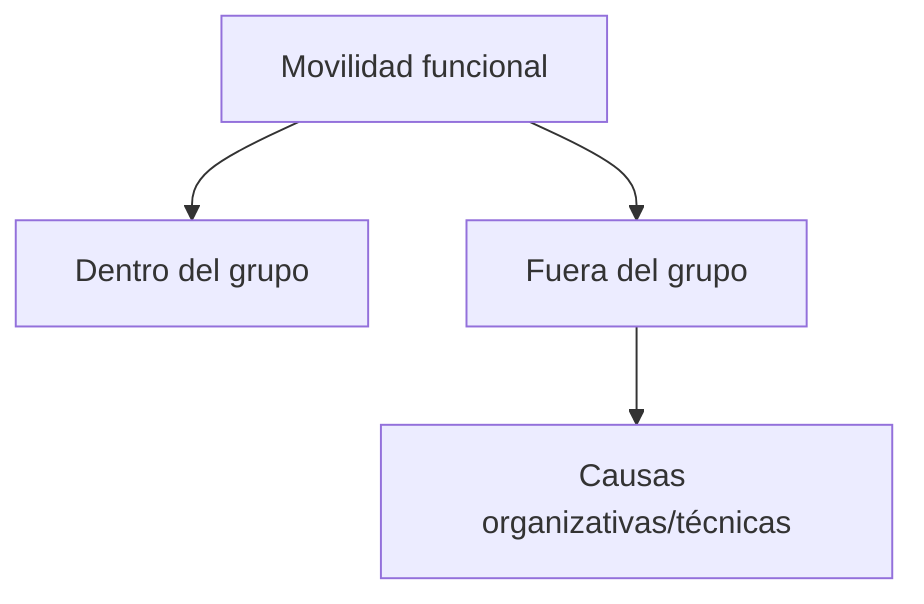

# Movilidad funcional

  

Cambio de tareas dentro de la empresa.

  

## Regla básica

Debe respetar:

- Titulación 

- Competencia profesional 

- Dignidad 

  

## Tipos

- **Dentro del grupo profesional** → permitida libremente.

- **Fuera del grupo** → debe ser temporal y estar justificada.

  

## Diagrama

## Relacionado

- [[U9-Modificacion-Sustancial]]
- [[U9-Concepto-Modificacion]]
