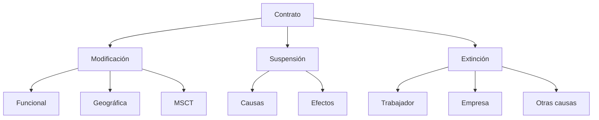

# 📝 Unidad 9 · Revisión Rápida (MINI)

## 🔧 Modificación del contrato

### ✔ Movilidad funcional → [[U9-Movilidad-Funcional]]

- Cambio de tareas.
- Debe respetar: **grupo profesional, titulación, dignidad**.
- Fuera del grupo → **solo temporal y justificada**.

### ✔ Movilidad geográfica → [[U9-Movilidad-Geografica]]

- Cambio de centro con **cambio de residencia**.
- **Traslado** (permanente) · **Desplazamiento** (temporal).
- Derechos: **preaviso + compensación**.

### ✔ Modificación sustancial → [[U9-Modificacion-Sustancial]]

Afecta a:

- Jornada
- Horario
- Salario
- Funciones
- Turnos

El trabajador puede:

- Aceptar
- Impugnar
- Extinguir contrato → **20 días/año**

---

## ⏸ Suspensión del contrato → [[U9-Suspension-Contrato]]

### Causas clave → [[U9-Suspension-Causas]]

- Incapacidad temporal
- Nacimiento/adopción
- Riesgo embarazo/lactancia
- Excedencias
- ERTE
- Huelga legal

### Efectos → [[U9-Suspension-Efectos]]

- No se trabaja · No salario
- Se mantiene **vínculo** y **antigüedad**

---

## 🛑 Extinción del contrato → [[U9-Extincion-Contrato]]

### ✔ Por parte del trabajador → [[U9-Extincion-Causas]]

- Dimisión
- Extinción por MSCT (20 días/año)

### ✔ Por parte de la empresa

- **Despido disciplinario** → 0 días
- **Despido objetivo** → 20 días/año
- **Despido colectivo (ERE)** → 20 días/año

### ✔ Otras causas

- Fin de contrato temporal
- Muerte · Jubilación
- Cierre de empresa

---

## 💰 Indemnizaciones rápidas → [[U9-Indemnizaciones]]

|Tipo|Indemnización|
|---|---|
|Objetivo|**20 días/año** (máx. 12 meses)|
|Improcedente|**33 días/año** (máx. 24 meses)|
|Fin temporal|**12 días/año**|
|ERE|**20 días/año**|

---

## 🧾 Finiquito → [[U9-Finiquito]]

Incluye:

- Salario pendiente
- Pagas extra (proporcional)
- Vacaciones no disfrutadas
- Horas extra
- Indemnización (si aplica)

> Si no estás conforme: **firmar NO CONFORME**

---

## 🔗 Mapa ultra-rápido
