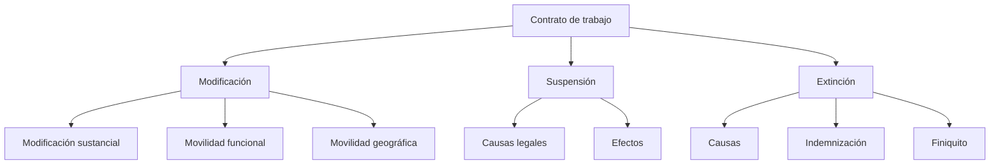
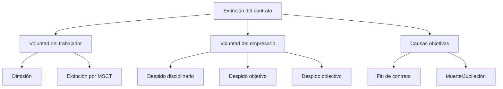

# 🎓 **Unidad 9 — Modificación, suspensión y extinción del contrato de trabajo**

---

## 🧠 **Organizo mis ideas**

---

# 1. 🔧 **Modificación del contrato de trabajo**

> [!info] El contrato puede modificarse cuando existen razones organizativas, técnicas, productivas o económicas que lo justifiquen.

---

## 1.1. **Movilidad funcional**

Afecta a **las funciones/tareas** que realiza el trabajador.

### ✔ Reglas

- Debe respetar **grupo profesional**, **titulación** y **dignidad** del trabajador.
- No puede conllevar **menosprecio** ni pérdida económica.
- **Movilidad dentro del grupo** → libre dentro de lo razonable.
- **Movilidad fuera del grupo** → debe estar justificada y ser temporal.

---

## 1.2. **Movilidad geográfica**

> [!warning] Atiende a cambios de centro de trabajo que implican **cambio de residencia**.

### Tipos

|Tipo|Características|Derechos del trabajador|
|---|---|---|
|**Traslado**|Cambio permanente|Indemnización por gastos + posibilidad de extinguir contrato|
|**Desplazamiento**|Temporal (menos de 12 meses en 3 años)|Gastos de viaje + dieta|

### Requisitos empresa

- Causas justificadas: **económicas, técnicas, organizativas o productivas**.
- **Preaviso mínimo 30 días** en traslados.

---

## 1.3. **Modificación sustancial de las condiciones de trabajo (MSCT)**

> [!danger] Afectan a elementos esenciales del contrato.

### Afecta a:

- Jornada
- Horario
- Régimen de turnos
- Sistema de trabajo y rendimiento
- Funciones
- Retribuciones

### Derechos del trabajador

- **Impugnar** la medida.
- **Rescindir contrato con indemnización** (20 días/año hasta 12 mensualidades).
- Aceptarla.

---

# 2. ⏸ **Suspensión del contrato de trabajo**

> [!note] No se trabaja y no se cobra salario (salvo prestaciones), **pero el vínculo laboral sigue activo**.

---

## 2.1. **Causas legales**

- **Incapacidad temporal** (enfermedad/accidente)
- **Nacimiento/adopción**, riesgo durante embarazo/lactancia
- **Excedencias**
    - Cuidado de hijos
    - Voluntaria
    - Cuidado de familiares
- **Huelga legal**
- **Privación de libertad** (sin condena firme)
- **Suspensión disciplinaria**
- **ERTE** por causas productivas, económicas, técnicas u organizativas
- **Fuerza mayor**

---

## 2.2. **Efectos**

- Se suspende:
    - Prestación de servicios
    - Pago de salario
- Se mantiene:
    - Antigüedad
    - Vinculación contractual
- Puede existir derecho a **prestación económica**, según el caso.

---

# 3. 🛑 **Extinción del contrato de trabajo**

> [!tip] Supone el fin definitivo de la relación laboral.

---

## 3.1. **Causas de extinción**

### ✔ Por voluntad del trabajador

- **Dimisión / baja voluntaria**
- **Abandono**
- **Extinción por modificación sustancial perjudicial**

### ✔ Por voluntad del empresario

- **Despido disciplinario**
    - Incumplimiento grave del trabajador
    - Sin indemnización
- **Despido objetivo**
    - Ineptitud sobrevenida
    - Faltas de adaptación
    - Causas económicas, técnicas, organizativas o productivas
    - Indemnización: **20 días/año (12 meses máx.)**

### ✔ Por causas ajenas a ambas partes

- Muerte, jubilación, incapacidad del trabajador o empresario
- Extinción de la empresa
- Fin de contrato temporal

---

## 3.2. **Indemnizaciones habituales**

|Tipo de extinción|Indemnización|
|---|---|
|Fin de contrato temporal|12 días/año|
|Objetivo|20 días/año (12 meses máx.)|
|Despido improcedente|33 días/año (24 meses máx.)|
|Despido colectivo (ERE)|20 días/año|

---

## 3.3. **Finiquito**

Incluye:

- Salario del mes
- Parte proporcional de pagas extras
- Vacaciones no disfrutadas
- Horas extra
- Indemnización correspondiente (si aplica)

> [!caution] Si no estás conforme → **firma NO CONFORME**.

---

## 3.4. **Esquema general de extinción**

