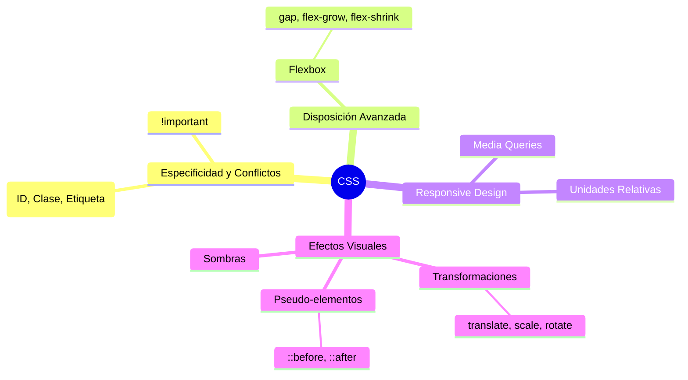

## 1. Introducción a CSS (Hojas de Estilo en Cascada)

> [!info] ¿Qué es CSS? 
> CSS (_Cascading Style Sheets_) es el lenguaje utilizado para describir la presentación y el diseño de un documento escrito en HTML. Separa el contenido (HTML) de la apariencia visual (CSS).

> [!note] Formas de incluir CSS
> 
> 1. **En línea (Inline):** Directamente en la etiqueta HTML usando el atributo `style` (No recomendado para mantenimiento).
>     
> 2. **Interno:** Dentro de la etiqueta `<style>` en el `<head>` del HTML.
>     
> 3. **Externo:** En un archivo `.css` independiente vinculado en el `<head>` con `<link rel="stylesheet" href="estilos.css">` (La forma más óptima).
>     

> [!example] Sintaxis Básica
> ```css
> selector {
> 	propiedad: valor;
>}
>h1 {
> 	color: blue; font-size: 24px;
>  }
> ```
## 2. Selectores y Especificidad

> [!info] Tipos de Selectores Principales
> 
> - **Universal (`*`):** Selecciona todos los elementos.
>     
> - **Etiqueta (`p`, `h1`, `div`):** Selecciona todas las etiquetas de ese tipo.
>     
> - **Clase (`.clase`):** Selecciona elementos con un atributo `class` específico. Reutilizable.
>     
> - **ID (`#id`):** Selecciona un único elemento con ese atributo `id`. No debe repetirse en la página.
>     

> [!note] Pseudo-clases y Combinadores Permiten seleccionar elementos basándose en su estado o posición.
> 
> - `:hover`: Cuando el ratón pasa por encima.
>     
> - `:nth-child(n)`: Selecciona el elemento en la posición _n_.
>     
> - `div p`: (Descendiente) Selecciona las `<p>` dentro de un `<div>`.
>     

## 3. El Modelo de Caja (Box Model)

> [!info] Concepto del Modelo de Caja En CSS, todo elemento HTML se considera una caja rectangular. Esta caja está compuesta por cuatro áreas concéntricas (de fuera hacia dentro):
> 
> 1. **Margin (Margen):** Espacio exterior transparente. Separa el elemento de otros.
>     
> 2. **Border (Borde):** Línea que envuelve el relleno y el contenido.
>     
> 3. **Padding (Relleno):** Espacio transparente entre el contenido y el borde.
>     
> 4. **Content (Contenido):** El área donde se muestra el texto, imagen, etc. (definido por `width` y `height`).
>     

> [!example] `box-sizing: border-box;` 
> Por defecto, el `width` solo aplica al _Content_. Si añades _padding_ o _border_, la caja se hace más grande. Para evitar que el diseño se rompa, se usa esta propiedad para que el ancho total incluya el borde y el relleno.
> ```css
> * {
> 	box-sizing: border-box;
>}
>.caja { 
>	width: 200px;
>	padding: 20px; 
>	border: 2px solid black; 
>	/* La caja ocupará exactamente 200px de ancho total */ 
>}
> ```
## 4. Disposición Web (Layout)

> [!info] Propiedad `display` Define cómo se comporta un elemento en el flujo del documento.
> 
> - **`block`:** Ocupa todo el ancho disponible y fuerza un salto de línea (ej. `<div>`, `<p>`).
>     
> - **`inline`:** Ocupa solo el ancho de su contenido y no permite modificar `width` ni `height` (ej. `<span>`, `<a>`).
>     
> - **`inline-block`:** Se coloca en línea con otros elementos, pero permite aplicarle ancho, alto, márgenes y rellenos.
>     
> - **`none`:** Oculta el elemento por completo y lo saca del flujo (no ocupa espacio).
>     

> [!note] Propiedad `position`
> 
> - **`static`:** Por defecto. Sigue el flujo normal.
>     
> - **`relative`:** Se mueve respecto a su posición original usando `top`, `right`, `bottom`, `left`.
>     
> - **`absolute`:** Se saca del flujo normal y se posiciona respecto a su primer ancestro que tenga posición relativa/absoluta/fija.
>     
> - **`fixed`:** Se posiciona respecto a la ventana del navegador. No se mueve al hacer scroll.
>     
> - **`sticky`:** Actúa como _relative_ hasta que haces scroll y llega a un punto, entonces se vuelve _fixed_.
>     

## 5. CSS Flexbox (Diseño Flexible)

> [!info] Conceptos Básicos de Flexbox 
> Flexbox es un modelo de diseño unidimensional (trabaja en filas O columnas). Se compone de un **Contenedor Flex** (el elemento padre) y los **Items Flex** (los hijos directos).

> [!example] Propiedades del Contenedor (Padre) 
> Para activar Flexbox, debes aplicarlo al contenedor.
> ```css
> .contenedor {
>    display: flex; /* Activa Flexbox */
>    flex-direction: row; /* Dirección principal: row (fila) o column (columna) */
 >   flex-wrap: wrap; /* Permite que los elementos salten a la siguiente línea si no caben */
>    
>    /* Alineación en el EJE PRINCIPAL (horizontal si es row) */
 >   justify-content: center; /* center, space-between, space-around, flex-start, flex-end */
>    
>    /* Alineación en el EJE CRUZADO (vertical si es row) */
>    align-items: center; /* stretch (por defecto), center, flex-start, flex-end */
>}
> ```

> [!example] Propiedades de los Items (Hijos)
> ```css
> .item {
>    order: 1; /* Cambia el orden visual sin tocar el HTML */
 >   flex-grow: 1; /* Define cuánto puede crecer el item para ocupar el espacio restante */
 >   align-self: flex-end; /* Sobrescribe el align-items del contenedor para este único hijo */
>}
> ```
## 6. Transiciones y Animaciones

> [!info] ¿Qué son las Transiciones? 
> Las transiciones en CSS permiten cambiar los valores de las propiedades de un elemento de forma suave y gradual durante un tiempo determinado, en lugar de que el cambio ocurra de manera instantánea. Suelen activarse mediante pseudo-clases como `:hover`, `:focus`, o al añadir/quitar clases con JavaScript.

> [!note] Propiedades de Transición
> 
> - **`transition-property`**: Especifica el nombre de la propiedad CSS a la que se le aplicará el efecto (ej. `background-color`, `width`, `all`).
>     
> - **`transition-duration`**: Define cuánto tiempo tarda en completarse la transición (ej. `0.3s`, `500ms`).
>     
> - **`transition-timing-function`**: Describe cómo se calcula la velocidad de la transición (ej. `ease`, `linear`, `ease-in-out`).
>     
> - **`transition-delay`**: Define un tiempo de espera antes de que comience el efecto (ej. `0.1s`).
>     
> - **`transition` (Shorthand)**: Permite agrupar todas las propiedades anteriores en una sola línea.
>     

> [!example] Ejemplo Práctico: Botón interactivo
> ```css
> .boton {
 >   background-color: blue;
 >   color: white;
 >   padding: 10px 20px;
 >   /* Shorthand: propiedad | duración | función de tiempo | retraso */
 >   transition: background-color 0.3s ease-in-out, transform 0.2s linear;
>}
>.boton:hover { 
>	background-color: darkblue; 
>	transform: scale(1.1); /* El botón crece un 10% suavemente */ 
>}
> ```

> [!info] Animaciones (`@keyframes`) 
> Mientras que las transiciones necesitan un "disparador" (como pasar el ratón por encima), las **animaciones** pueden ejecutarse solas, repetirse en bucle y tener múltiples pasos intermedios.
> 
> - Se definen usando la regla `@keyframes` para establecer los pasos (del `0%` al `100%`).
>     
> - Se aplican al elemento usando propiedades como `animation-name` y `animation-duration`.
>     

> [!example] Ejemplo Práctico: Animación en bucle
> ```css
> /* 1. Definimos la animación */
>@keyframes parpadeo {
>	0% { opacity: 1; }
 >	50% { opacity: 0; }
> 	100% { opacity: 1; }
>}
>/* 2. Aplicamos la animación al elemento */ 
>.alerta { 
>	animation-name: parpadeo; 
>	animation-duration: 2s; 
>	animation-iteration-count: infinite; /* Se repite para siempre */ 
>}
> ```

## 7. Especificidad y Conflictos (La Cascada)

> [!info] ¿Qué es la Especificidad? Cuando hay varias reglas CSS que apuntan al mismo elemento y entran en conflicto (por ejemplo, dos reglas intentan darle un color distinto), el navegador decide cuál aplicar basándose en un sistema de "puntos" o peso.

> [!note] Jerarquía de Especificidad (De mayor a menor peso)
> 
> 1. **`!important`**: Sobrescribe cualquier otra regla. (Usar con extrema precaución).
>     
> 2. **Estilos en línea**: Atributo `style` dentro del HTML (1000 puntos).
>     
> 3. **ID (`#id`)**: (100 puntos).
>     
> 4. **Clases (`.clase`), Pseudo-clases (`:hover`) y Atributos**: (10 puntos).
>     
> 5. **Etiquetas (`div`, `h1`) y Pseudo-elementos (`::before`)**: (1 punto).
> _Nota: Si dos reglas tienen exactamente los mismos puntos, "gana" la última que se haya escrito en el archivo CSS (efecto cascada)._
>     

> [!example] Ejemplo Práctico de Conflicto
> ```css
> /* Esta regla tiene 1 punto (Etiqueta) */
>p { color: blue; }
> /* Esta regla tiene 10 puntos (Clase) -> GANARÁ ESTA */ 
> .texto-destacado { color: red; }
> /* Esta regla gana a todas porque tiene !important */ 
> p { color: green !important; }
> ```
## 8. Transformaciones (Transforms)

> [!info] Propiedad `transform` 
> Para que las transiciones de las que hablamos antes sean realmente espectaculares, se suelen combinar con transformaciones. Modifican el espacio visual de un elemento (lo mueven, lo giran o le cambian el tamaño) sin afectar al flujo del resto de elementos de la página.

> [!example] Funciones de Transformación más comunes
> ```css
> .caja {
>    /* Mueve el elemento en el eje X (horizontal) e Y (vertical) */
 >   transform: translate(50px, 100px); 
>    
 >   /* Aumenta (o disminuye) el tamaño. 1.5 es un 150% de su tamaño original */
>    transform: scale(1.5); 
>    
>    /* Gira el elemento en grados */
>    transform: rotate(45deg); 
>  
>    /* Se pueden combinar en una sola línea */
>    transform: translateX(20px) scale(1.2) rotate(10deg);
>}
> ```

