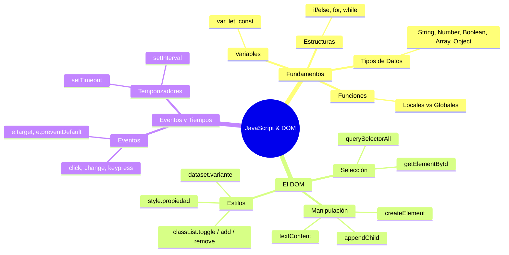

## Índice
[[1. Introducción a JavaScript]]
[[2. Variables y Tipos de Datos]]
[[3. Estructuras de Control]]
[[4. Funciones y Objetos]]
[[5. El DOM (Document Object Model)]]
[[6. Eventos y Temporizadores]]
## 1. Introducción a JavaScript

> [!info] Concepto Base 
> JavaScript es un lenguaje de programación interpretado. Se utiliza principalmente para crear páginas web dinámicas , acceder a elementos de la página web y realizar llamadas asíncronas al servidor.
> 

> [!example] Salidas de datos (Output)
> ```js
> // Muestra una ventana emergente en el navegador
alert("¡Hola mundo!"); 
// Imprime mensajes en la consola para depuración 
console.log('Hola, saludamos a la consola!'); console.error('Mostrando un error');
// Escribe directamente en el documento HTML 
document.write('Hola este mensaje se mostrará en mi web');
> ```
## 2. Variables y Tipos de Datos

> [!note] Declaración de variables (ES6) 
> * **`var`**: Declara variables sin ámbito de bloque y se pueden volver a declarar. 
> * **`let`**: Declara variables con ámbito de bloque y no se pueden volver a declarar. 
> * **`const`**: Declara constantes de sólo lectura con ámbito de bloque.

> [!info] Tipos de Datos Principales 
> * **number**: Valor numérico (enteros, decimales, etc.). 
> * **string**: Valor de texto (cadenas de texto, carácteres). 
> * **Boolean**: Valores verdadero o falso. 
> * **Undefined**: Valor sin definir. 
> * **Object**: Estructura más compleja.

> [!example] Arrays y sus Métodos 
> Un array es un conjunto de elementos.
> ```js
> let amigos = ["Carlos", "Fernando", "Lucía", "Alejandro"];
> let longitudArreglo = amigos.length; // Longitud del array 
> amigos.push("Rosa", "Elena", "Ricardo"); // Añade elementos al final 
> amigos.pop(); // Borra el último elemento
> 
> let amigosNuevos = ["Mila", "Lucas", "Pepe"]; 
> let amigosTotales = amigos.concat(amigosNuevos); // Concatena arreglos
> ```
## 3. Estructuras de Control

> [!example] Condicionales y Bucles
> ```js
> // Condicionales (if, else if, else)
>let edad = 27; 
>if (edad === 30) { 
>    document.write("Si la edad es 30");
>} else { 
>    document.write("Si no se cumple ninguna");
>}
>// Bucle FOR: Itera un número de veces 
>for (let i = 0; i <= 10; i++) { 
>	document.write(i + " ");
>}
>// Bucle WHILE / DO... WHILE
>//While pregunta y luego ejecuta
>let i= 0
>while(i <= 10){
>	document.write(i+ "<br>");
>	i++;
>}
>//Do While , Ejecuta una vez y luego pregunta
>let j=0
>do{
>	document.write(i);
>	j++;
>}
>while(j<=5){
>}
> ```
## 4. Funciones y Objetos

> [!info] Funciones (Locales vs Globales) Las funciones contienen código reutilizable y deben retornar un valor. 
> * **Variables Globales**: Están fuera de las funciones y pueden usarse en todo el documento. 
> * **Variables Locales**: Están dentro de las funciones y solo se pueden usar en esa función.

> [!example] Sintaxis de Funciones y Objetos
> ```js
> // Función tradicional
>function resta (valor1, valor2) {
 >   let resultado = valor1 - valor2;
>    return resultado; 
>}
>// Objeto y uso de "this" 
>var myCar = { make: "Ford", model: "Mustang", imprime: function() { // "this" se usa dentro de un método para referirse al objeto actual 
>	console.log("Este coche es un: " + this.make); } 
>	};
> ```
## 5. El DOM (Document Object Model)

> [!info] ¿Qué es el DOM? 
> Es la estructura de nuestro sitio web conformada en nodos de forma jerárquica y arbolea para poder acceder a los elementos con JavaScript. Los elementos están incluidos en el interior de una variable llamada `document`.

> [!example] Manipulación del DOM
> ```js
> // 1. Seleccionar Elementos
>let elemento1 = document.getElementById("elemento"); 
>let parrafos = document.querySelectorAll("p.azul");
>
> // 2. Crear e Insertar Nodos Nuevos 
> let nuevo = document.createElement("h3"); 
> let contenido = document.createTextNode("Este es mi nuevo Elemento"); 
> nuevo.appendChild(contenido); // Junta el elemento con el contenido 
> document.body.appendChild(nuevo); // Agrega en el documento
> 
> // 3. Estilos y Clases 
> nuevo.setAttribute("class", "misubtitulo"); // Añade atributo de clase 
> titulo.className = "tituloGrande"; // Asigna clase 
> titulo.style.color = "black"; // Aplica estilo en línea 
> ```
### 5.1 Manipulación de Estilos, Atributos y Textos (Aplicación Práctica)

> [!info] Modificar Clases CSS (`classList`) La forma más moderna y limpia de cambiar el aspecto de un elemento es mediante sus clases predefinidas.
> 
> - `classList.add('clase')`: Añade la clase especificada.
>     
> - `classList.remove('clase')`: Quita la clase.
>     
> - `classList.toggle('clase')`: Es un interruptor. Si tiene la clase, se la quita; si no la tiene, se la añade.
>     

> [!info] Atributos Personalizados (`data-*`) y Textos
> 
> - **Dataset**: Permite leer y escribir atributos que empiezan por `data-` transformándolos a camelCase.
>     
> - **Actualizar Textos**: Usar la propiedad `textContent` permite actualizar el contenido textual de una etiqueta sin inyectar HTML, lo que lo hace muy seguro y rápido.
>     

> [!example] Aplicando Estilos y Textos (DOM Dinámico)
> ```js
> // Cambiar texto visible
>const texto = document.querySelector("#bannerText");
>texto.textContent = "Nuevo mensaje aquí";
>
> // Manipular variables de datos personalizadas (ej. data-variant="info") 
> const banner = document.querySelector("#banner"); 
> banner.dataset.variant = "warn"; // Cambia en el HTML a data-variant="warn" 
> banner.removeAttribute("data-variant"); // Elimina el atributo por completo
> 
> // Alternar un modo oscuro con toggle 
> const btnTheme = document.querySelector("#btnTheme"); 
> btnTheme.addEventListener("click", () => { 
> document.body.classList.toggle("dark"); 
> });
> 
> // Inyectar estilos en línea directamente (cuidado, usar unidades como %) 
> const barra = document.querySelector("#bar"); 
> barra.style.width = "50%"; // Equivalente a inyectar style="width: 50%;"
> ```
## 6. Eventos y Temporizadores

> [!info] Tipos de Eventos Comunes 
> * **click**: Cada vez que hagamos Clic encima del Input. 
> * **change**: Dará el mensaje en console sólo cuando cambie el contenido de mi input. Se utiliza para comprobar nombres de usuario una vez que se complete el campo Input. 
> * **keypress**: Este evento se usa como disparador para activar la lógica de predicción del texto así como vayamos escribiendo en el Input.

> [!example] Escuchadores de Eventos (Event Listeners)
> ```js
> let boton = document.getElementById("boton");
> let holaMundo = function(e) { 
> 
> //Nos indica qué evento se está ejecutando 
> console.log("El tipo de evento es " + e.type); 
> 
> // Nos indica sobre qué elemento se está ejecutando ese evento
> console.log("El elemento es " + e.target);
> 
> // Evita que se ejecute la acción predeterminada 
> e.preventDefault();
> }
> boton.addEventListener("click", holaMundo);
> ```
### 6.1 Animaciones y Retrasos (`setTimeout`)

> [!info] Controlando el tiempo (`setTimeout`) 
> La función `setTimeout` permite ejecutar un bloque de código **una sola vez** después de que haya transcurrido un tiempo específico en milisegundos. Es la herramienta clave para crear efectos encadenados o animaciones por pasos (como el efecto de sacudida o _shake_ de la práctica).

> [!example] Ejemplo Práctico: Efecto Shake
> ```js
> const card = document.querySelector("#card");
> btnShake.addEventListener("click", () => { 
> // Paso 1: Mover a la izquierda inmediatamente 
> card.style.transform = "translateX(-10px)";
> // Paso 2: A los 80ms, mover a la derecha 
> setTimeout(() => { card.style.transform = "translateX(10px)"; 
> }, 80);
> // Paso 3: A los 160ms, devolver al centro 
> setTimeout(() => { 
> 	card.style.transform = "translateX(0px)"; 
> 	}, 160);
> });
> ```
> 
> 

