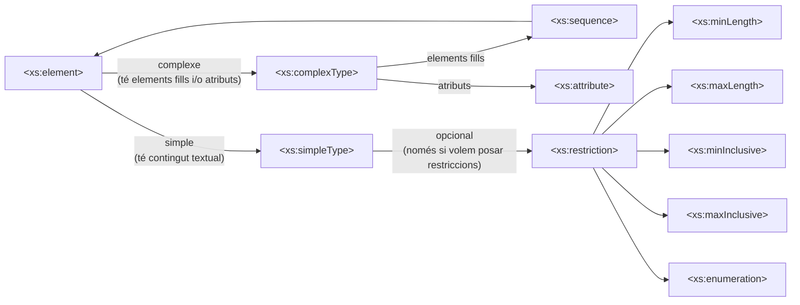

```mermaid
graph LR
    %% Definición de nodos
    A["&lt;xs:element&gt;"]
    B["&lt;xs:complexType&gt;"]
    C["&lt;xs:simpleType&gt;"]
    D["&lt;xs:sequence&gt;"]
    E["&lt;xs:attribute&gt;"]
    F["&lt;xs:restriction&gt;"]
    
    %% Nodos de restricciones
    G["&lt;xs:minLength&gt;"]
    H["&lt;xs:maxLength&gt;"]
    I["&lt;xs:minInclusive&gt;"]
    J["&lt;xs:maxInclusive&gt;"]
    K["&lt;xs:enumeration&gt;"]

    %% Conexiones y etiquetas
    A -->|"complexe<br>(té elements fills i/o atributs)"| B
    A -->|"simple<br>(té contingut textual)"| C
    
    B -->|"elements fills"| D
    B -->|"atributs"| E
    
    %% Flecha de retorno de sequence a element
    D --> A
    
    C -->|"opcional<br>(només si volem posar restriccions)"| F
    
    %% Conexiones desde restriction a los diferentes tipos
    F --> G
    F --> H
    F --> I
    F --> J
    F --> K
```