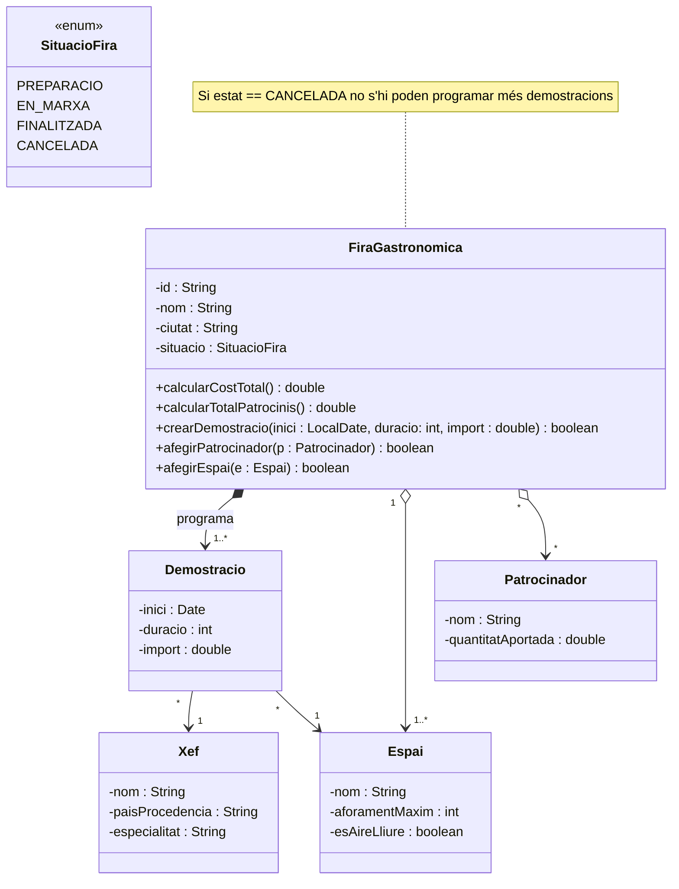

```mermaid
classDiagram
	class FiraGastronomica{
		-id : String
		-nom : String
		-ciutat : String
		-situacio : SituacioFira
		+calcularCostTotal() double
		+calcularTotalPatrocinis() double
		+crearDemostracio(inici : LocalDate, duracio: int, import : double) boolean
		+afegirPatrocinador(p : Patrocinador) boolean
		+afegirEspai(e : Espai) boolean
	}
	class Espai{
		-nom : String
		-aforamentMaxim : int
		-esAireLliure : boolean
	}
	class Demostracio{
	-inici : Date
	-duracio : int
	-import : double
	
	}
	class Xef{
		-nom : String
		-paisProcedencia : String
		-especialitat : String
	}
	class Patrocinador{
		-nom : String
		-quantitatAportada : double
	}
	class SituacioFira{
	<<enum>>
		PREPARACIO
		EN_MARXA
		FINALITZADA
		CANCELADA
	}
	FiraGastronomica *--> "1..*"Demostracio : programa
	FiraGastronomica "1" o--> "1..*" Espai
	Demostracio "*"-->"1" Xef
	FiraGastronomica "*" o--> "*" Patrocinador
	Demostracio "*" --> "1"Espai
	
	note for FiraGastronomica "Si estat == CANCELADA no s'hi poden programar més demostracions"
```

[[Diagrama Examen Programación.png]]