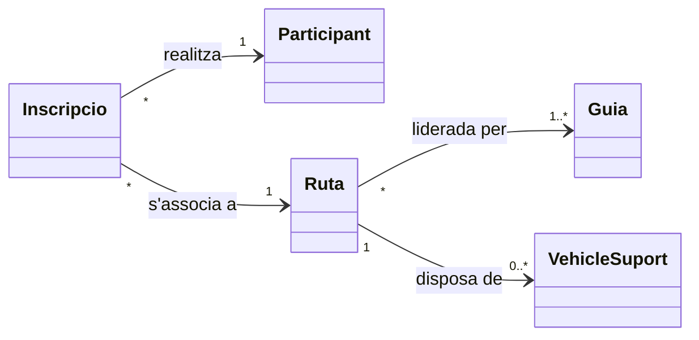
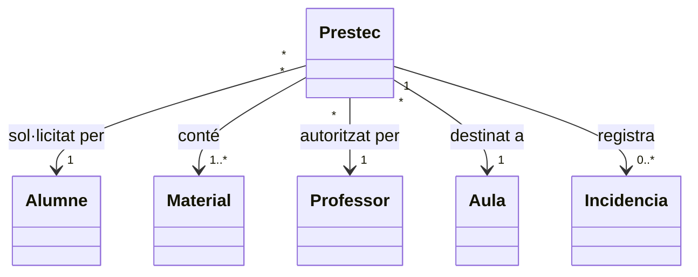
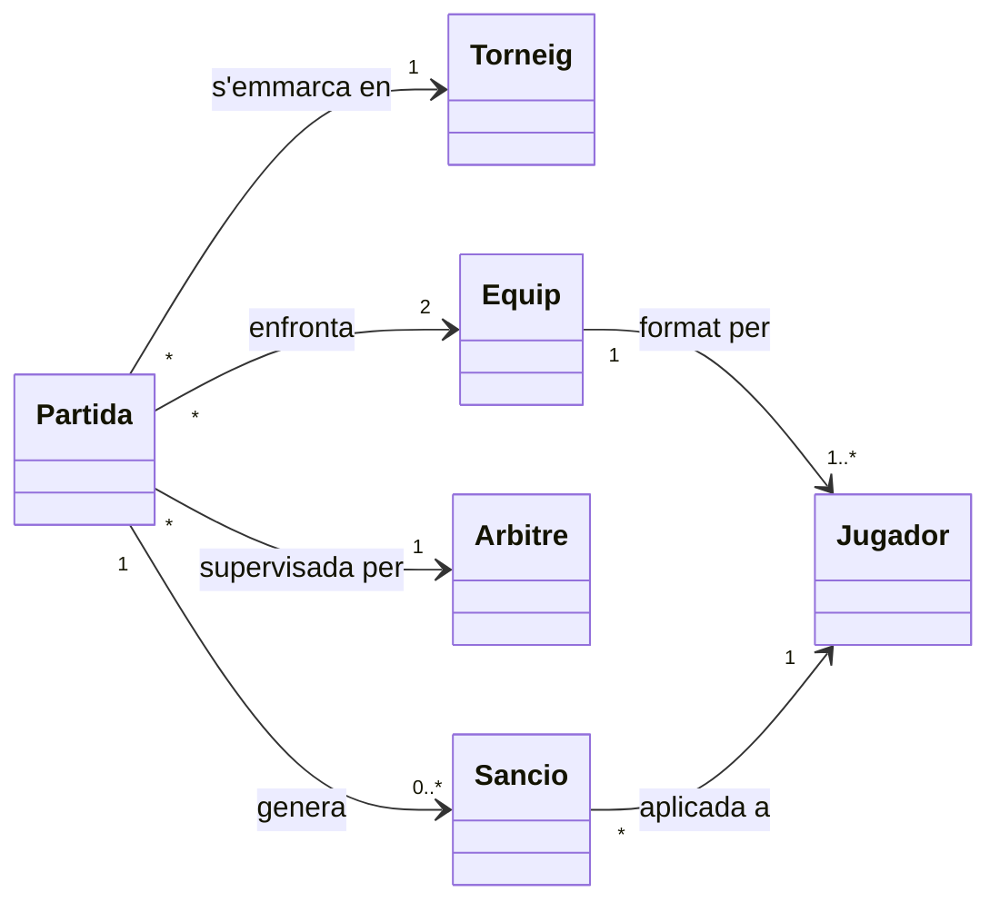

A.

```mermaid
classDiagram
    direction LR
    class Inscripcio
    class Participant
    class Ruta
    class Guia
    class VehicleSuport

    Inscripcio "*" --> "1" Participant : realitza
    Inscripcio "*" --> "1" Ruta : s'associa a
    Ruta "*" --> "1..*" Guia : liderada per
    Ruta "1" --> "0..*" VehicleSuport : disposa de
	
```
B

```mermaid
classDiagram
    class Prestec
    class Alumne
    class Material
    class Professor
    class Aula
    class Incidencia

    Prestec "*" --> "1" Alumne : sol·licitat per
    Prestec "*" --> "1..*" Material : conté
    Prestec "*" --> "1" Professor : autoritzat per
    Prestec "*" --> "1" Aula : destinat a
    Prestec "1" --> "0..*" Incidencia : registra
```
C

```mermaid
classDiagram
    direction LR
    class Partida
    class Torneig
    class Equip
    class Arbitre
    class Jugador
    class Sancio

    Partida "*" --> "1" Torneig : s'emmarca en
    Partida "*" --> "2" Equip : enfronta
    Partida "*" --> "1" Arbitre : supervisada per
    Partida "1" --> "0..*" Sancio : genera
    Equip "1" --> "1..*" Jugador : format per
    Sancio "*" --> "1" Jugador : aplicada a
```