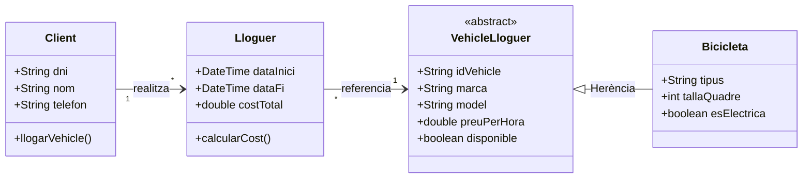

```mermaid
classDiagram
direction LR
    class VehicleLloguer {
    <<abstract>>
        +String idVehicle
        +String marca
        +String model
        +double preuPerHora
        +boolean disponible
    }

    class Bicicleta {
        +String tipus
        +int tallaQuadre
        +boolean esElectrica
    }

    class Client {
        +String dni
        +String nom
        +String telefon
        +llogarVehicle()
    }

    class Lloguer {
        +DateTime dataInici
        +DateTime dataFi
        +double costTotal
        +calcularCost()
    }

    %% Relacions
    VehicleLloguer <|-- Bicicleta : Herència
    Client "1" --> "*" Lloguer : realitza
    Lloguer "*" --> "1" VehicleLloguer : referencia
	
```