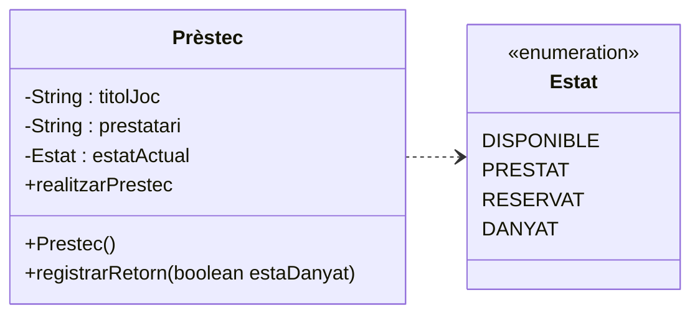

```mermaid
classDiagram
direction LR
	class Prèstec{
	-String : titolJoc
	-String : prestatari
	-Estat : estatActual
	+Prestec()
	+realitzarPrestec 
	+registrarRetorn(boolean estaDanyat)
	}
	class Estat{
	<<enumeration>>
	DISPONIBLE
	PRESTAT
	RESERVAT
	DANYAT
	}
	Prèstec ..> Estat
```