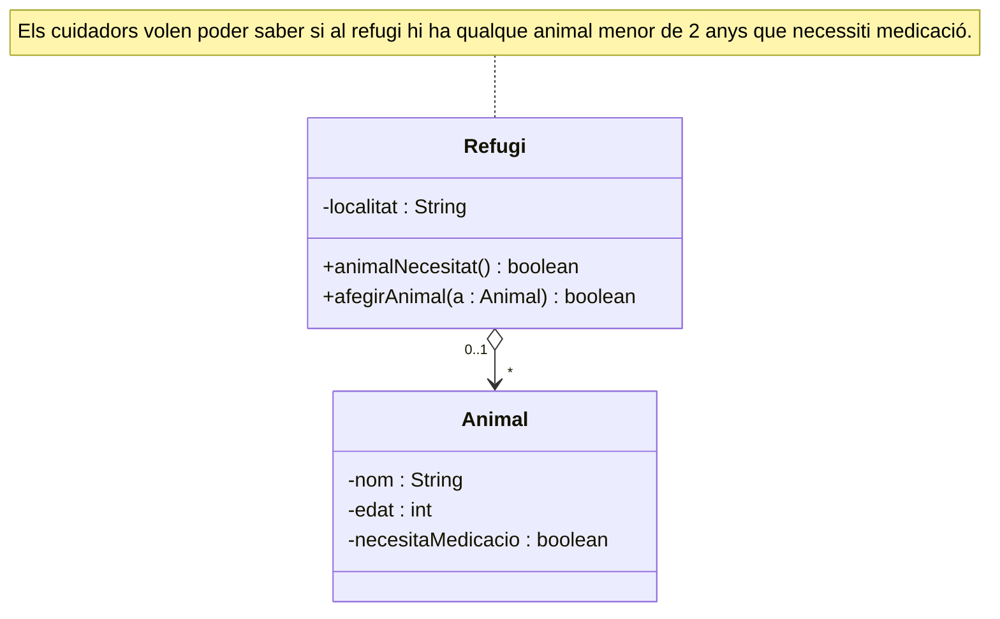

```mermaid
classDiagram
	class Refugi{
		-localitat : String
		+animalNecesitat() boolean
		+afegirAnimal(a : Animal ) boolean
	}
	class Animal{
		-nom : String
		-edat : int
		-necesitaMedicacio : boolean
	}
	Refugi "0..1" o--> "*" Animal 
	note for Refugi "Els cuidadors volen poder saber si al refugi hi ha qualque animal menor de 2 anys que necessiti medicació."
```