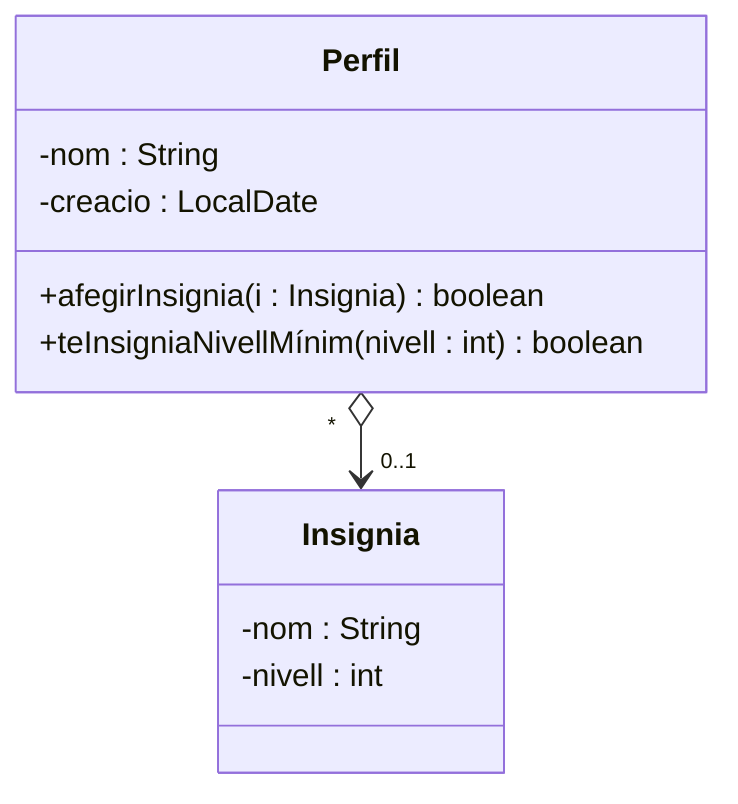

```mermaid
classDiagram
	class Perfil{
		-nom : String
		-creacio : LocalDate
		+afegirInsignia(i : Insignia) boolean
		+teInsigniaNivellMínim(nivell : int) boolean
	}
	class Insignia{
		-nom : String
		-nivell : int
	}
	Perfil "*" o--> "0..1" Insignia

```