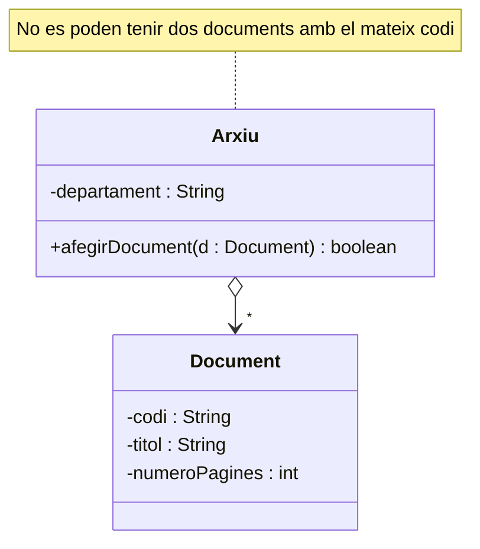

```mermaid
classDiagram
	class Document{
		-codi : String
		-titol : String
		-numeroPagines : int
	}
	class Arxiu{
		-departament : String
		+afegirDocument(d : Document) boolean
	}
	Arxiu o--> "*"Document
	note for Arxiu "No es poden tenir dos documents amb el mateix codi"
```

![[Diagrama EjerciciosRefuerzo1.5.png]]