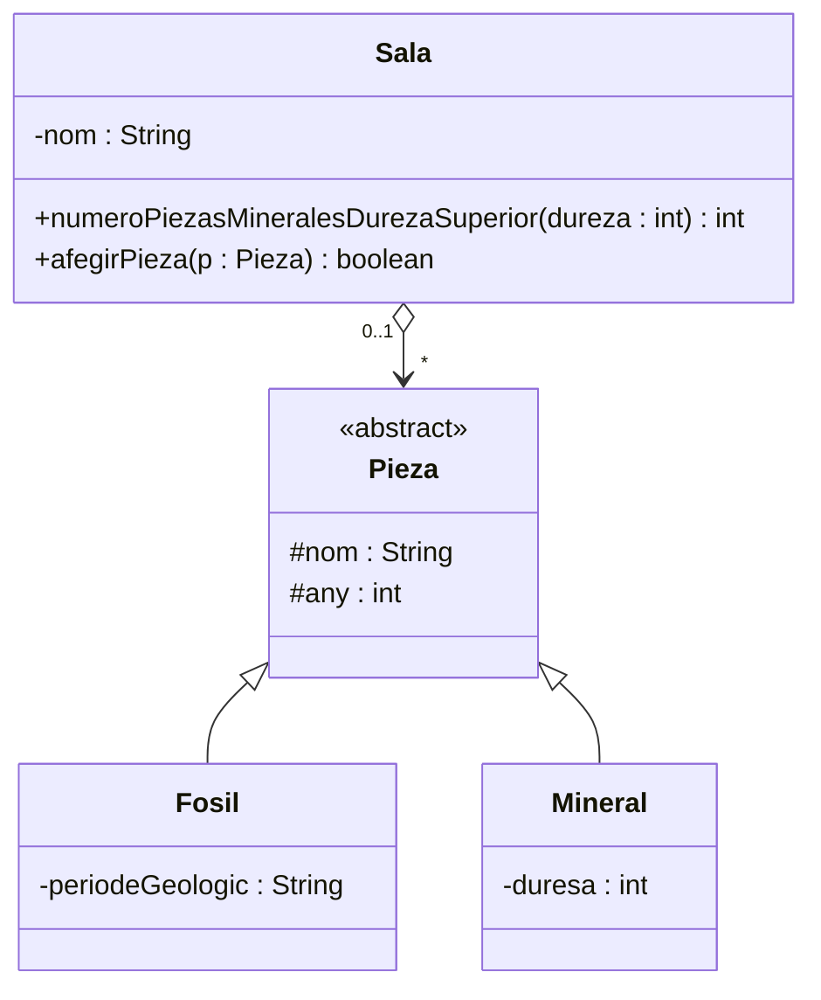

```mermaid
classDiagram
	class Pieza{
	<<abstract>>
		#nom : String
		#any : int
	}
	class Fosil{
		-periodeGeologic : String 
	}
	class Mineral{
		-duresa : int
	}
	class Sala{
		-nom : String
		+numeroPiezasMineralesDurezaSuperior (dureza : int) int
		+afegirPieza(p : Pieza) boolean
	}
	Sala "0..1" o-->"*" Pieza
	Pieza <|-- Fosil
	Pieza <|-- Mineral
	
	
```
![[Diagrama EjerciciosRefuerzo1.6.png]]