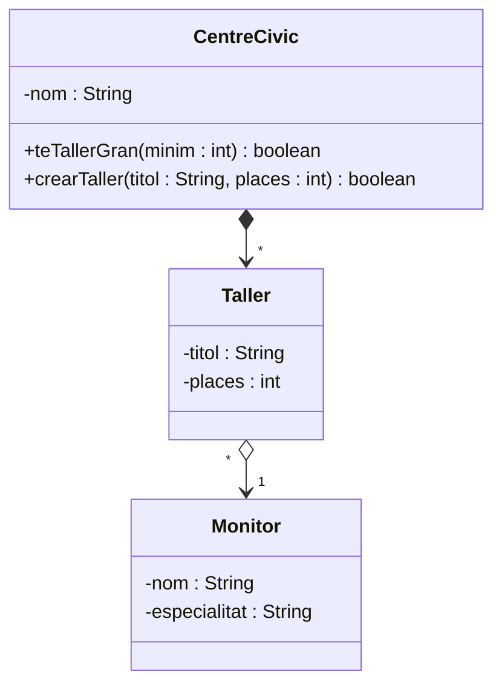
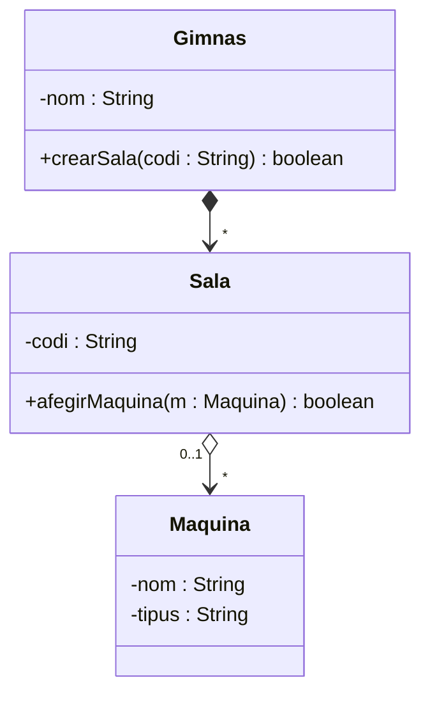
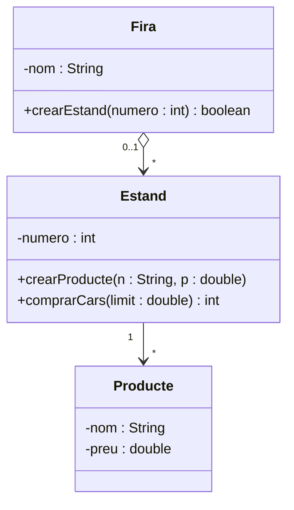

## a

```mermaid
classDiagram
	class CentreCivic{
		-nom : String
		+teTallerGran(minim : int) boolean
		+crearTaller(titol : String, places : int) boolean
	}
	class Taller{
		-titol : String
		-places : int
	}
	class Monitor{
		-nom : String
		-especialitat : String
	}
	CentreCivic  *--> "*" Taller
	Taller "*" o--> "1" Monitor
```

## b

```mermaid
classDiagram
	class Gimnas{
		-nom : String
		+crearSala(codi : String) boolean
	}
	class Sala{
		-codi : String
		+afegirMaquina(m : Maquina) boolean
		
	}
	class Maquina{
		-nom : String
		-tipus : String
	}
	Gimnas *--> "*"Sala
	Sala "0..1" o--> "*" Maquina
```

## c

```mermaid
classDiagram
	class Fira{
		-nom : String
		+crearEstand(numero : int) boolean
	}
	class Estand{
		-numero : int
		+crearProducte(n : String, p : double)
		+comprarCars(limit : double) int
	}
	class Producte{
	-nom : String
	-preu : double
	}
	Fira "0..1" o--> "*" Estand
	Estand "1" --> "*" Producte
```