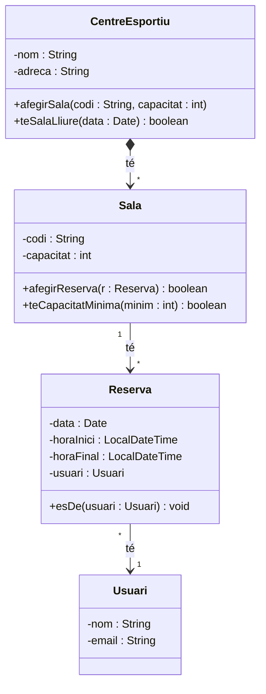

```mermaid
classDiagram
	class CentreEsportiu{
		-nom : String
		-adreca : String
		+afegirSala(codi : String, capacitat : int)
		+teSalaLliure (data : Date) boolean
	}
	class Sala{
		-codi : String
		-capacitat : int
		+afegirReserva(r : Reserva) boolean
		+teCapacitatMinima(minim : int) boolean
	}
	class Reserva{
		-data : Date
		-horaInici : LocalDateTime
		-horaFinal : LocalDateTime
		-usuari : Usuari
		+esDe(usuari : Usuari) void
	}
	class Usuari{
		-nom : String
		-email : String
	}
	CentreEsportiu *--> "*" Sala : té
	Sala "1" --> "*" Reserva : té
	Reserva "*" --> "1" Usuari : té
```