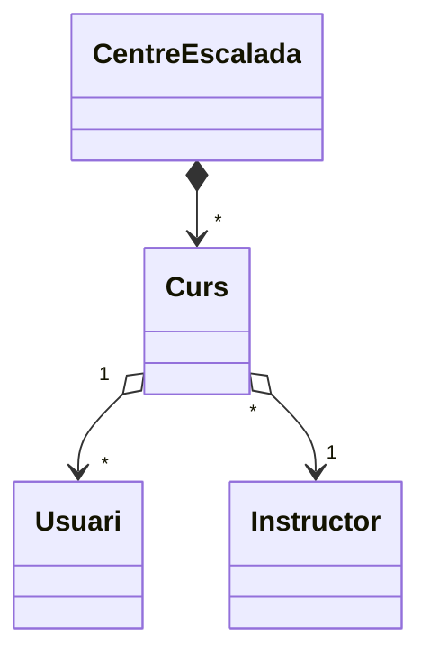
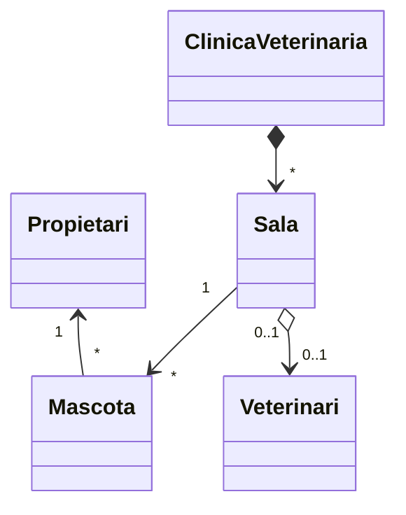
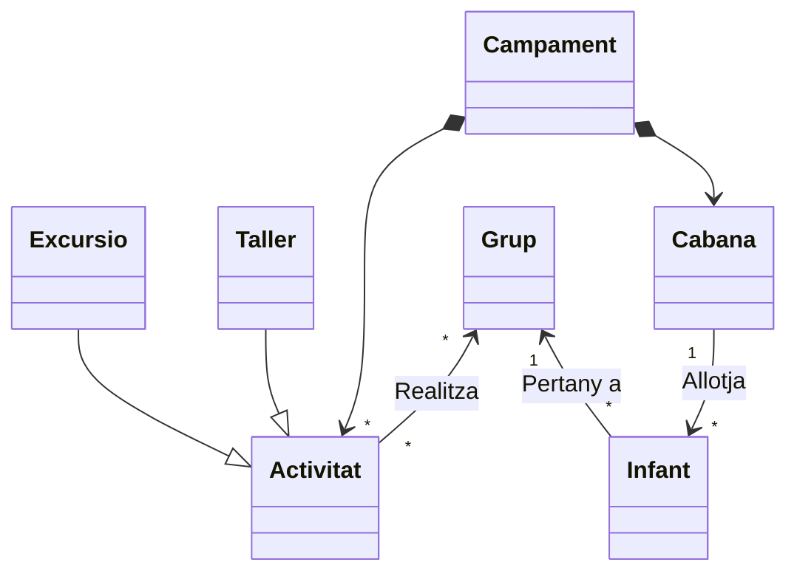

## a

```mermaid
classDiagram
	class CentreEscalada
	class Curs
	class Usuari
	class Instructor
	CentreEscalada *--> "*" Curs
	Curs "1" o--> "*"Usuari
	Curs "*" o--> "1" Instructor
```

## b

```mermaid
classDiagram
	class ClinicaVeterinaria
	class Sala
	class Mascota
	class Propietari
	class Veterinari
	
	ClinicaVeterinaria *--> "*" Sala
	Sala "1" --> "*" Mascota
	Propietari "1" <-- "*" Mascota
	Sala "0..1" o--> "0..1" Veterinari
```
## c

```mermaid
classDiagram
    
    class Cabana
    class Infant
    class Grup
    class Activitat
    class Taller
    class Excursio
    class Campament

    Cabana "1" --> "*" Infant : Allotja
    Grup "1" <-- "*" Infant : Pertany a
    Grup "*" <-- "*" Activitat : Realitza
    Campament *--> "*" Activitat
    Campament *--> Cabana
    
    Taller --|> Activitat
    Excursio --|> Activitat
```