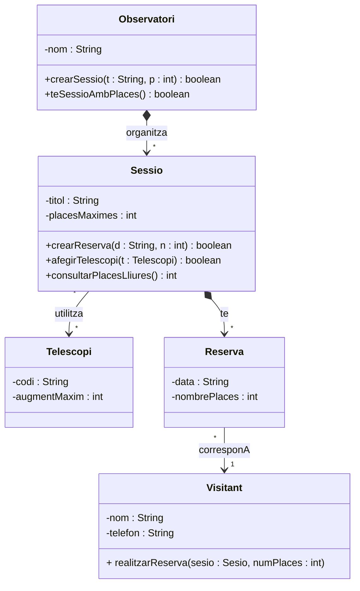
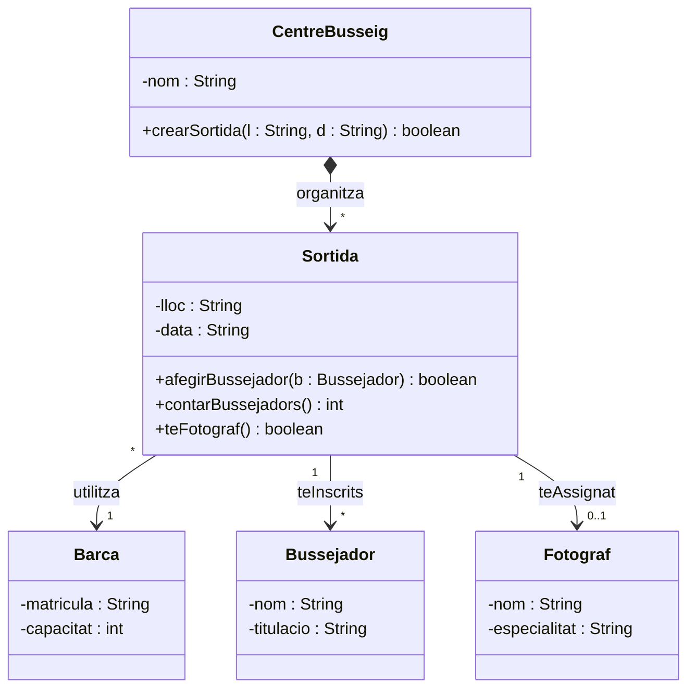

## a

```mermaid
classDiagram
	class Observatori{
		-nom : String
		+crearSessio(t : String, p : int) boolean
		+teSessioAmbPlaces() boolean
	}
	class Sessio{
		-titol : String
		-placesMaximes : int
		+crearReserva(d : String, n : int) boolean
		+afegirTelescopi( t : Telescopi) boolean
		+consultarPlacesLliures() int 
	}
	class Telescopi{
		-codi : String
		-augmentMaxim : int
	}
	class Reserva{
		-data : String
		-nombrePlaces : int
	}
	class Visitant{
		-nom : String
		-telefon : String
		+ realitzarReserva(sesio : Sesio, numPlaces : int)
	}
	Observatori *--> "*" Sessio : organitza
	Sessio "*" --> "*" Telescopi : utilitza
	Sessio *--> "*" Reserva : te
	Reserva "*" --> "1" Visitant : corresponA
```
## b

```mermaid
classDiagram
	class CentreBusseig{
		-nom : String
		+crearSortida(l : String, d : String) boolean
	}
	class Sortida{
		-lloc : String
		-data : String
		+afegirBussejador(b : Bussejador) boolean
		+contarBussejadors() int
		+teFotograf() boolean
	}
	class Barca{
		-matricula : String
		-capacitat : int
	}
	class Bussejador{
		-nom : String
		-titulacio : String
	}
	class Fotograf{
		-nom : String
		-especialitat : String
	}
	CentreBusseig *--> "*" Sortida : organitza
	Sortida "*" --> "1" Barca : utilitza
	Sortida "1" --> "*" Bussejador : teInscrits
	Sortida "1" --> "0..1" Fotograf : teAssignat
```