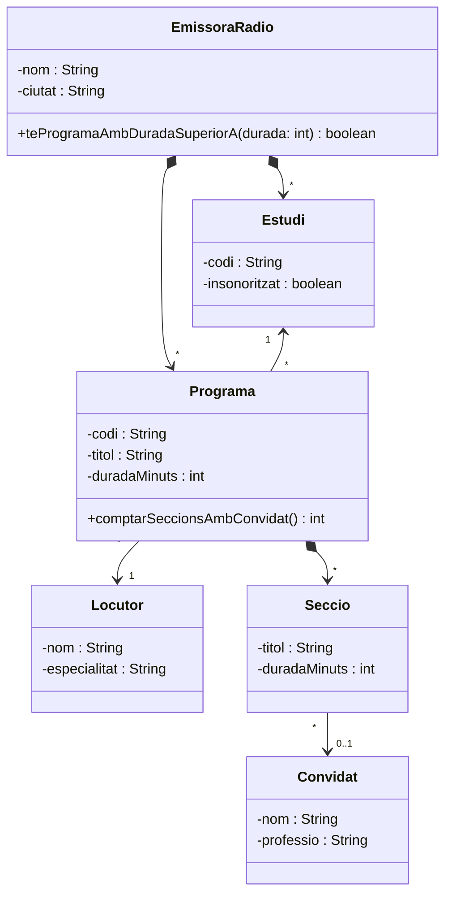

```mermaid
classDiagram
	class EmissoraRadio{
		-nom : String
		-ciutat : String
		+teProgramaAmbDuradaSuperiorA(durada: int) boolean
	}
	class Estudi{
		-codi : String
		-insonoritzat : boolean
	}
	class Programa{
		-codi : String
		-titol : String
		-duradaMinuts : int
		+comptarSeccionsAmbConvidat() int
	}
	class Locutor{
		-nom : String
		-especialitat : String
	}
	class Seccio{
		-titol : String
		-duradaMinuts : int
	}
	class Convidat{
		-nom : String
		-professio : String
	}
	EmissoraRadio *--> "*" Programa
	Seccio "*" --> "0..1" Convidat
	Programa *--> "*" Seccio
	EmissoraRadio *--> "*" Estudi
	Estudi "1" <-- "*"Programa
	Programa "*" --> "1" Locutor
	
```
![[Diagrama Apartado A.drawio.png]]