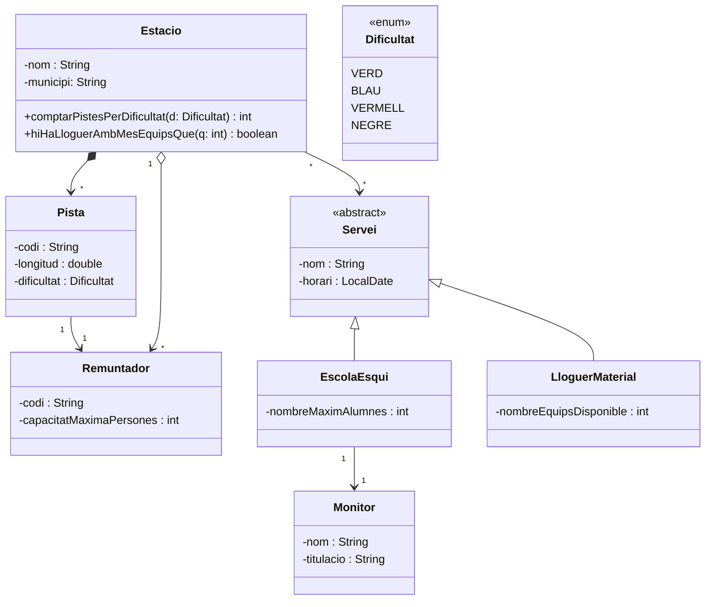

```mermaid
classDiagram
	class Estacio{
		-nom : String
		-municipi: String
		+comptarPistesPerDificultat(d: Dificultat) int
		+hiHaLloguerAmbMesEquipsQue(q: int) boolean
	}
	class Pista{
		-codi : String
		-longitud : double
		-dificultat : Dificultat
	}
	class Dificultat{
	<<enum>>
		VERD
		BLAU
		VERMELL
		NEGRE
	}
	class Remuntador{
		-codi : String
		-capacitatMaximaPersones : int
	}
	class Servei{
	<<abstract>>
		-nom : String
		-horari : LocalDate
	}
	class EscolaEsqui{
		-nombreMaximAlumnes : int
	}
	class LloguerMaterial{
		-nombreEquipsDisponible : int
	}
	class Monitor{
		-nom : String
		-titulacio : String
	}
	Estacio *--> "*" Pista
	Pista "1"--> "1" Remuntador
	Estacio "1" o--> "*" Remuntador
	Estacio "*" --> "*" Servei
	Servei <|--EscolaEsqui
	Servei <|-- LloguerMaterial
	EscolaEsqui "1" --> "1" Monitor 
	
```
![[Diagrama Apartado B.drawio.png]]
