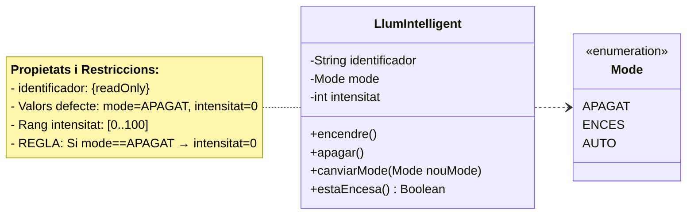
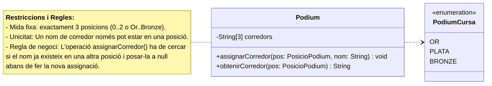
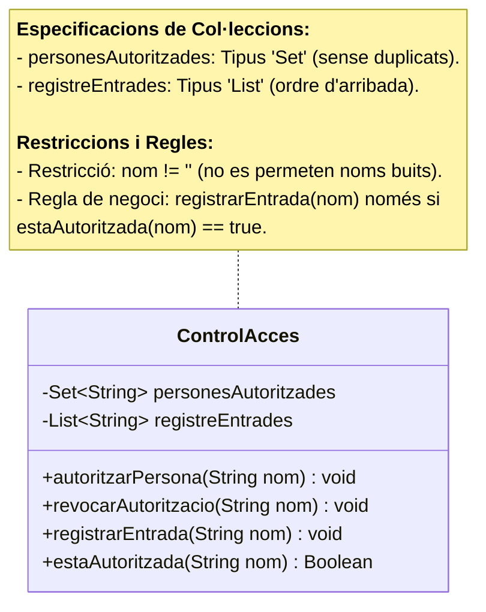
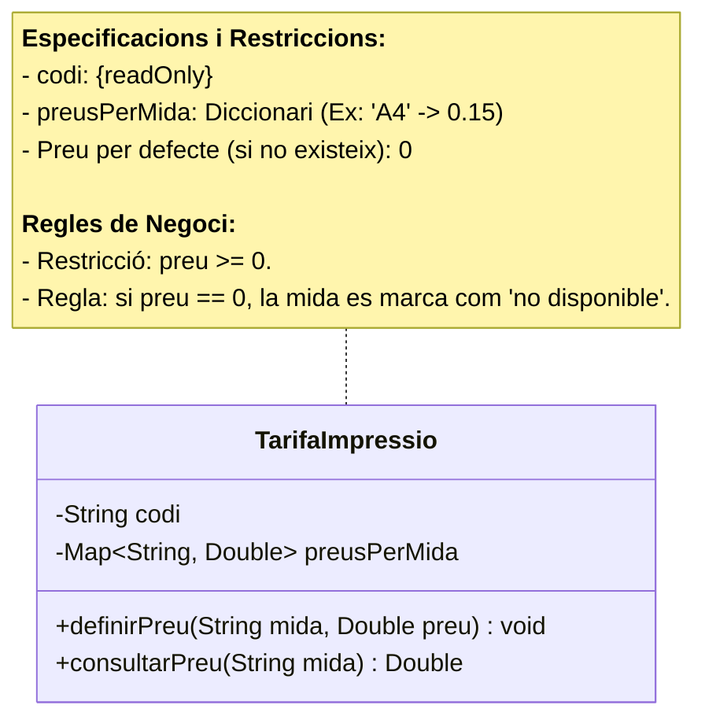

```mermaid
classDiagram
    direction LR
    class Mode {
        <<enumeration>>
        APAGAT
        ENCES
        AUTO
    }

    class LlumIntelligent {
        -String identificador
        -Mode mode
        -int intensitat
        +encendre()
        +apagar()
        +canviarMode(Mode nouMode)
        +estaEncesa() Boolean
    }

    LlumIntelligent ..> Mode : 

    note for LlumIntelligent "<b>Propietats i Restriccions:</b><br/>- identificador: {readOnly}<br/>- Valors defecte: mode=APAGAT, intensitat=0<br/>- Rang intensitat: [0..100]<br/>- REGLA: Si mode==APAGAT → intensitat=0"
```

```mermaid
classDiagram
    direction LR
    class PodiumCursa {
        <<enumeration>>
        OR
        PLATA
        BRONZE
    }

    class Podium {
        -String[3] corredors
        +assignarCorredor(pos: PosicioPodium, nom: String) void
        +obtenirCorredor(pos: PosicioPodium) String
    }

    Podium ..> PodiumCursa : 

    note for Podium "<b>Restriccions i Regles:</b><br/>- Mida fixa: exactament 3 posicions (0..2 o Or..Bronze).<br/>- Unicitat: Un nom de corredor només pot estar en una posició.<br/>- Regla de negoci: L'operació assignarCorredor() ha de cercar<br/>si el nom ja existeix en una altra posició i posar-la a null<br/>abans de fer la nova assignació."
```

```mermaid
classDiagram
    class ControlAcces {
        -Set~String~ personesAutoritzades
        -List~String~ registreEntrades
        +autoritzarPersona(String nom) void
        +revocarAutoritzacio(String nom) void
        +registrarEntrada(String nom) void
        +estaAutoritzada(String nom) Boolean
    }

    note for ControlAcces "<b>Especificacions de Col·leccions:</b><br/>- personesAutoritzades: Tipus 'Set' (sense duplicats).<br/>- registreEntrades: Tipus 'List' (ordre d'arribada).<br/><br/><b>Restriccions i Regles:</b><br/>- Restricció: nom != '' (no es permeten noms buits).<br/>- Regla de negoci: registrarEntrada(nom) només si<br/>estaAutoritzada(nom) == true."
```

```mermaid
classDiagram
    class TarifaImpressio {
        -String codi
        -Map~String, Double~ preusPerMida
        +definirPreu(String mida, Double preu) void
        +consultarPreu(String mida) Double
    }

    note for TarifaImpressio "<b>Especificacions i Restriccions:</b><br/>- codi: {readOnly}<br/>- preusPerMida: Diccionari (Ex: 'A4' -> 0.15)<br/>- Preu per defecte (si no existeix): 0<br/><br/><b>Regles de Negoci:</b><br/>- Restricció: preu >= 0.<br/>- Regla: si preu == 0, la mida es marca com 'no disponible'."
```