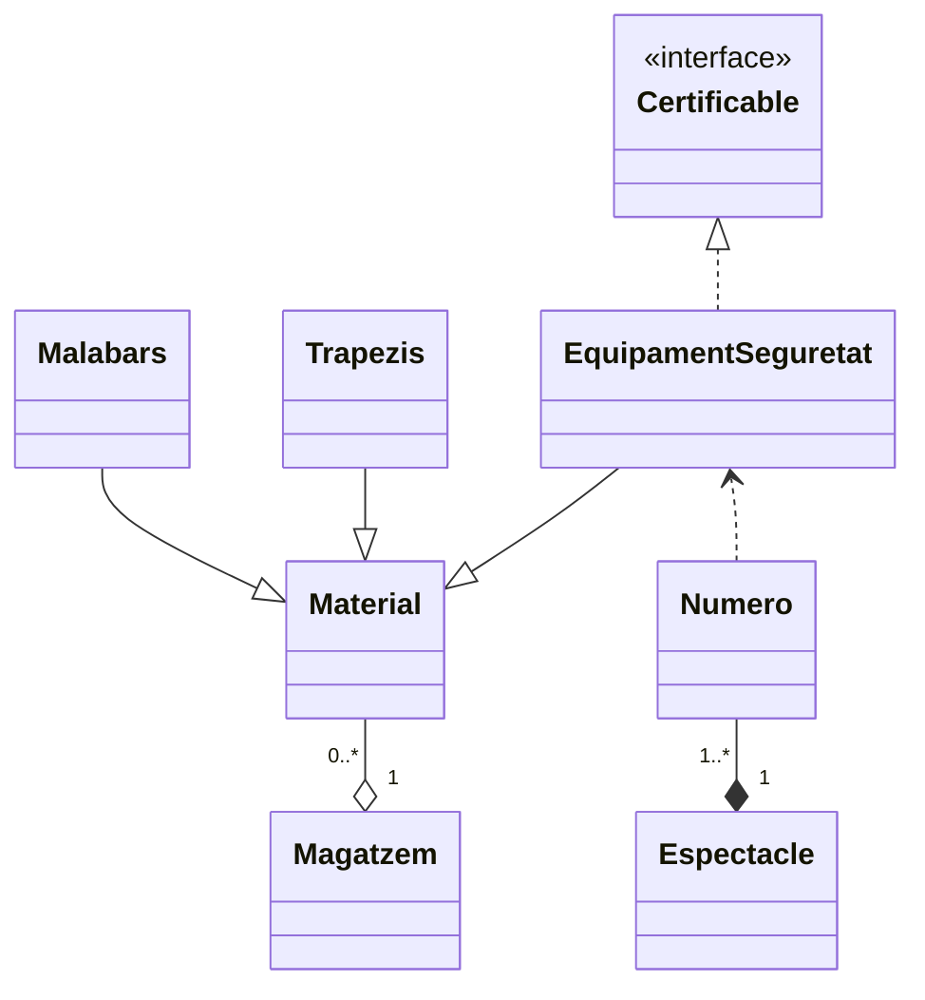

```mermaid
classDiagram
    direction BT

    class Espectacle
    class Numero
    class Magatzem
    class Material
    class Malabars
    class Trapezis
    class EquipamentSeguretat
    class Certificable {
        <<interface>>
    }

    %% Relacions
    Espectacle "1" *-- "1..*" Numero 
    Magatzem "1" o-- "0..*" Material 
    
    Material <|-- Malabars 
    Material <|-- Trapezis 
    Material <|-- EquipamentSeguretat 
    
    EquipamentSeguretat ..|> Certificable 
    Numero ..> EquipamentSeguretat 
```