## ¿Qué es la Programación Orientada a Objetos (POO)?
La **Programación Orientada a Objetos (POO)** es un paradigma de programación que organiza el software en torno a **objetos**, en lugar de funciones o procedimientos aislados.

Un objeto combina:

- **Estado** → datos que describen su situación interna.
    
- **Comportamiento** → acciones que puede realizar.
### Objetivos principales

- Mejorar la **claridad** del código.
    
- Facilitar el **mantenimiento y la evolución** del software.
    
- Favorecer la **reutilización** y la **extensibilidad**.


## Idea clave: _“Moldear el dominio”_

En POO, el diseño del software parte del **dominio del problema**.

- Se identifican las **entidades relevantes** del sistema.
    
- Para cada entidad se define:
    
    - Qué **información** posee (estado).
        
    - Qué **acciones** puede realizar (comportamiento).
        

El resultado es un código que **refleja el problema real**, haciendo que el programa sea una representación conceptual del dominio y no solo una secuencia de instrucciones técnicas.

## Clase vs Objeto

### Clase

Una **clase** es una **plantilla** o **modelo** que define:

- Qué atributos tendrá un objeto.
    
- Qué métodos podrá ejecutar.
    

No ocupa memoria para datos concretos hasta que se crean objetos.

### Objeto

Un **objeto** es una **instancia concreta** de una clase.

- Cada objeto tiene su **propio estado**.
    
- Varios objetos pueden crearse a partir de la misma clase.

## Componentes de una clase

### Atributos

- Representan el **estado interno** del objeto.
    
- Normalmente son **variables**.
    
- Buena práctica: declararlos como `private`.
    

> Norma mental: **atributos = sustantivos**

---

### Métodos

- Definen el **comportamiento** del objeto.
    
- Permiten interactuar con su estado de forma controlada.
    

> Norma mental: **métodos = verbos**

Métodos Get

---

### Parámetros

- Son los **valores de entrada** que recibe un método o constructor.
    
- Permiten que el comportamiento sea **flexible y reutilizable**.
    

---

### Constructores

Un **constructor** es un método especial que se ejecuta **automáticamente al crear un objeto** y cuya función es **inicializar sus atributos**, garantizando que el objeto comience en un **estado válido y coherente**.

Características principales:

- Tiene el **mismo nombre que la clase**.
    
- **No devuelve ningún valor**.
    
- Se ejecuta al usar `new`.
    
- Inicializa el estado del objeto.
    
- Puede recibir **parámetros**.
    
- Puede haber **varios constructores** (sobrecarga).
    

Funciones clave:

- Definir **cómo nace** el objeto.
    
- Evitar objetos incompletos o inconsistentes.
    
- Centralizar la lógica de creación.
    
- Obligar a crear objetos correctamente.
    

Si no se define ningún constructor, Java crea uno **por defecto** que no inicializa los atributos de forma controlada, lo que puede provocar estados no deseados.

> El constructor se encarga de la **creación e inicialización** del objeto; el comportamiento se define mediante los métodos.

---

### Encapsulación


La **encapsulación** es un principio fundamental de la Programación Orientada a Objetos que consiste en **proteger el estado interno de un objeto** y controlar cómo se accede y modifica.

Principios:
- Los **atributos** se declaran como `private`, impide que se modifiquen directamente desde fuera.
    
- El acceso al estado se realiza **exclusivamente a través de métodos públicos** (getters/setters).
    
- El objeto decide **cómo y cuándo** puede cambiar su estado. Permite aplicar **reglas y validaciones**.
- 
Esto evita modificaciones directas y descontroladas que podrían provocar **estados inválidos**.

Beneficios:

- Menos errores.
    
- Código más robusto.
    
- Menor acoplamiento.
    
- Mayor control sobre el estado del objeto.
- Consume menos recursos (solo consume lo que necesito)

### Métodos _getter_ y _setter_

Los **getters** y **setters** son métodos públicos que permiten **leer o modificar** atributos privados de forma controlada.

#### Getters

- Permiten **obtener el valor** de un atributo.
    
- **No modifican** el estado del objeto.
    
- Suelen comenzar por `get`.
	
- Acceso seguro a la información interna.
    
- Evitan exponer directamente los atributos.

Ejemplo:

```java
public int getVelocidad() {
    return velocidad;
}
```

---

#### Setters

- Permiten **modificar el valor** de un atributo.
    
- Aplican **reglas y validaciones** antes de cambiar el estado.
    
- Suelen comenzar por `set`.
	
- Previenen estados imposibles (velocidad negativa).
	
- Centralizan la lógica de modificación.
    
- Facilitan el mantenimiento del código.
    

Ejemplo:

```java
public void setVelocidad(int velocidad) {
    if (velocidad >= 0) {
        this.velocidad = velocidad;
    }
}
```

---

### ¿Por qué no acceder directamente a los atributos?

Acceso directo:

```java
coche.velocidad = -50; // estado inválido
```

Acceso encapsulado:

```java
coche.setVelocidad(50);
```

El objeto **protege su coherencia interna**.

---

### Beneficios de usar encapsulación con getters y setters

- Mayor **seguridad** del estado.
    
- Código más **robusto y mantenible**.
    
- Posibilidad de cambiar la implementación interna sin afectar al resto del programa.
    
- Facilita la depuración y evolución del sistema.
    

---

## Declaración de una clase en Java

```java
public class Coche {

    // Atributos (estado)
    private String marca;
    private String modelo;
    private int velocidad;

    // Constructor
    public Coche(String marca, String modelo) {
        this.marca = marca;
        this.modelo = modelo;
        this.velocidad = 0; // estado inicial válido
    }

    // Métodos (comportamiento)

    public void acelerar(int incremento) {
        if (incremento > 0) {
            velocidad += incremento;
        }
    }

    public void decelerar(int decremento) {
        if (decremento > 0 && velocidad - decremento >= 0) {
            velocidad -= decremento;
        }
    }

    public int getVelocidad() {
        return velocidad;
    }

    public String getDescripcion() {
        return marca + " " + modelo + " a " + velocidad + " km/h";
    }
}
```

## Creación de objetos
```java
public class Main {
    public static void main(String[] args) {

        Coche coche1 = new Coche("Volkswagen", "Passat");
        coche1.acelerar(30);
        coche1.decelerar(10);

        System.out.println(coche1.getDescripcion());
    }
}
```


---

## Herencias

---
Dentro de la POO existen cuatro pilares fundamentales:

1. Encapsulamiento
    
2. Herencia
    
3. Polimorfismo
    
4. Abstracción
    

Este apartado se centra en **Herencia**, pero relacionándola con los otros pilares.

---

### ¿Qué es una herencia?

La **herencia** es un mecanismo mediante el cual una clase (subclase o clase hija) adquiere:

- Atributos
    
- Métodos
    
- Comportamientos semánticos
    

de otra clase (superclase o clase padre).

Desde el punto de vista teórico, la herencia modela relaciones del tipo:

```
ES-UN (IS-A relationship)
```

Ejemplo conceptual:

- Profesor ES UNA Persona
    
- Alumno ES UNA Persona
    

---

### Jerarquías de Clases

Una jerarquía de clases es una estructura arborescente donde:

- La raíz contiene comportamiento común
    
- Los nodos inferiores especializan ese comportamiento
    

#### Propiedades formales

- Reutilización estructural
    
- Especialización progresiva
    
- Sustituibilidad (Principio de Liskov)
    

Ejemplo jerárquico:

```
Entidad
 └── Persona
      ├── Profesor
      └── Alumno
```

---

### Modelo Sintáctico

Java implementa herencia mediante:

```
class Subclase extends Superclase { }
```

Características:

- Java permite **herencia simple** (solo un padre directo)
    
- Evita ambigüedad del "problema del diamante"
    
- La reutilización múltiple se logra con interfaces
    

---

### Construcción de Objetos en Herencia

#### Modelo de Construcción Interno

Cuando se instancia una subclase:

1. Se construye primero la superclase
    
2. Luego se construye la subclase
    

Esto es obligatorio porque:

- La subclase depende estructuralmente de la superclase
    

---

#### Función del Constructor en Herencia

El constructor:

- Inicializa el estado del objeto
    
- Garantiza consistencia interna
    

En jerarquías, el constructor del padre debe ejecutarse siempre.

---

### Uso de `super()`

La instrucción `super()` es una llamada explícita al constructor de la superclase.

Permite:

- Inicializar la parte heredada del objeto
    
- Respetar la coherencia del modelo de objetos
    

**Regla del Lenguaje**

Si no se llama explícitamente:

Java inserta automáticamente:

```
super();
```

Pero solo funciona si existe un constructor vacío.

---

### Ejemplo Conceptual

Si la clase base requiere datos obligatorios:

```java
Persona(String nombre)
```

Entonces la subclase debe garantizar esa inicialización:

```java
Profesor(String nombre) {
    super(nombre);
}
```

---

### Herencia de Atributos

Una subclase hereda los atributos visibles de la superclase según modificador de acceso.

### Tabla de Visibilidad

|Modificador|Misma clase|Subclase|Paquete|Global|
|---|---|---|---|---|
|private|✔|✘|✘|✘|
|protected|✔|✔|✔|✘|
|public|✔|✔|✔|✔|

---

### Encapsulamiento dentro de Herencia

Si todos los atributos fueran públicos:

- Se rompe el control de estado
    
- Se viola la integridad del objeto
    

### Soluciones Arquitectónicas

- **Opción 1** — private + getters/setters (más segura)

- **Opción 2** — protected (más flexible en jerarquías)

En sistemas grandes se prefiere:

```
private + métodos de acceso controlados
```

---

### Herencia de Métodos

Las subclases heredan métodos si son:

- public
    
- protected
    

Esto permite reutilizar lógica común.

Ejemplo conceptual:

```
Persona → método saludar()
Profesor → usa saludar()
Alumno → usa saludar()
```

---

### Sobreescritura de Métodos (Override)

La sobreescritura permite redefinir un método heredado manteniendo su firma.
Permite especializar comportamiento sin romper la jerarquía.

Debe mantenerse:

- Nombre del método
    
- Parámetros
    
- Tipo de retorno compatible

- Uso de `@Override`

---

### Rol de `@Override`

No es obligatorio, pero:

- Garantiza validación en compilación
    
- Previene errores de tipado
    

---

### Polimorfismo Relacionado con Herencia

La herencia habilita el polimorfismo:

```
Persona p = new Profesor();
```

Permite tratar objetos distintos como si fueran del tipo base.

Esto es esencial para:

- Arquitecturas extensibles
    
- Inyección de dependencias
    
- Diseño orientado a interfaces

## Relaciones entre clases en Programación Orientada a Objetos (Java)

En Programación Orientada a Objetos (POO), las clases **no existen de forma aislada**. Un sistema mínimamente realista se modela mediante **clases que colaboran entre sí**, y esa colaboración se expresa a través de **relaciones**.

Las relaciones entre clases permiten:

- Modelar correctamente el dominio del problema.
    
- Establecer responsabilidades claras.
    
- Favorecer la extensibilidad, el mantenimiento y el polimorfismo.
    

Desde un punto de vista conceptual y de modelado (UML y diseño OO), las relaciones principales son:

- **Herencia** → relación de _especialización_ ("es un tipo de").
    
- **Asociación** → relación _estructural_ ("tiene un").
    
- **Dependencia** → relación de _uso_ ("usa a").
    
---

## Herencia

La **herencia** es una relación entre dos clases en la que una clase **derivada** (subclase) **extiende** a otra clase **base** (superclase).

Se expresa como:

> **A es un tipo de B**

Es decir, un objeto de la subclase **puede ser tratado como** un objeto de la superclase.

En Java:

```java
class Animal { }
class Perro extends Animal { }
```

Un `Perro` **es un** `Animal`.

---

### Cuándo usar herencia

La herencia **no se utiliza libremente**. Está justificada únicamente cuando se cumplen criterios conceptuales claros:

1. **Especialización real del dominio**  
    La subclase representa una categoría más específica del mismo concepto.
    
2. **Principio de sustitución de Liskov (LSP)**  
    Cualquier instancia de la subclase puede sustituir a la superclase sin romper el comportamiento esperado.
    
3. **Polimorfismo**  
    Se necesita tratar objetos distintos de forma uniforme, pero con comportamientos diferentes.
    

Ejemplo:

```java
Animal a = new Perro();
a.hacerSonido();
```

---

### Errores típicos en herencia

❌ Usar herencia **solo para reutilizar código**.  
❌ Crear jerarquías artificiales porque las clases tienen atributos similares.  
❌ Heredar entre clases que representan _componentes_ y no _tipos_.

La herencia **modela tipos**, no reutilización técnica.

---

## Asociación

La **asociación** es una relación estructural entre dos clases donde **una clase mantiene una referencia a otra como parte de su estado interno**.

Se expresa como:

> **A tiene un B**

Ejemplo:

```java
class Coche {
    private Motor motor;
}
```

Un `Coche` **tiene un** `Motor`.

---

#### ¿Qué significa "estado de un objeto"?

El **estado de un objeto** es el conjunto de valores almacenados en sus atributos en un momento dado.

Ejemplo:

```java
class Cuenta {
    private double saldo;
}
```

El valor de `saldo` forma parte del **estado** del objeto `Cuenta`.

Cuando una clase tiene otra como atributo, esa relación **forma parte de su estado**.

---

### Asociación simple (normal)

Una **asociación simple** es:

- Una relación estable entre dos clases.
    
- No impone reglas estrictas sobre el ciclo de vida.
    
- Ambas clases pueden existir de forma independiente.
    

Ejemplo:

```java
class Profesor {
    private Departamento departamento;
}
```

Si el `Profesor` desaparece, el `Departamento` **puede seguir existiendo**.

---

#### Ciclo de vida de un objeto

El **ciclo de vida** de un objeto comprende:

1. Creación (instanciación con `new`).
    
2. Uso durante la ejecución del programa.
    
3. Destrucción (cuando deja de ser accesible y el GC lo elimina).
    

Cuando se habla de relaciones, el ciclo de vida indica **si un objeto puede existir sin otro**.

---

## Composición

La **composición** es una forma fuerte de asociación donde:

- **B es una parte esencial de A**.
    
- **B no tiene sentido sin A**.
    
- El ciclo de vida de B depende completamente del de A.
    
- A controla la creación y destrucción de B.
    

Se expresa como:

> **A está compuesto por B**


```java
class Casa {
    private List<Habitacion> habitaciones = new ArrayList<>();

    public Casa() {
        habitaciones.add(new Habitacion());
    }
}
```

Aquí:

- `Habitacion` **no existe fuera de `Casa`**.
    
- `Casa` crea y gestiona sus `Habitacion`.
    

---

### Colecciones

Una **colección** es una estructura que permite almacenar múltiples objetos del mismo tipo.

En Java, se usa habitualmente la interfaz `List`, `Set` o `Map`.

Ejemplo:

```java
List<Habitacion> habitaciones;
```

Se utiliza cuando la relación es **uno a muchos**.

---

## Agregación

La **agregación** es una forma débil de asociación donde:

- **B existe independientemente de A**.
    
- A solo mantiene una referencia a B.
    
- B puede ser compartido por varios objetos A.
    

Se expresa como:

> **A tiene referencias a B, pero no lo posee**


```java
class Equipo {
    private List<Jugador> jugadores;

    public void añadirJugador(Jugador j) {
        jugadores.add(j);
    }
}
```

Aquí:

- `Jugador` existe fuera de `Equipo`.
    
- Un `Jugador` podría pertenecer a varios equipos en distintos contextos.
    

---

## Diferencias entre composición y agregación

|Criterio|Composición|Agregación|
|---|---|---|
|¿Quién crea B?|A|Externo|
|¿B tiene sentido sin A?|No|Sí|
|¿B puede compartirse?|No|Sí|
|Dependencia de ciclo de vida|Total|Parcial|

---

## Multiplicidad

La **multiplicidad** indica cuántas instancias de una clase pueden relacionarse con otra.

Es una propiedad **de la relación**, no de la clase.

### Tipos comunes

- **1 a 1**: un A tiene exactamente un B.
    
- **1 a muchos**: un A tiene varios B.
    
- **muchos a muchos**: varios A se relacionan con varios B.
    

---

### Implementación en Java

- **1 a 1** → un atributo simple.
    
- **1 a muchos** → una colección (`List`, `Set`).
    

Ejemplo:

```java
class Biblioteca {
    private List<Libro> libros;
}
```

---

## Frontera conceptual: "tiene" vs "usa"

En diseño orientado a objetos existe una **frontera clara** entre dos tipos de relación:

- **Relaciones estructurales** → _tiene_
    
- **Relaciones de uso** → _usa_
    

Esta frontera es fundamental para decidir **si algo debe ser un atributo de la clase o no**.

---

### "Tiene": forma parte del estado (persistencia)

Una clase **tiene** otra cuando:

- La referencia a B **forma parte del estado interno de A**.
    
- B se almacena como **atributo**.
    
- La relación es **persistente en el tiempo** mientras A exista.
    

Es decir, B:

> **Sigue existiendo dentro de A entre llamadas a métodos**.

Ejemplo:

```java
class Pedido {
    private Cliente cliente; // forma parte del estado
}
```

Aquí:

- `cliente` existe mientras exista `Pedido`.
    
- No depende de una operación concreta.
    

Esto corresponde a **asociación, agregación o composición**.

---

### "Usa": relación temporal (dependencia)

Una clase **usa** otra cuando:

- B **no forma parte del estado** de A.
    
- B aparece **solo dentro de un método**.
    
- La relación es **temporal y puntual**.
    

Ejemplo:

```java
class Factura {
    public double calcularTotal(Impuesto impuesto) {
        return impuesto.aplicar(this);
    }
}
```

Aquí:

- `Impuesto` **no es atributo**.
    
- Solo se utiliza para realizar una operación.
    

Esto es una **dependencia**, no una asociación.

---

### Regla fundamental de diseño

> **Si no forma parte del estado, no es un atributo**.

Consecuencias directas:

- ❌ No se deben crear atributos solo porque una clase "necesita usar" otra.
    
- ❌ No todo lo que aparece en un método debe almacenarse.
    
- ✔ Solo aquello que define el estado del objeto se guarda como campo.
    

---

### Comparación directa

|Criterio|Tiene|Usa|
|---|---|---|
|¿Es atributo?|Sí|No|
|¿Persiste en el tiempo?|Sí|No|
|¿Forma parte del estado?|Sí|No|
|Tipo de relación|Asociación / Agregación / Composición|Dependencia|

Estas relaciones son fundamentales para un diseño OO correcto y profesional.

---

//Mezclar con lo de arriba

# Relaciones entre Clases en Programación Orientada a Objetos (Java)

En el diseño de software, las clases no operan en el vacío; interactúan para formar sistemas complejos. Estas interacciones se denominan **relaciones**. La calidad de un diseño depende de elegir la relación correcta para minimizar el acoplamiento (dependencia excesiva) y maximizar la cohesión.

Antes de entrar en las relaciones, definamos tres conceptos que faltaban en tus apuntes y son vitales:

> **Conceptos Previos Fundamentales:**
> 
> - **Estado del Objeto:** Es el conjunto de valores que tienen los atributos (variables) de un objeto en un momento dado. Si la relación "forma parte del estado", significa que guardamos referencia a ese otro objeto en una variable de clase.
>     
> - **Ciclo de Vida:** El tiempo que transcurre desde que un objeto se crea en memoria (`new`) hasta que se destruye (el _Garbage Collector_ lo elimina).
>     
> - **Colección:** Cuando una relación es de "uno a muchos" (ej. un Equipo tiene _muchos_ Jugadores), Java no usa variables sueltas, sino estructuras de datos dinámicas (como `ArrayList`, `List`, `Set`) que permiten agrupar múltiples objetos en una sola variable.
>     

---

## 1. Dependencia ("Usa un")

Es la relación más débil. Ocurre cuando una clase **A** necesita a una clase **B** momentáneamente para realizar una operación, pero **no la almacena**.

- **Definición:** Relación de uso transitoria.
    
- **Característica clave:** B no es parte del estado de A. B suele aparecer como **parámetro de un método** o una variable local dentro de un método.
    
- **Ejemplo:** Una `Impresora` recibe un `Documento` para imprimirlo. La impresora no "tiene" el documento guardado para siempre, solo lo usa y lo olvida.
    


```java
public class Impresora {
    // El documento entra, se usa y la relación termina al acabar el método
    public void imprimir(Documento doc) {
        System.out.println(doc.getTexto());
    }
}
```

---

## 2. Asociación ("Tiene un")

Es una relación **estructural**. Significa que dos objetos están conectados de forma más o menos permanente. Un objeto guarda una referencia al otro como un **atributo**.

- **Definición:** Conexión semántica entre clases donde una instancia conoce a la otra.
    
- **Estado:** El objeto asociado persiste en la memoria del objeto principal.
    
- **Multiplicidad:** Define cuántos objetos participan (1 a 1, 1 a muchos). Si es "1 a muchos", usamos una **Colección**.
    

Existen dos formas especializadas de asociación que definen la "fuerza" y la "propiedad" de la relación: **Agregación** y **Composición**.

### A. Agregación (Asociación Débil)

Representa una relación "Todo-Parte" débil.

- **Lógica:** "B es parte de A, pero B puede vivir sin A".
    
- **Ciclo de Vida:** Independiente. Si destruimos el objeto contenedor (A), el objeto contenido (B) **sigue existiendo**.
    
- **Propiedad:** El objeto B suele crearse fuera de A y se le pasa (se "agrega") a través del constructor o un método `set`. B puede ser compartido por otros objetos.
    

**Ejemplo:** Un `Equipo` y un `Jugador`. Si el equipo se disuelve, el jugador no muere, queda libre o se va a otro equipo.


```java
public class Equipo {
    private List<Jugador> jugadores; // Colección (1 a muchos)

    public Equipo() {
        // Inicializamos la lista vacía
        this.jugadores = new ArrayList<>();
    }

    // AGREGACIÓN: El jugador viene de fuera.
    // El equipo no lo crea, solo lo añade.
    public void ficharJugador(Jugador j) {
        this.jugadores.add(j);
    }
}
```

### B. Composición (Asociación Fuerte)

Representa una relación "Todo-Parte" fuerte.

- **Lógica:** "B es parte integral de A y no tiene sentido fuera de A".
    
- **Ciclo de Vida:** Dependiente. Si destruimos A, **B se destruye automáticamente**. A controla la creación y destrucción de B.
    
- **Propiedad:** El objeto B se crea (`new`) **dentro** de la clase A (normalmente en el constructor). B no suele ser compartido.
    

**Ejemplo:** Una `Casa` y una `Habitacion`. Si derribas la casa, las habitaciones desaparecen. Una habitación no existe flotando en la nada sin una casa.

Java

```
public class Casa {
    private List<Habitacion> habitaciones;

    public Casa() {
        this.habitaciones = new ArrayList<>();
        // COMPOSICIÓN: La Casa crea las habitaciones.
        // Si la Casa muere, nadie más tiene referencia a estas habitaciones.
        this.habitaciones.add(new Habitacion("Cocina"));
        this.habitaciones.add(new Habitacion("Baño"));
    }
}
```

---

## 3. Herencia ("Es un tipo de")

Es la relación de generalización/especialización. Permite definir una nueva clase basándose en una existente.

- **Objetivo Real:**
    
    1. **Polimorfismo:** Poder tratar objetos de diferentes subclases de manera uniforme (ej. tratar a `Gato` y `Perro` simplemente como `Animal`).
        
    2. **Abstracción:** Definir comportamientos genéricos en la clase padre.
        
    3. **Sustitución (Principio de Liskov):** Cualquier sitio donde se espere un objeto Padre, debe poder funcionar un objeto Hijo sin romper el programa.
        
- **Error Común (Anti-patrón):** Usar herencia _solo_ para reutilizar código (ej. Heredar de `Ventana` solo para tener un método `cerrar()`, aunque tu clase no sea una ventana). Si solo quieres reusar código, usa Composición.
    


```java
// Clase Base
public class Animal {
    public void comer() { ... }
}

// Herencia: Perro ES UN Animal
public class Perro extends Animal {
    @Override
    public void comer() {
        System.out.println("Comiendo pienso");
    }
}
```

---

## Resumen Diferencial

|**Característica**|**Dependencia**|**Agregación**|**Composición**|
|---|---|---|---|
|**Frase clave**|"Usa un"|"Tiene un" (débil)|"Contiene un" (fuerte)|
|**Duración**|Temporal (lo que dure el método)|Permanente (mientras no se quite)|Permanente (vida del objeto)|
|**Ciclo de vida**|Irrelevante|Independiente (B vive si A muere)|Dependiente (B muere si A muere)|
|**Creación**|Recibido como parámetro|Recibido desde fuera (inyección)|Creado dentro de la clase (constructor)|
|**Ejemplo**|Impresora usa Documento|Equipo tiene Jugadores|Casa tiene Habitaciones|

### ¿Cómo decidir cuál usar? (Guía rápida)

1. **Pregunta 1:** ¿Es una relación de "Es un..."? (Un Coche es un Vehículo).
    
    - SÍ $\rightarrow$ **Herencia**.
        
    - NO $\rightarrow$ Pasa a la pregunta 2.
        
2. **Pregunta 2:** ¿El objeto A necesita guardar al objeto B para recordarlo luego?
    
    - NO $\rightarrow$ **Dependencia** (Pásalo por parámetro).
        
    - SÍ $\rightarrow$ Es una **Asociación**. Pasa a la pregunta 3.
        
3. **Pregunta 3:** Si elimino A, ¿debería desaparecer B automáticamente?
    
    - SÍ $\rightarrow$ **Composición** (Haz `new` dentro de A).
        
    - NO (B puede usarse en otro lado) $\rightarrow$ **Agregación** (Pásalo en el constructor).
        

---

### Siguiente paso para el usuario

¿Quieres que te prepare un **diagrama UML** textual rápido o un ejercicio de código pequeño donde tengas que identificar qué relación usar para consolidar esto?

---

## Relaciones entre clases

Necesito que completes, mejores y amplíes estos apuntes. He ido dejando notas para que veas qué falla. Mantén una redacción académica y profesional.
////Nota: Estos son los apuntes, me valen verga porque nada tiene sentido. Necesito algo más profesional, claro y académico. Están muy mal hechos, son conceptos super importantes y no tengo ni una puñetera definición ni un uso real que lo aclare ni si quiera se ve una diferencia clara. Quiero lograr un nivel Universitario y no llega ni a eso la explicación. 

Las clases no viven aisladas, se relaciones
Relaciones clave:
Herencia - "es un tipo de..."
Asociación - "es parte de un estado" - Son relaciones estructurales porque estructuran el programa
Dependencia - "solo se usa para operar" - Son relaciones de uso

### Herencia
¿Cuándo usar herencias?
Para categorías reales del dominio
Por polimorfismo (misma interfaz y comportamiento diferente)
Por sustitución: Un A puede usarse como un B

#### Errores típicos
Crear una herencia para reutilizar código, porque tienen campos iguales o entre componentes.

## Asociación
"Tienei un" - A tiene B cuando B forma parte del estado (ni idea de que quiere decir)
Puede ser 1 o muchos
Relacion estructural del modelo
Variantes especiales: Agregación y composición

### Asociación simple/normal (ni se lo que es)
Relación estable entre dos clases
Forma parte del estado de un objeto (que coño es une estado del objeto)
No especifica propiedad de ciclo de vida (ni puta idea - Se ve que si deja de existir la clase, la otra puede seguir existiendo)

### Composición
B es una parte de A
B depende del ciclo de vida de A (que coño es un ciclo de vida, si existe o no?? es que no se explica)
A controla la creación/gestión de B
(De repente aparece una colección, por la cara, qué es una colección, habla de líneas y no se llega a ningún punto claro. De repente un método añade cosas dentro de esa colección).
Nulo, no saco nada claro. Ni si quiera sé qué hace.

### Agregación
B existe independientemente de A
A solo referencia a B
B puede ser compartido por diversos A.
Vuelve a aparecer una colección para el ejemplo, sin sentido. Dice que la clase ejecuta el atributo ¿?
Los métodos aquí se ve que añaden, la diferencia? ni idea. Se ve que la composición crea y la agregación añade.

Diferencias
Quien crea B (ni idea de lo que significa)
B tiene sentido sin A? (otra vez ni idea)
B puede ser compartido? * (con estrellita para añadir una explicación que no se da)

Multiplicidad - Esto que es? una propiedad de los objetos, classes, ni puta idea.
1 a 1: A tiene B
1 a muchos: A tiene muchos
Muchos implica una colección (pero qué cojones es una colección)


Ahora de repente hay una frontera
Frontera: tiene vs usa
Te B forma aprte del estado (persistencia)
Usa B - Aparece solo en una operación (temporal)
Regla - si no es estado, no es atributo

---

## 10. Resumen conceptual final

- **Herencia** modela tipos.
    
- **Tiene** → relación estructural (estado persistente).
    
- **Usa** → relación de dependencia (temporal).
    
- **Composición** implica propiedad y ciclo de vida compartido.
    
- **Agregación** implica referencia sin propiedad.
    
- **Multiplicidad** define cuántos objetos participan en la relación.
    

Distinguir correctamente entre _tiene_ y _usa_ es una de las claves del diseño orientado a objetos profesional.
# UML
## UML : Una notación estandard
- UML es un lenguaje gráfico para representar sistemas. 
- Ayuda a describir el modelo de forma clara y compartible. 
- UML incluye diagramas estructurales y de comportamiento.
## Nivel de detalle
- Un diagrama puede ser general o cercano al código.  
- Incluya solo lo que añada valor a la comprensión del sistema.  
- Prioridad: legibilidad y coherencia.
## Representación de una clase
- Rectángulo con: Nombre / Atributos / Operaciones. 
- Si no se requieren detalles, se puede mostrar solo el nombre. 
- El estilo debe ser coherente en todo el diagrama.
- Los atributos y métodos tienen que seguir el estilo camel (codigoSeguimiento), si un método empieza por mayúscula es que es un constructor.
## Clases abstractas e interficies
**Abstracta ( no se puede instanciar, "que es")**
{abstract} o el nombre en cursiva
**Interficie (contracto, "que puedes hacer")**
<<``interface``>>
Todas las clases que contengan interface tendrán que tener el método String exportar();
**Ejemplos:**
```java
public interface Exportable{
	String exportar();
}
```

```java
public class Producto implements Exportable{
	public String exportar(){
	}
}
```
```java
public class Producte extends ArticleCatalog implements Exportable{

}
```
## Visibilidad en UML
- ``+``public
- `-`private
- ``# protected``
## Atributos
- FORMAT -> visibilidad nombre : Tipo
	- `- nombre : String`
- Inicialización (=valor):
	- `- iva : double = 0.21
- No editable (solo si interesa) : {readOnly}
	- ` - id : int {readOnly}`
## Métodos
- FORMAT -> visibilidad nombre(parámetros): Retorno
	- ``+ calcularTotal(): double``

void dos maneras posibles (importante hacerlo igual en todo el UML):

``+ pintar(texte: String)``  

`+ pintar(texte: String): void`

  
- Constructor (solo si da información necesaria): Clase(parámetros)
    
`+ Comanda(id: int, cliente: Client)`

- Estático (solo si interesa): {static}
    

+ calcular(base: double): double {static}

// métodos static: sirven para no tener que hacer cada vez un new de la clase, haremos NombreClase.método
## Enumeraciones
``<<enumeration>>`` NombreEnumeración
Son una alternativa a los booleanos, se usan cuando no nos basta ter true y false, por ejemplo : EstatComanda estat que podría tener Pendiente, Pagada, Enviada y Cancelada, en java cada uno de los estados siempre en mayusculas (ya se verá como se hace en código)
## Colecciones: List, Set, arrays y diccionarios
Se utiliza como tipo para atributos, parámetros, de return, etc. P.ej:
nombreAtributo: Colección
Diferentes tipos de colecciones: 
- List``<TipoElementos>``
- Set``<TiposElementos>``
- Map<TipoKey, TipoValor>
- TipoElementos[]/TiposElementos[n] (si el tamaño es relevante)
Un set es como una bolsa que tiene diferentes elementos desordenados pero seguro que no se repiten.
Un map es un diccionario.
+ Array
	+ mida fija
	+ orden
	+ se pueden repetir
+ List
	+ mida variable
	+ orden (indice)
	+ se pueden repetir
+ set
	+ mida variable
	+ NO orden
	+ elementos no se pueden repetir
+ map
	+ Key NO se puede repetir
	+ valor SÍ
	+ mida variable
	+ NO orden
## Asociación
- Una línea continua entre dos clases.
- Puede tener multiplicidades en los extremos.
- Puede tener dirección (navegabilidad). 
- Podemos dar un nombre a la relación (en la dirección de la navegabilidad).
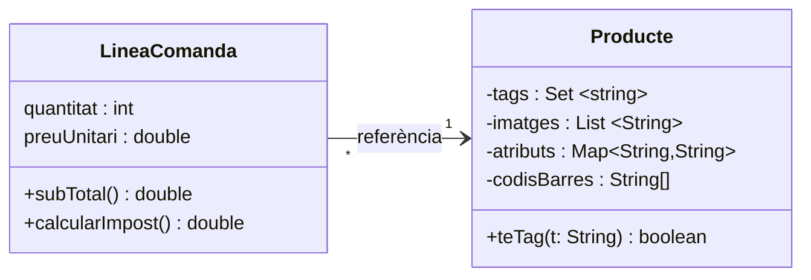
## Agregación
- Asociación con un rombo vacío junto a «todo».  
- Relación débil «parte de».  
- Tiene el resto de características de asociación (navegación, multiplicidades, nombre de la relación).
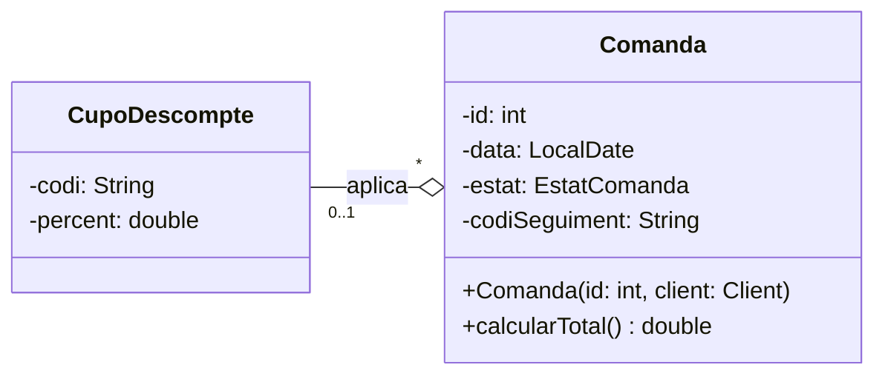

## Composición
- Asociación con un diamante sólido junto a «todos».  
- Relación fuerte «parte de» (vinculada de por vida).  
- Tiene el resto de características de asociación (navegabilidad, multiplicidades, nombre de relación).
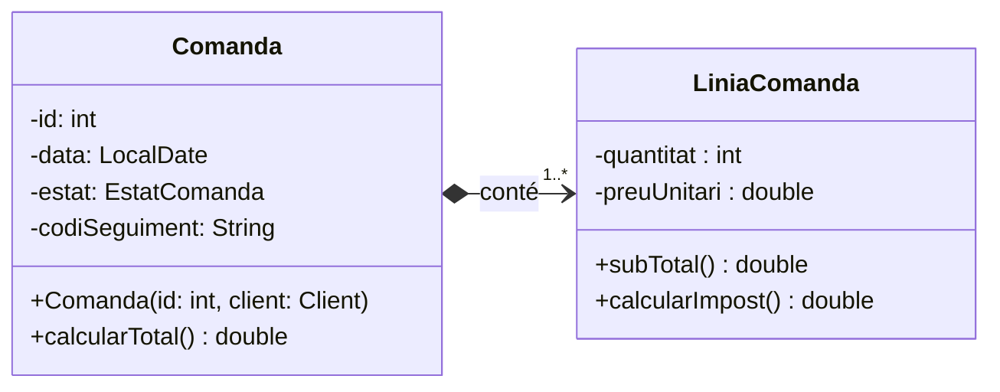

// En las composiciones no hace falta poner un uno encima del rombo ya que señalando este tipo de relación siempre tendrá uno
## Herencia
- Línea continua con un triángulo abierto hacia la superclase. 
- Representa «es un». 
- El triángulo siempre apunta al tipo más general.
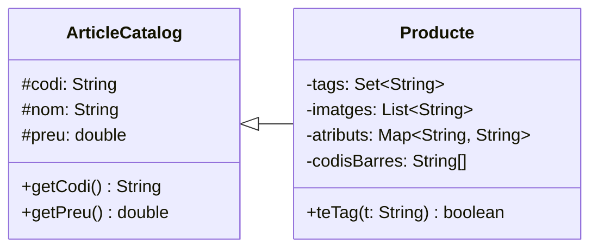

## Realización de interficie

- Línea discontinua con un triángulo vacío hacia la interfaz. 
- Representa las interfaces Java. 
- La interfaz se denota mediante ``<<interface>>``.
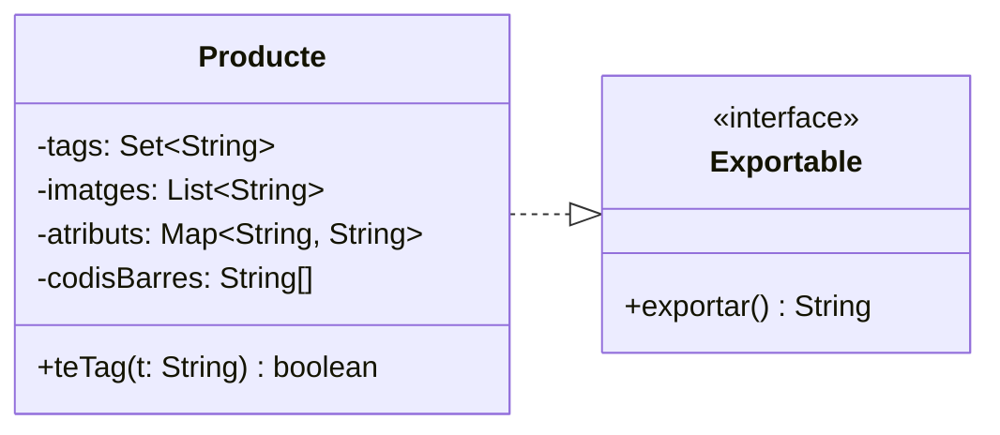

## Dependencia
- Flecha desconectada hacia el tipo utilizado. 
- Representa un uso único (parámetro, variable local, llamada). 
- No implica una relación estable, como una asociación.
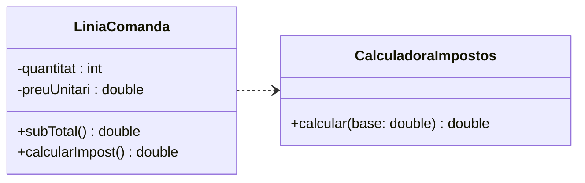
## Notas y restricciones
- Notas UML para aclaraciones importantes (por ejemplo, reglas de negocio).  
- No es necesario incluir todas las reglas de negocio, solo si son clave y no sobrecargan el UML.  
- Restricciones con claves: {…} en atributos.
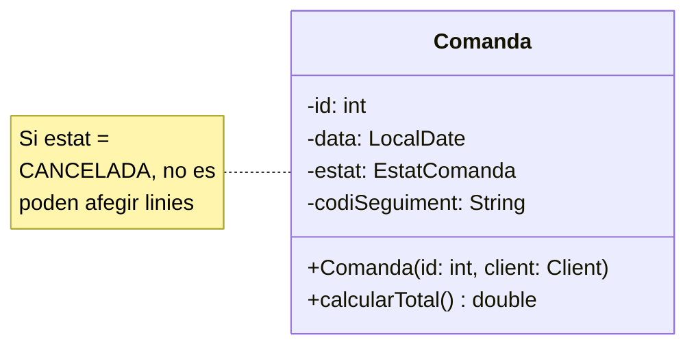

// Si consideramos que una restricción es muy importante la podemos poner como una nota en el diagrama, importante no llenar el diagrama de notas, que no haya mas notas que clases
## Paquetes
- Paquetes para agrupar clases (por ejemplo, modelo, servicios). 
- Ayudan a mantener el diagrama organizado. 
- Representan la estructura lógica del proyecto.
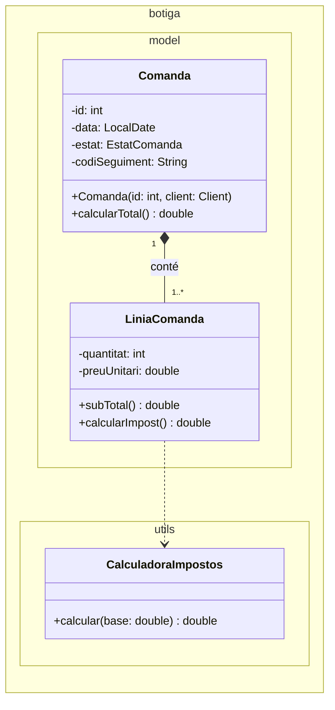
# Implementación: Del Diagrama de Clases al Código Java

La fase de implementación consiste en traducir la estructura y relaciones descritas en el diagrama UML al lenguaje Java (clases, campos, métodos y paquetes). El diagrama UML actúa como una guía de responsabilidades y dependencias.

 

## 1. Representación de Clases y Atributos

Una clase estándar en UML se traduce directamente a una `class` en Java. Los atributos se convierten en campos (`fields`) privados para mantener la integridad.

> [!INFO] **Mapa Mental de Atributos** 
> * **Atributo UML:** Define el nombre y el tipo de dato. 
> * **Tipo Java:** Se eligen tipos primitivos, clases, enums o colecciones según la necesidad. 
> * **Inicialización:** Se realiza en el constructor o mediante valores por defecto para asegurar la consistencia. 
> * **Restricción {readOnly}:** Se implementa en Java con la palabra clave `final`.

> [!EXAMPLE] **Ejemplo: Clase Cupón de Descuento** 
> En UML: `CupoDescompte` con `-codi: String {readOnly}` y `-percent: double`.
> ```java
> 	public class CupoDescompte { 
> 	private final String codi; // readOnly 
> 	private double percent;
> 	public CupoDescompte(String codi, double percent) { 
> 		this.codi = codi; 
> 		this.percent = percent;
> 	 }
> }
> ```
## 2. Visibilidad y Encapsulamiento

El control de acceso es fundamental para proteger el estado del objeto.

 

- **`+` (Public):** Acceso total desde cualquier punto.
    
     
    
- **`-` (Private):** Solo accesible dentro de la misma clase.
    
     
    
- **`#` (Protected):** Como un `private`, pero otorga visibilidad a las subclases (herencia).
    
     
    

> [!IMPORTANT] **Regla de Encapsulación** 
> Solo aquello que define el estado del objeto se guarda como atributo. Se deben usar **Getters** cuando es necesario consultar el estado desde fuera y **Setters** solo cuando tenga sentido modificarlo, permitiendo validar los datos.

## 3. Métodos y Constructores

Los métodos definen el comportamiento y la "API pública" de la clase.

  

- **Firma:** La firma en UML (visibilidad, nombre, parámetros y retorno) debe coincidir en Java.
    
      
    
- **Constructores:** Sirven para crear objetos consistentes. Todas las propiedades clave deben asignarse aquí para evitar objetos incompletos.
    
      
    
- **Métodos Internos:** Se declaran como `private` para organizar lógica interna o reutilizar código sin exponerlo.
    
      
    

> [!EXAMPLE] **Restricción de Negocio en Métodos** 
> Si el UML indica una nota como: "Si estado = CANCELADA, no se pueden añadir líneas".
> ```java
> public boolean añadirLinea(LineaPedido linea) {
> 	  if (this.estado == EstadoPedido.CANCELADA) {
> 	      return false; // Bloqueo por regla de negocio
> 	   }
>    return lineas.add(linea);
>}
> ```

## 4. Implementación de Relaciones

Las relaciones estructurales ("Tiene") se implementan mediante atributos de clase.

### Agregación vs. Composición

- **Agregación (Débil):** El objeto relacionado viene del exterior (inyección vía constructor o setter) y puede ser compartido.
    
      
    
- **Composición (Fuerte):** La clase principal crea la instancia del objeto relacionado (normalmente en el constructor) y controla su ciclo de vida.
    
      
    

> [!INFO] **Dependencia ("Usa")** 
> Ocurre cuando una clase aparece solo en una operación temporal (parámetro o variable local) y no forma parte del estado persistente.
> 
>   

## 5. Colecciones y Multiplicidad

Cuando una relación es de "uno a muchos" (`*` o `1..*`), el atributo en Java debe ser una colección del paquete `java.util`.

  

- **List:** Para elementos ordenados que permiten duplicados.
    
      
    
- **Set:** Para elementos no ordenados que no permiten duplicados.
    
      
    
- **Map:** Para pares clave-valor (diccionarios).
    
      
    

> [!TIP] **Buenas Prácticas con Colecciones** 
> Declarar siempre usando la **interfaz** (ej. `List`) y crear la instancia con la **clase concreta** (ej. `ArrayList`) en el constructor.
> 
>   

## 6. Otros Elementos Técnicos

- **Enumeraciones (`enum`):** Se usan para valores cerrados (ej. estados de un pedido), evitando "Strings mágicas" y errores de tipado.
    
      
    
- **Interfaces (`interface`):** Representan un contrato de "qué puede hacer" una clase. Se implementan con `implements`.
    
      
    
- **Clases Abstractas:** No se pueden instanciar y definen "qué es" algo de forma general.
    
- **Paquetes (`package`):** Agrupan clases por funcionalidad (ej. `modelo`, `utils`) y deben reflejarse en la estructura de carpetas del proyecto.
## 7. Multiplicidad y Navegabilidad UML (asociaciones)
>[!INFO] Multiplicidad
>- "1": camp T
>- "0..1": camp T opcional (pot ser null)
>- "`*`" o "1..`*`" : colección de T (lista,mapa,...)

>[!INFO] Navegabilidad. Si A->B
>Dentro de A tendremos el campo T o la colección (dependiendo de la multiplicidad).
>En B NO no tendremos nada.

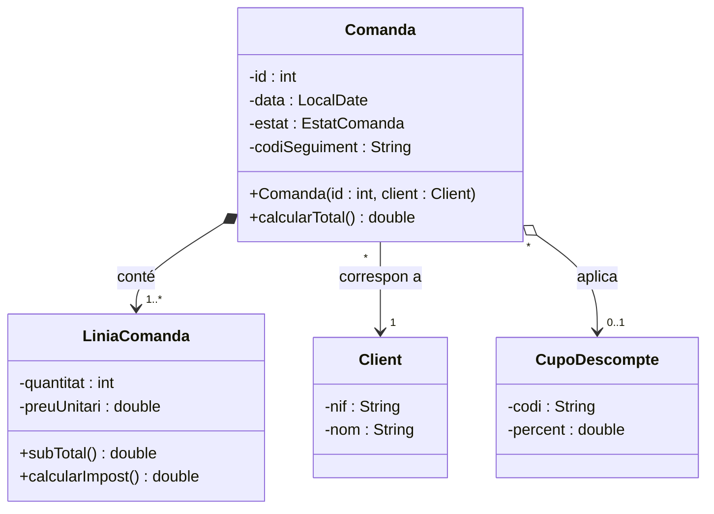

>[!IMPORTANT]
>La dirección de la flecha indica navegabilidad: "A->B" quiere decir "A conoce a B"

>[!IMPORTANT]
>LiniaComanda,CupoDescompte y Client **NO** tendrán el atributo Comanda, ya que la flecha no va hacia Comanda

```java
public class Comanda implements Exportable{
	private final int id;
	private LocalDate data;
	private EstatComanda estat;
	private String codiSeguiment;
	
	private CupoDescompte cupo;
	private final List<LiniaComanda> linies;
	private final Client client;
}
```
## Asociación: navegabilidad
- Por ahora, siempre mantendremos las asociaciones unidireccionales. 
- En primer lugar, elegimos una clase central, que será el punto de partida para los casos de uso (en el main). 
- Añadimos navegación para que, desde esta clase central, podamos llegar a los datos que necesitamos. 
- En Java, cada flecha de navegación se traduce en una referencia (o colección) a la clase de origen.
- No incluimos la referencia de retorno (por ahora), porque sincronizarla complica la implementación.
- Aplicamos el mismo criterio a la agregación y la composición.
## Ejemplo 1
![[Diagrama Ejemplo 1.png|500]]
- Al main, el punto de partida será Comanda
- Atributos comanda:
	- Coleccion lineas
	- Cliente 
	- Cupón
- Atributos linea:
	- Producto
## Ejemplo 2
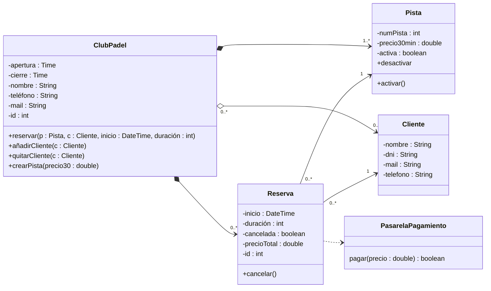
- Al main, el punto de partida será ClubPadel
- Atributos ClubPadel:
	- Colección reservas
	- Colección clientes
	- Colección pista
- Atributos Reserva:
	- Cliente
	- Psita
## Agregación vs Composición: propiedad y ciclo de vida
```java
public class Comanda implements Exportable{
	public boolean afegirLinia(Producte producte, int quantitat, double preuUnitari) {  
	    if (estat == EstatComanda.CANCELADA) return false;  
	    if (quantitat <= 0) return false;  
	    LiniaComanda nova = new LiniaComanda(producte, quantitat, preuUnitari);  // En composición, creamos el objeto (Hacemos un new)
	    return linies.add(nova);  
	}
	public void aplicarCupo(CupoDescompte cupo) {  // En agregación NO creamos el obejto, solo guardamos la referencia
	    this.cupo = cupo;  
	}
}
```
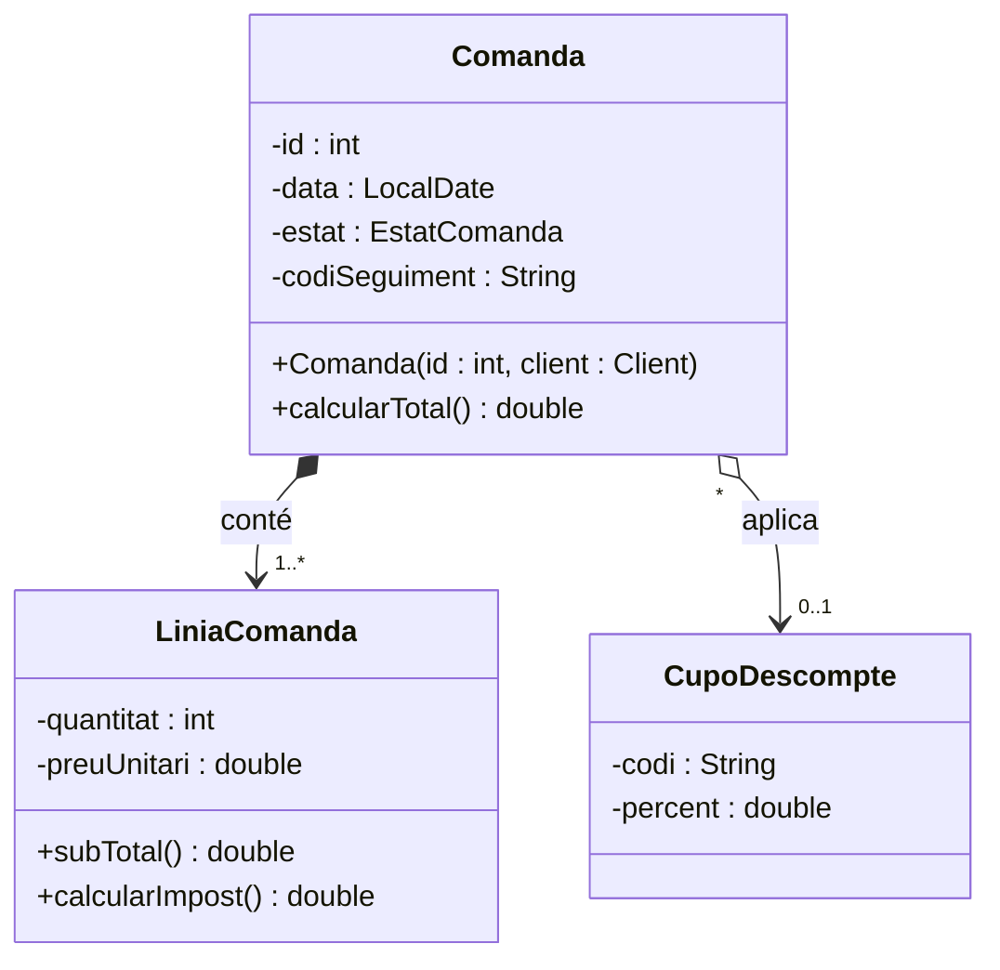
- Agregación : la parte puede existir independientemente.
- Composición: la parte depende del todo
- En el código : se reflecta sobre todo en quien crea/gestiona los objetos.
## Herencia
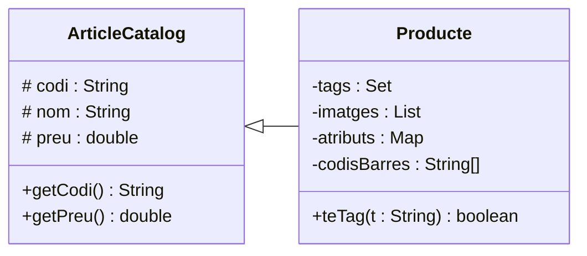
```java
public abstract class ArticleCatalog {  
    protected final String codi;  
    protected String nom;  
    protected double preu;  
  
    public ArticleCatalog(String codi, String nom, double preu) {  
        this.codi = codi;  
        this.nom = nom;  
        this.preu = preu;  
    }
    public String getNom() { return nom; } 
    
public class Producte extends ArticleCatalog {  
    private final Set<String> tags;  
    private final List<String> imatges;  
    private final Map<String, String> atributs;  
    private final String[] codisBarres;  
  
    public Producte(String codi, String nom, double preu) {  
        super(codi, nom, preu);  //Super para llamar al constructor de la superclase
        this.tags = new HashSet<>();  
        this.imatges = new ArrayList<>();  
        this.atributs = new HashMap<>();  
        this.codisBarres = new String[10];  
    }  
    @Override  //Redefinición
    public String getNom(){  
        return "[TEST override] " + nom;   //Acceso con protected
    }
```
- Subclase "es un" tipo de la superclase
- Reutilización y especialización
- Redefinición (override) cuando el comportamiento cambia
