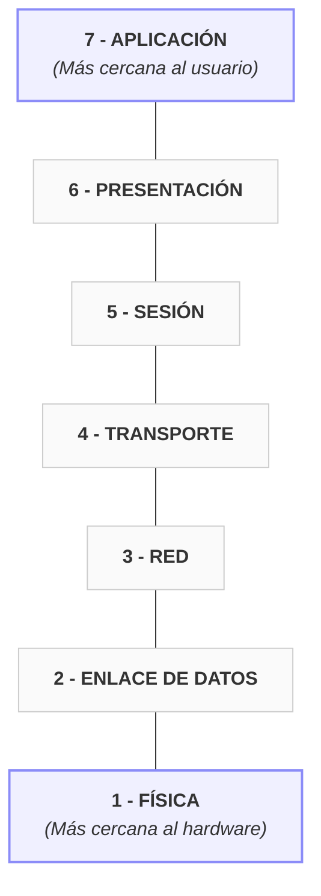

# 5.2.1 - Modelo OSI

tags: #redes #OSI #capas #protocolos

← [[5.2 - Modelos de Referencia]]

---

## Introducción

> [!info] OSI — Open Systems Interconnection
> Modelo **teórico** de referencia para la interconexión de sistemas de diferentes tipos.
> Publicado por la **ISO** en 1984.
> Compuesto por **7 capas**, cada una con una función específica y bien definida.

Cada capa se comunica con las capas adyacentes añadiendo o quitando **cabeceras** (encapsulación/desencapsulación).

---

## Las 7 Capas del Modelo OSI

---

## Descripción de cada capa

### 7 — Aplicación
- **Función**: Permite a las aplicaciones acceder a las demás capas
- **Ejemplos**: HTTP, FTP, SMTP, DNS, DHCP
- Interfaz entre el **usuario/aplicación** y la red

### 6 — Presentación
- **Función**: Cifra, comprime y convierte los datos a un formato comprensible
- Gestiona la **codificación** y el **cifrado** de los datos
- Ejemplos: SSL/TLS, JPEG, MPEG, ASCII

### 5 — Sesión
- **Función**: Establece, gestiona y cierra **sesiones** entre aplicaciones
- Permite tener más de una sesión activa simultáneamente
- Controla el diálogo entre equipos

### 4 — Transporte
- **Función**: Asegura y confirma que los datos llegaron correctamente a su destino
- Divide los datos en **segmentos** (TCP) o **datagramas** (UDP)
- Controla el flujo y la corrección de errores extremo a extremo
- Protocolos: **TCP**, **UDP**, **SCTP**

### 3 — Red
- **Función**: Encamina los datos de forma **óptima** a través de la red
- Asigna y gestiona las **direcciones IP**
- Toma decisiones de enrutamiento
- Protocolos: **IP**, **ICMP**, **ARP**, **IGMP**
- Dispositivo asociado: **Router**

### 2 — Enlace de Datos
- **Función**: Agrupa los datos en **tramas** y controla que no haya errores en la transmisión
- Gestiona las **direcciones MAC**
- Se divide en dos subcapas:
	- **LLC** (Logical Link Control) → control de flujo y errores
	- **MAC** (Media Access Control) → acceso al medio físico
- Protocolos: **Ethernet**, **WiFi (802.11)**
- Dispositivos asociados: **Switch**, **Bridge**

### 1 — Física
- **Función**: Se encarga de la **transmisión física** de los bits por el medio
- Define voltajes, frecuencias, conectores, cables...
- No interpreta el contenido, solo transmite señales
- Dispositivos asociados: **Hub**, **Repetidor**, **Cable**

---

## Flujo de datos en el modelo OSI

### Comunicación Emisor - Receptor

| EMISOR | Datos / PDU | RECEPTOR |
| :--- | :--- | :--- |
| **7 Aplicación** | datos | **7 Aplicación** |
| **6 Presentación** | `[cabecera] + datos` | **6 Presentación** |
| **5 Sesión** | `[cab] + [cab] + datos` | **5 Sesión** |
| **4 Transporte** | segmento / datagrama | **4 Transporte** |
| **3 Red** | paquete | **3 Red** |
| **2 Enlace** | trama | **2 Enlace** |
| **1 Física** | bits --------------------→ | **1 Física** |

> [!tip] Nemónico para recordar las capas (de abajo a arriba)
> **F**ísica · **E**nlace · **R**ed · **T**ransporte · **S**esión · **P**resentación · **A**plicación
> → "**Fer Tres Semanas Para Aprender**" (o el que te funcione)

---

## Unidades de datos por capa

| Capa | Unidad de datos |
|------|----------------|
| 7, 6, 5 — Aplicación/Presentación/Sesión | **Datos** |
| 4 — Transporte | **Segmento** (TCP) / **Datagrama** (UDP) |
| 3 — Red | **Paquete** |
| 2 — Enlace | **Trama** |
| 1 — Física | **Bits** |

→ Ver comparación con TCP/IP en [[5.2.3 - Comparación OSI y TCP-IP]]
