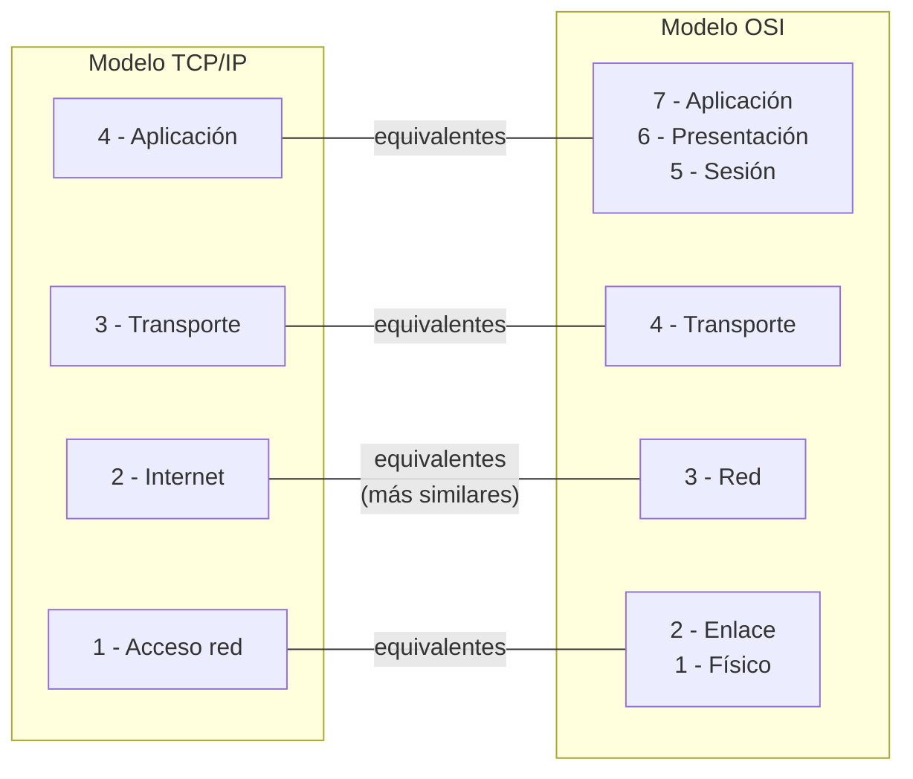
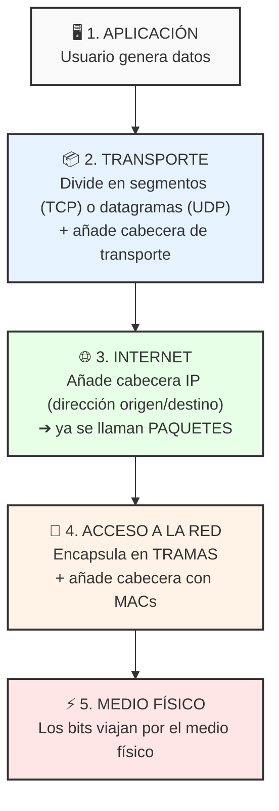

# 5.2.3 - Comparación OSI y TCP/IP

tags: #redes #OSI #TCPIP #comparación

← [[5.2 - Modelos de Referencia]]

---

## Equivalencia entre capas

| TCP/IP | OSI | Relación |
| :--- | :--- | :--- |
| **4 - Aplicación** | 7 - Aplicación 6 - Presentación 5 - Sesión | Equivalentes |
| **3 - Transporte** | 4 - Transporte | Equivalentes |
| **2 - Internet** | 3 - Red | Equivalentes (más similares) |
| **1 - Acceso red** | 2 - Enlace 1 - Físico | Equivalentes |

> [!tip] Las capas más similares entre modelos
> - **Transporte** ↔ **Transporte**
> - **Internet** ↔ **Red**

---

## Diferencias clave

| Aspecto | OSI | TCP/IP |
|---------|-----|--------|
| **Número de capas** | 7 | 4 |
| **Tipo** | Modelo teórico | Modelo práctico (usado en internet) |
| **Capa de Presentación** | Sí (capa 6) | No (incluida en Aplicación) |
| **Capa de Sesión** | Sí (capa 5) | No (incluida en Aplicación) |
| **Capas física y enlace** | Separadas (1 y 2) | Unidas en "Acceso a la red" |
| **Origen** | ISO (1984) | DoD / ARPANET (años 70) |

---

## Flujo de datos (igual en ambos modelos)

> [!info] Flujo de transmisión
> **Emisor**: los datos van de la capa **superior → inferior**
> **Receptor**: los datos van de la capa **inferior → superior**

### Proceso detallado en TCP/IP

