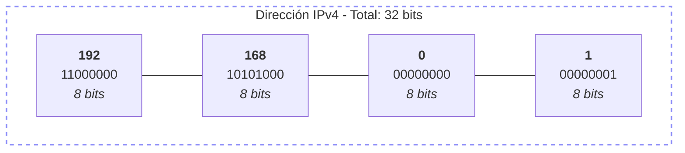

# 5.3 - Direccionamiento IP

tags: #redes #IP #direccionamiento #subnetting

← [[Tema 5 - Sistemas Informáticos en Red]]

---

## Introducción

Para el correcto funcionamiento de una red, cada nodo debe tener una **dirección IP única**. Se necesita configurar:
- Dirección IP
- Máscara de subred
- (Opcional) Puerta de enlace (gateway)
- (Opcional) Servidores DNS y DHCP

---

## IPv4

> [!info] Estructura IPv4
> **32 bits** → representados como 4 números decimales (0-255) separados por puntos.
> Denominado: **notación decimal con puntos** o **punteado**.

| | Octeto 1 | Octeto 2 | Octeto 3 | Octeto 4 |
| :--- | :---: | :---: | :---: | :---: |
| **Decimal** | **192** | **168** | **0** | **1** |
| **Binario** | `11000000` | `10101000` | `00000000` | `00000001` |
| **Tamaño** | 8 bits | 8 bits | 8 bits | 8 bits |


> **Tamaño Total:** 32 bits
---

## IPv6

> [!info] Estructura IPv6
> **128 bits** → representados en **8 grupos de 16 bits** en hexadecimal, separados por `:`.

Surgió porque las direcciones IPv4 se agotaban con el crecimiento de internet.

**Ventajas adicionales de IPv6:**
- Muchas más direcciones
- Mayor seguridad (usa **IPSec**)

### Reglas de abreviación IPv6

1. Se pueden **omitir los ceros iniciales** de cada grupo
2. Una secuencia de grupos de ceros puede abreviarse como `::` (solo una vez por dirección)

```
Completa:   15ba:0000:0000:0000:0000:20ef:2020:2200
Paso 1:     15ba:0:0:0:0:20ef:2020:2200
Paso 2:     15ba::20ef:2020:2200
```

> [!warning] Importante
> `::` solo se puede usar **una vez** en una dirección para evitar ambigüedad.

---

## Dirección de Loopback

| Versión | Dirección |
|---------|-----------|
| IPv4 | `127.0.0.1` (cualquier dirección de la red `127.0.0.0/8`) |
| IPv6 | `::1` |
| Nombre | `localhost` |

> [!tip] Uso
> Se usa para desarrollar y probar software localmente antes de desplegarlo.

---

## Dirección de Broadcast

- **IPv4**: se obtiene poniendo a `1` todos los bits de host → envía mensaje a toda la red
- **IPv6**: NO tiene broadcast. En su lugar usa:
	- **Unicast** → un nodo
	- **Multicast** → varios nodos
	- **Anycast** → varios nodos, responde el más cercano

---

## IPs Públicas vs Privadas

| Tipo | Descripción | Quién la asigna |
|------|-------------|-----------------|
| **Pública** | Visible desde internet | ISP (proveedor de internet) |
| **Privada** | Solo visible en la red LAN propia | Administrador de red / DHCP |

> [!info] NAT — Network Address Translator
> Técnica que ha impedido el agotamiento de IPv4. Dentro de cada LAN se usan IPs privadas; hacia el exterior se comparte una única IP pública.

### Rangos de IPs Privadas

| Rango | Clase |
|-------|-------|
| `10.0.0.0` – `10.255.255.255` | Clase A |
| `172.16.0.0` – `172.31.255.255` | Clase B |
| `192.168.0.0` – `192.168.255.255` | Clase C |

---

## Clases de Redes IPv4

| Clase | Intervalo | Bits red | Bits host | Máscara | Broadcast |
|-------|-----------|----------|-----------|---------|-----------|
| **A** | 0.0.0.0 – 127.255.255.255 | 8 | 24 | 255.0.0.0 `/8` | x.255.255.255 |
| **B** | 128.0.0.0 – 191.255.255.255 | 16 | 16 | 255.255.0.0 `/16` | x.x.255.255 |
| **C** | 192.0.0.0 – 223.255.255.255 | 24 | 8 | 255.255.255.0 `/24` | x.x.x.255 |
| **D** | 224.0.0.0 – 239.255.255.255 | — | — | — | Multicast |
| **E** | 240.0.0.0 – 255.255.255.255 | — | — | — | Experimental |

> [!note] Clase A
> El rango `127.0.0.0/8` está reservado para **loopback**.
> La dirección `0.0.0.0` indica "sin IP asignada" o "cualquier valor".

---

## Máscara de Subred

> [!info] Definición
> 32 bits que indican qué parte de la IP pertenece a la **red** y qué parte al **host**.

Se puede expresar de dos formas:
- **Decimal con puntos**: `255.255.255.0`
- **Notación CIDR**: `/24`

| Máscara | CIDR | Bits red | Bits host |
|---------|------|----------|-----------|
| 255.255.255.0 | /24 | 24 | 8 |
| 255.255.0.0 | /16 | 16 | 16 |
| 255.0.0.0 | /8 | 8 | 24 |

### Calcular la dirección de red
Se hace una operación **AND** entre la IP y la máscara:

| | Formato Decimal | Formato Binario |
| :--- | :--- | :--- |
| **IP** | `192.168.0.32` | `11000000 . 10101000 . 00000000 . 00100000` |
| **Máscara** | `255.255.255.0`| `11111111 . 11111111 . 11111111 . 00000000` |
| **Red** | **`192.168.0.0`** | **`11000000 . 10101000 . 00000000 . 00000000`** |

### Número de hosts en una red

```
Hosts = 2^n - 2
```
Donde `n` = número de bits reservados para host.
Se restan 2 porque:
- Una IP es la **dirección de red** (todos los bits de host a 0)
- Una IP es la **dirección de broadcast** (todos los bits de host a 1)

**Ejemplo con `/24` (8 bits de host):**
```
2^8 - 2 = 256 - 2 = 254 hosts válidos
Rango: 192.168.0.1 – 192.168.0.254
```

---

## Subnetting — División en Subredes

> [!info] Subnetting
> Dividir una red en **varias subredes** ampliando la máscara (tomando **bits prestados** de los bits de host).

**Para dividir en 2 subredes** → añadir 1 bit a la máscara
**Para dividir en 4 subredes** → añadir 2 bits a la máscara
**Para dividir en 2^n subredes** → añadir n bits a la máscara

### Ejemplo: Dividir 192.168.0.0/24 en 2 subredes

Nueva máscara: `/25` = `255.255.255.128`

| Subred | Dirección red | Rango válido | Broadcast |
|--------|--------------|--------------|-----------|
| Red 1 | 192.168.0.0/25 | 192.168.0.1 – 192.168.0.126 | 192.168.0.127 |
| Red 2 | 192.168.0.128/25 | 192.168.0.129 – 192.168.0.254 | 192.168.0.255 |

### Ejemplo: Dividir 192.168.10.0/24 en 4 subredes

Nueva máscara: `/26` = `255.255.255.192` (2 bits prestados → 2^2 = 4 subredes)

| Subred | Dirección | Rango válido | Broadcast |
|--------|-----------|--------------|-----------|
| Red 1 | 192.168.10.0/26 | .1 – .62 | .63 |
| Red 2 | 192.168.10.64/26 | .65 – .126 | .127 |
| Red 3 | 192.168.10.128/26 | .129 – .190 | .191 |
| Red 4 | 192.168.10.192/26 | .193 – .254 | .255 |

> [!tip] Supernetting
> Técnica contraria al subnetting: quita bits de la red y los añade a hosts, para tener más equipos.

---

## Puerta de Enlace (Gateway)

> [!info] Gateway
> Dirección IP del dispositivo que proporciona **salida a internet** o conecta redes con protocolos diferentes.

- En redes domésticas suele ser el **router con módem**
- Dirección por defecto: `192.168.0.1` o `192.168.1.1`

---

## Servidores DHCP y DNS

### DHCP — Dynamic Host Configuration Protocol

> [!info] DHCP
> Servidor que asigna **automáticamente** direcciones IP válidas a los equipos cuando se conectan a la red. Evita duplicados.

Alternativa: **configuración estática** (asignación manual).

### DNS — Domain Name System

> [!info] DNS
> Traduce **nombres de dominio** (ej. `google.com`) en **direcciones IP**.
> Sin DNS habría que usar IPs directamente para navegar.
