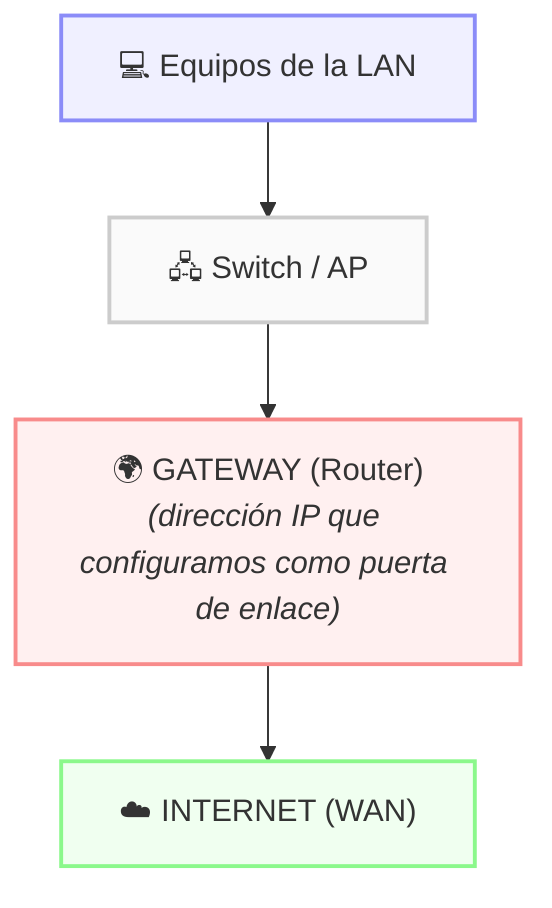

# 5.3.4 - Puerta de Enlace (Gateway)

tags: #redes #gateway #router #configuración

← [[5.3 - Direccionamiento IP]]

---

## ¿Qué es la puerta de enlace?

> [!info] Gateway / Puerta de enlace
> Dirección IP del dispositivo que permite **conectar redes con protocolos diferentes** o proporciona **salida a internet**.

En una red local, la puerta de enlace indica la dirección del dispositivo que da acceso al exterior (normalmente internet).

---

## En redes domésticas y pequeñas empresas

- Suele ser un **router con módem incorporado**
- Dirección IP por defecto: `192.168.0.1` o `192.168.1.1`
- Para acceder a su configuración se necesita:
	- La **dirección IP** del router (la puerta de enlace)
	- Un **nombre de usuario** y una **contraseña**

---

## Cómo acceder al router

1. Abrir un navegador web
2. Escribir en la barra de direcciones: `http://192.168.0.1` (o `192.168.1.1`)
3. Introducir usuario y contraseña (suelen estar en una pegatina en el propio router)

---

## Cómo consultar la puerta de enlace en el equipo

### En Linux
```bash
ip route                   # Buscar la línea "default via x.x.x.x"
ip route show default
```

### En Windows
```cmd
ipconfig                   # Buscar "Puerta de enlace predeterminada"
ipconfig /all
```

---

## Relación con otros elementos de red



> [!tip] Regla práctica
> Si no sabes la puerta de enlace de tu red, normalmente es la **primera IP usable** de la red:
> Ej: en `192.168.1.0/24`, la puerta de enlace suele ser `192.168.1.1`
