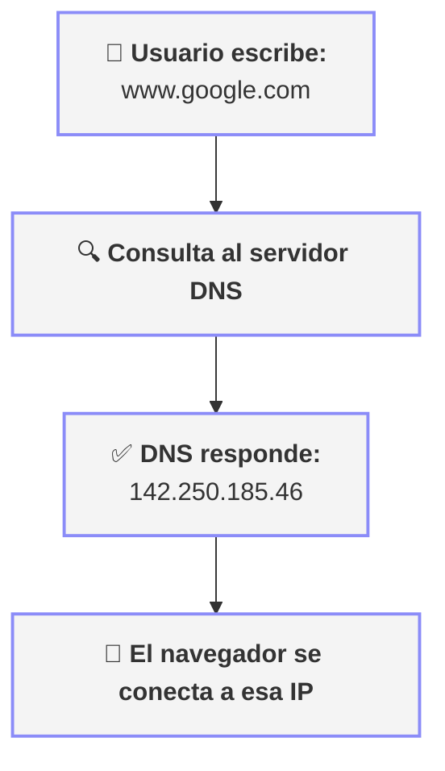
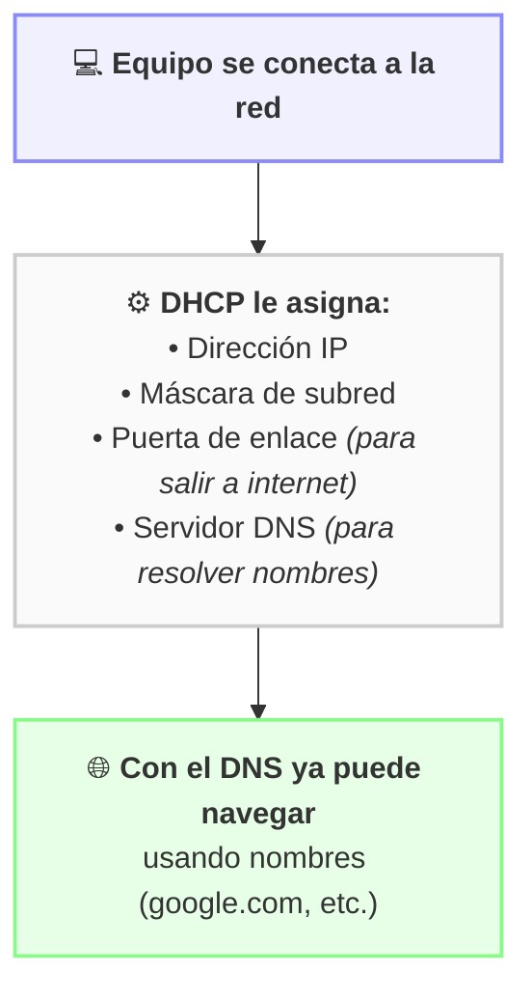

# 5.3.6 - Servidores DHCP y DNS

tags: #redes #DHCP #DNS #direccionamiento #servidores

← [[5.3 - Direccionamiento IP]]

---

## Formas de asignar IPs en una red

| Tipo | Descripción |
|------|-------------|
| **Estática / Manual** | El administrador asigna manualmente la IP a cada equipo |
| **Dinámica / Automática (DHCP)** | Un servidor DHCP asigna IPs automáticamente al conectarse |

---

## DHCP — Dynamic Host Configuration Protocol

> [!info] Servidor DHCP
> Servidor que **asigna automáticamente** direcciones IP válidas a los equipos cuando se conectan a la red.

### ¿Qué hace exactamente?
1. El equipo se conecta a la red y solicita una IP
2. El servidor DHCP le asigna una IP libre del rango disponible
3. Gestiona todas las IPs asignadas para **evitar duplicados**
4. La IP tiene una **duración limitada** (tiempo de concesión / lease time), tras la cual puede renovarse

### Información que proporciona el DHCP
- Dirección IP
- Máscara de subred
- Puerta de enlace (gateway)
- Servidores DNS

### ¿Cuándo usar IP estática vs DHCP?

| Situación | Recomendación |
|-----------|---------------|
| Servidores, impresoras en red, routers | **IP estática** (siempre la misma) |
| PCs de usuario, portátiles, móviles | **DHCP** (más cómodo y flexible) |

---

## DNS — Domain Name System

> [!info] Servidor DNS
> Sistema que **traduce nombres de dominio** (como `google.com`) en **direcciones IP** (como `142.250.185.46`).

### ¿Por qué es necesario?
- Los equipos se comunican usando **direcciones IP** numéricas
- Los humanos memorizamos **nombres** más fácilmente
- Sin DNS tendríamos que escribir IPs en lugar de nombres para navegar

### Funcionamiento básico



### DNS en redes locales
- Un servidor DNS **local** puede asignar nombres de dominio a los equipos de la red
- Así cada equipo puede tener un nombre de dominio propio dentro de la red

### Servidores DNS públicos conocidos

| Proveedor | IP primaria | IP secundaria |
|-----------|-------------|---------------|
| Google | `8.8.8.8` | `8.8.4.4` |
| Cloudflare | `1.1.1.1` | `1.0.0.1` |
| OpenDNS | `208.67.222.222` | `208.67.220.220` |

---

## Relación entre DHCP y DNS



---

## Comandos relacionados

### Ver configuración DHCP/DNS en Linux
```bash
ip address              # Ver IP asignada
ip route                # Ver puerta de enlace
cat /etc/resolv.conf    # Ver servidores DNS configurados
resolvectl status       # Ver resolución DNS (systemd)
```

### Ver configuración DHCP/DNS en Windows
```cmd
ipconfig /all           # Ver IP, máscara, gateway y DNS
ipconfig /release       # Liberar IP asignada por DHCP
ipconfig /renew         # Pedir nueva IP al servidor DHCP
```

### Consultar un servidor DNS
```bash
nslookup google.com       # Consultar la IP de un dominio
nslookup 8.8.8.8          # Consultar el nombre de una IP
host google.com           # Alternativa en Linux
```
